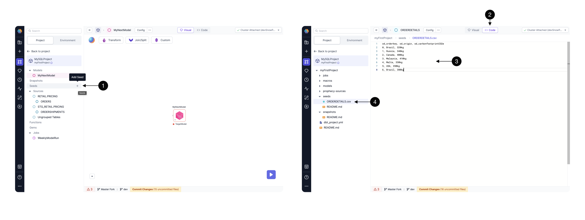
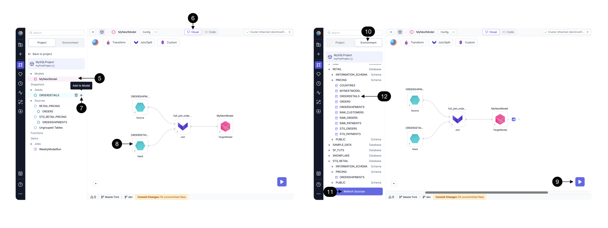
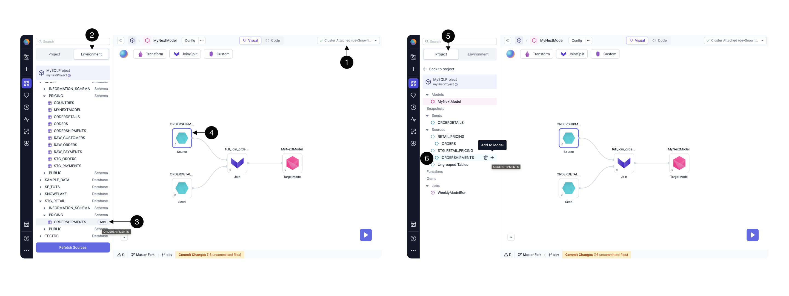
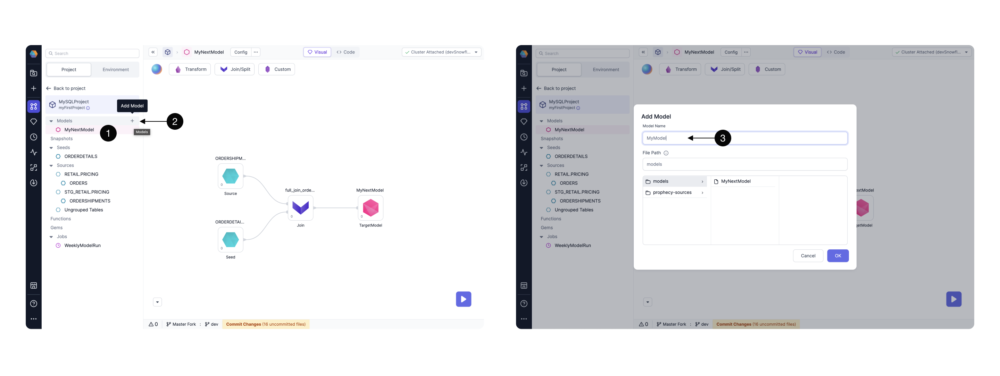
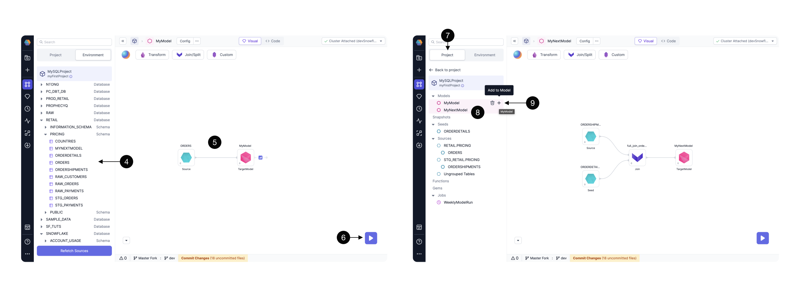
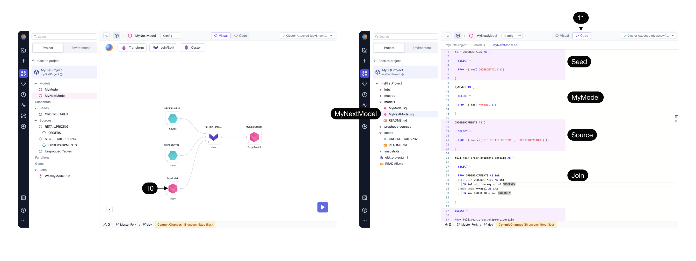

Loading data into Prophecy is done via the [Seed](#seed), [Source](#source), or [Model](#model) Gems - all based on [dbt](https://docs.getdbt.com/docs/build/projects) concepts.

## Seed

A Seed is an excellent way to load small CSV files into Prophecy. This is super useful for small test datasets or lookup mappings, like a list of cities or countries. Seeds are saved as .sql files on Git when Projects are committed and released. Follow the steps below to Create a Seed and write to the SQL Warehouse defined in the Fabric.

| **Seed Creation**                                                                                                                           |
| ------------------------------------------------------------------------------------------------------------------------------------------- |
| **1 Add Seed** - Inside the Model canvas, from the Project tab, select + Add Seed and provide a name. Here the Seed was named ORDERDETAILS. |
| **2 Toggle to `Code`** - The code view displays a text editor.                                                                              |
| **3 Paste data** - Paste content in CSV format with header and separated by commas.                                                         |
| **4 Seed file** - The Seed file is now listed in the files that will be committed to Git when the Project is committed and released.        |

| **Seed - use in a Model and write to the Warehouse**                                                                                                                                                                                                                                        |
| ------------------------------------------------------------------------------------------------------------------------------------------------------------------------------------------------------------------------------------------------------------------------------------------- |
| **5 Open Model** - Click to open the desired Model where you'd like to use the Seed.                                                                                                                                                                                                        |
| **6 Toggle to `Visual`** - From this visual view we can see the Model canvas.                                                                                                                                                                                                               |
| **7 Add Seed to Model** - Add the Seed as a datasource for this Model.                                                                                                                                                                                                                      |
| **8 Seed appears in the Model Canvas** - Now the content of the Seed is part of the Model and can be transformed, joined, etc.                                                                                                                                                              |
| **9 Interactive Run** - Click the Play button to interactively run the Model, including the Seed datasource.                                                                                                                                                                                |
| **10 Click the Environment tab** - to browse the SQL Warehouse                                                                                                                                                                                                                              |
| **11 Refetch Sources** - Crawls the SQL Warehouse to list tables in each of the databases and schemas accessible to your user. Seeds are by default materialized as Tables.                                                                                                                 |
| **12 Seed appears as a Table in the Warehouse** - Once Prophecy has refetched the sources, Prophecy lists the Seed in the Project Browser. So the Seed exists as both a Table in the Warehouse and is also saved as a versioned CSV file on Git when the Project is committed and released. |

## Source

Each Source points to a table in the SQL Warehouse(s) specified in the Fabric. Prophecy does not store the contents of the Source Table. Inside a Project, the `Env` tab allows for browsing the database and schema. Tables in the `Env` tab can be drag-n-dropped to the canvas without manually specifying any metadata. Follow the steps below to create and use a Source.

| **Source creation and usage**                                                                                                                                     |
| ----------------------------------------------------------------------------------------------------------------------------------------------------------------- |
| **1 Cluster and Fabric** - The Cluster and Fabric define the SQL Warehouse execution environment. Attach the desired Fabric which contains the Table of interest. |
| **2 Click the Environment tab** - Browse the SQL Warehouse specified in the selected Fabric.                                                                      |
| **3 Add a table** - Prophecy respects the user's permissions. Any table for which the user has read permission can be added to the Model canvas.                  |
| **4 Source is added to the Model Canvas** - The Source named ORDERSHIPMENTS is now part of the Model, and is ready for transformation, joins, etc.                |
| **5 Click the Project tab** - Lists all the Sources that are now accessible to any Model in the Project.                                                          |

## Model

A Model is similar to a Pipeline, as both contain data transformation steps. Unlike a Pipeline, however, each Model defines a single [materialized view or table](https://docs.getdbt.com/docs/build/materializations#materializations).

Models are represented as visual format or as a single .sql file in `code` format. Because Models define a single materialized view or table, Models can serve as inputs to other models.

| Model Creation                                                                                                                                                |
| ------------------------------------------------------------------------------------------------------------------------------------------------------------- |
| **1 Open existing Model** - Within a Project, open an existing Model, eg MyNextModel.                                                                         |
| **2 Add Model** - Click to add a new Model to the existing Model.                                                                                             |
| **3 Model Name and File Path ** - Provide a name for the new Model, eg MyModel. Define the desired storage path in Git to store the new Model as a .sql file. |

Now the new Model has been created and the canvas is displayed. Optionally, click `Config`. Prophecy makes it easy to decide whether a model should be materialized as a view, table, ephemeral, incremental, or dynamic table. Click [here](https://www.prophecy.io/blog/interactive-development) to see how to configure a table's materiliazation.

| Model as a Datasource                                                                                                    |
| ------------------------------------------------------------------------------------------------------------------------ |
| **4 Add a Source** - From the Environment tab, select a source for the new Model.                                        |
| **5 Configure ** - Configure the new source, do any transformation steps or simply connect to the new Model Gem.         |
| **6 Interactive Run** - Click the "Play" button to execute the new Model and create a materiaized view of the new Model. |
| **7 Project Tab** - Click the Project tab and notice MyModel is now available in the Project Browser.                    |
| **8 Existing Model** - Open the existing Model of interest. In this example, MyNextModel is opened.                      |
| **9 Add Model as a Source** - Add the new Model (eg MyModel) as a Source.                                                |

| Model as a Datasource (cont'd)                                                                                                                                                                                                         |
| -------------------------------------------------------------------------------------------------------------------------------------------------------------------------------------------------------------------------------------- |
| **10 Model as a Source** - The new Model (MyModel) appears on the canvas of the existing Model (MyNextModel). Connect the new Model as an input to the Join Gem or any desired transformation Gem. The new Model acts as a Datasource. |
| **11 Toggle to `code`** - The SQL `code` view for the open Model, MyNextModel, is shown. Each code fragment represents one Gem in MyNextModel.                                                                                         |

As a result, **MyNextModel** contains three sources: a Seed (ORDERDETAILS), a Source (ORDERSHIPMENTS), and a Model (MyModel). These three sources are joined together and materialized as a table or view in the database.schema defined in the Fabric.

**MyNextModel** can be viewed visually (left) or as a SQL file (right). The Project browser (left) lists the Sources, Seeds, and Models available to drag-n-drop into the selected Model's canvas. For more details on dbt concepts including [Sources](https://docs.getdbt.com/docs/build/sources), [Seeds](https://docs.getdbt.com/docs/build/seeds), and [Models](https://docs.getdbt.com/docs/build/models) explore the dbt documentation or checkout Prophecy's getting-started [guide](/docs/getting-started/getting-started-with-low-code-sql.md).
