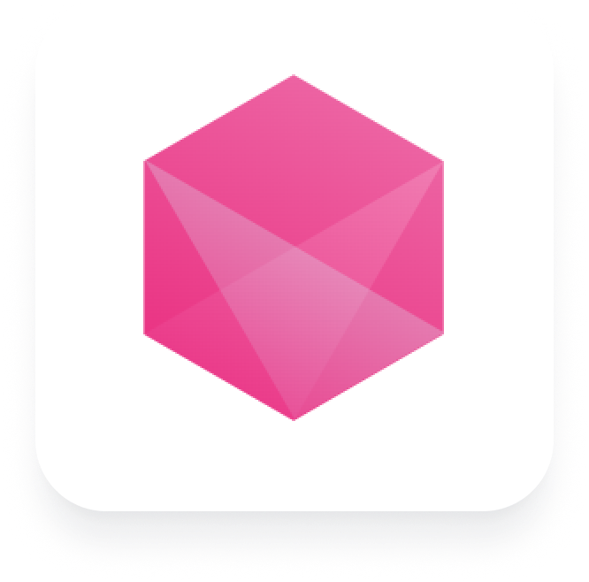

A Gem is a unit of functionality ranging from reading, transforming, writing, and various other ad-hoc operations on data. [Models](/docs/concepts/project/models.md) are typically composed of multiple Gems. Each Gem represents a SQL statement, and allows users to construct that statement by configuring a visual interface.

| 
Gem
      | Category                                              | Description                                                                               |
| --------------------------------------------- | ----------------------------------------------------- | ----------------------------------------------------------------------------------------- |
|       | [**Datasource**](./datasources.md)                    | Gems related to loading data: Seeds, Sources, or Models can be used as datasources        |
|                | [**Transform**](./transformations/transformations.md) | Gems related to the transformation of your data                                           |
|  | [**Join**](./joins.md)                                | Gems related to splitting or joining tables together                                      |
|                      | [**Custom**](./custom/custom.md)                      | The set of Gems built to extend Prophecy's capabilities.                                  |
|                        | [**Model**](/docs/concepts/project/models.md)         | Each model defines a single table or view; the model can also be considered a Target Gem. |

