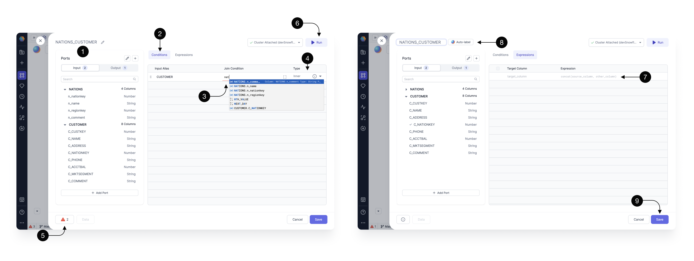

Upon opening the join Gem, you can see a pop-up which provides several helpful features.

For transparency, you can always see the **(1) Input schema** on the left hand-side, **(5) Errors** in the footer, and have the ability to **(6) Run** the Gem on the top right.

To fill-in our **(3) Join condition** within the **(2) Conditions** section, start typing the input table name and key. For example, if we have two input tables, `nation` and `customer`, type `nation.nationkey = customers.nationkey`. This condition finds a nation based on the nationkey feild for every single customer.  

When you’re writing your join conditions, you’ll see available functions and columns to speed up your development. When the autocomplete appears, press ↑, ↓ to navigate between the suggestions and press tab to accept the suggestion. 

Select the **(4)[Join Type](https://docs.snowflake.com/en/user-guide/querying-joins)**.

The **(7) Expressions** tab allows you to define the set of output columns that are going to be returned from the Gem. Here we leave it empty, which by default passes through all the input columns, from both of the joined sources, without any modifications.

To rename our Gem to describe its functionality, click on it’s **(8) Name** or try the **Auto-label** option. Gem names are going to be used as query names, which means that they should be concise and composed of alphanumeric characters with no spaces.

Once done, press **(9) Save.**

## Add a port

:::info
To explore the Gem UI, see [this page](/docs/concepts/project/gems.md) which applies to all Gems. 
:::

<iframe src="https://fast.wistia.net/embed/iframe/rd0gwkkj48?seo=false?videoFoam=true" title="Design a Pipeline Video" allow="autoplay; fullscreen" allowtransparency="true" frameborder="0" scrolling="no" class="wistia_embed" name="wistia_embed" msallowfullscreen width="100%" height="100%"></iframe>

When your Join Gem has the desired inputs, conditions and expressions, consider running interactively to view [sample data](../interactive-development/data-explorer.md). 
