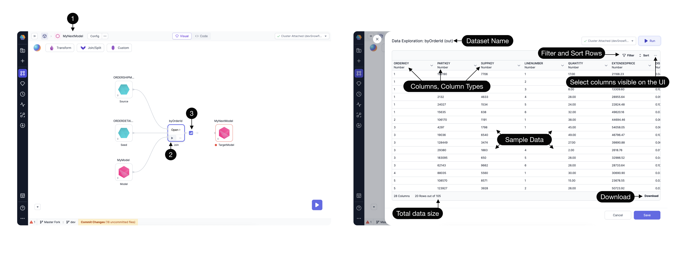

The Data Explorer feature empowers users to explore and analyze their data samples directly within the user interface (UI). With this feature, users can gain insights, verify data accuracy, and make informed decisions.

## Interims are Data Samples

Within any **(1) SQL Model**, interactively **(2) Run** upto one of the Gems. Notice the **(3) Data Interim** appears. Open the [interim](/docs/low-code-spark/execution/interactive-execution.md#interims) to inspect the data.

### Filter and Sort Options

Users can now apply filters and sort rows based on any column, providing enhanced visibility and improved data analysis.

:::info
Please note that after applying or modifying any filter or sort criteria, you need to click the Run button to update the displayed data.
:::

### Column Visibility Filtering

By clicking on the ellipsis `...` icon, users can conveniently filter the columns visible in the UI. No need to rerun the process to reflect these changes in the UI.

### Download Data

Users can now download the data visible in the UI in CSV format using the dedicated download button.

Experience seamless data exploration and analysis with the Data Explorer feature, enabling users to effortlessly navigate and understand their data directly from the user interface.
