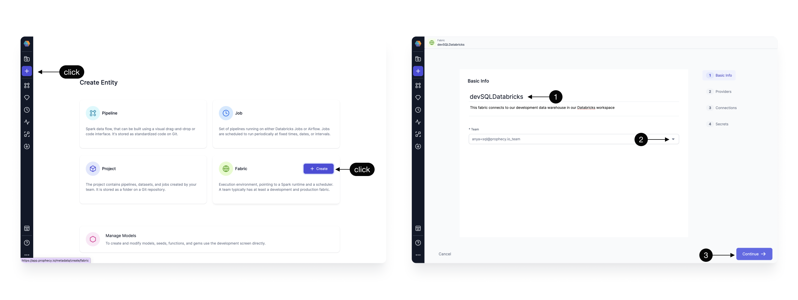
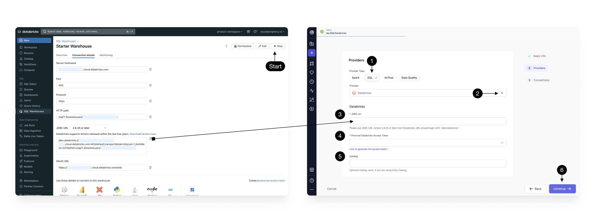
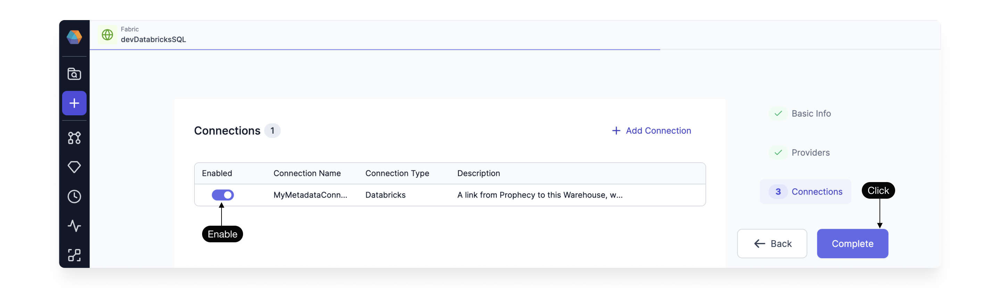

Databricks SQL Warehouse offers seamless integration into the Databricks ecosystem. Follow the steps below to create a Fabric in Prophecy so that you can execute data transformations on your Databricks Warehouse.

## Create a Fabric

Create an entity by clicking the **plus** icon. Click to **Create a Fabric**.
There are four steps to creating a Fabric:

1. [Basic info](./databricks.md#basic-info)
2. [Providers](./databricks.md#provider)
3. [Connections](./databricks.md#connections)
4. [Secrets](./databricks.md#secrets) (coming soon)

### Basic Info

First we’ll give our Fabric some **Basic information**

| **Basic Info**                                                                                                                                                                                     |
| -------------------------------------------------------------------------------------------------------------------------------------------------------------------------------------------------- |
| **1 - Title** - Specify a title, like devDatabricks, for your Fabric. “dev” or “prod” are helpful descriptors for this environment setup. Also specify a description (optional).                   |
| **2 - Team** - Select a team to own this Fabric. Click the dropdown to list the teams your user is a member. If you don’t see the desired team, ask a Prophecy Administrator to add you to a team. |
| **3 - Continue** to the Provider step.                                                                                                                                                             |

### Provider

Add the **Provider** details. The SQL provider is both the storage warehouse and the execution environment where your SQL code will run. Be sure to **Start** the Databricks Warehouse before trying to setup the Fabric.

| **Provider details**                                                                                                                                                                                                                                                                                                            |
| ------------------------------------------------------------------------------------------------------------------------------------------------------------------------------------------------------------------------------------------------------------------------------------------------------------------------------- |
| **1 - Provider Type** - Select SQL as the Provider type. (Alternatively, create a Spark type Fabric using instructions [here](/docs/low-code-spark/fabrics/fabrics.md) or an Airflow type Fabric following these [instructions](/docs/low-code-jobs/airflow/setup/setup.md).)                                                   |
| **2 - Provider** - Click the dropdown menu for the list of supported Provider types. Select Databricks.                                                                                                                                                                                                                         |
| **3 - JDBC URL** - Copy the JDBC URL from the Databricks UI as shown. This is the URL that Prophecy will connect for SQL Warehouse data storage and execution.                                                                                                                                                                  |
| **4 - Personal Databricks Access Token ** - This is the token Prophecy will use to connect to Databricks. Each user will need to apply their own token. To generate a Databricks PAT follow [these instructions](https://docs.databricks.com/en/dev-tools/auth/pat.html#databricks-personal-access-tokens-for-workspace-users). |
| **5 - Catalog** - (Optional) Enter the Catalog name if you are using Unity Catalog                                                                                                                                                                                                                                              |
| **6 - Continue** to the Connections step.                                                                                                                                                                                                                                                                                       |

### Connections

If your Warehouse includes hundreds or thousands of tables, consider setting up a [Metadata Connection](/docs/metadata/metadata-connections.md). Follow the steps detailed [here](/docs/metadata/metadata-connections.md#add-a-metadata-connection) and enjoy a faster listing of Databricks SQL Warehouse tables in the Prophecy Project browser. Be sure to **enable** the connection to query the selected Warehouse at the interval defined in the Connection.

### Secrets

([Secrets](https://docs.prophecy.io/low-code-spark/secret-management/) are currently implemented for Spark fabrics and are coming soon for SQL Fabrics.)

Now the Databricks SQL Fabric is complete! Once you’ve created a Fabric, it will appear on the Metadata page. Team Admins can manage their Team’s Fabrics by clicking into the Fabric from this Metadata page. Prophecy SQL Projects can connect to your new Databricks SQL Fabric, read tables, and execute models.

