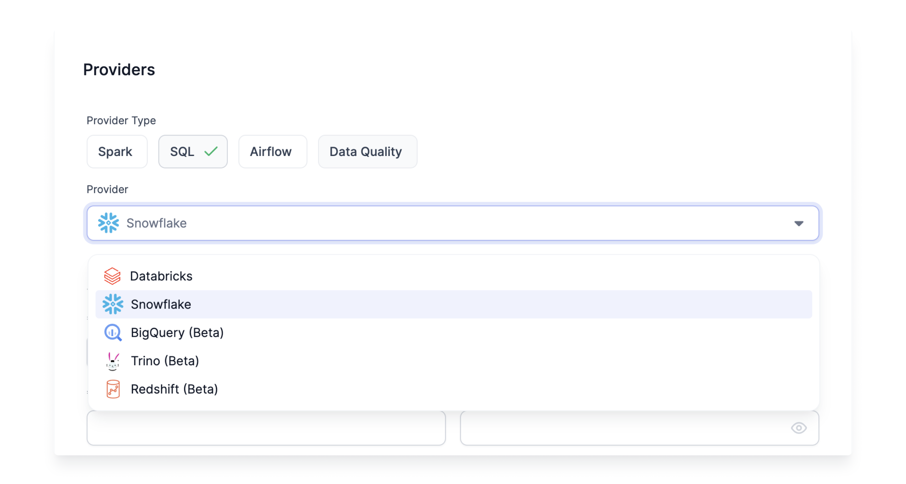

A Fabric is a logical execution environment. Teams can organize their data engineering into multiple environments such as development, staging, and production. SQL Fabrics define the credentials for Prophecy to connect to the SQL Warehouse. Importantly, each user must update the relevant Fabric with their own credentials. Once a SQL Fabric is created, Prophecy can ingest data, execute data models and generate target tables.

Prophecy supports Databricks and Snowflake SQL Warehouses, with more options coming soon.

1. Click [here](./snowflake.md) for steps to create a SQL Snowflake Fabric. To run Models on a schedule, setup an [Airflow Fabric](/docs/low-code-jobs/airflow/setup/setup.md), and add a [Connection](/docs/low-code-jobs/airflow/setup/mwaa.md#setting-up-snowflake-connection) to the Snowflake Fabric.

2. Click [here](./databricks.md) for steps to create a SQL Databricks Fabric. To run Models on a schedule, setup a [Databricks Job](/docs/low-code-jobs/databricks-jobs.md).
