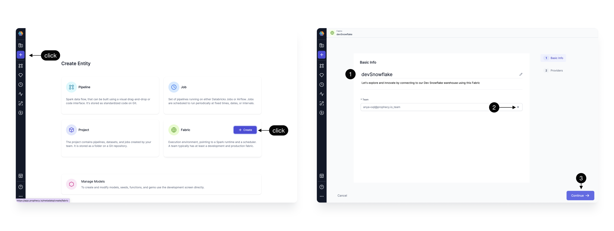
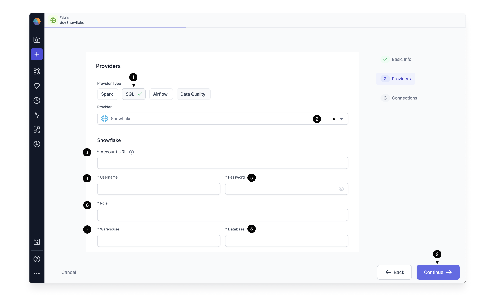
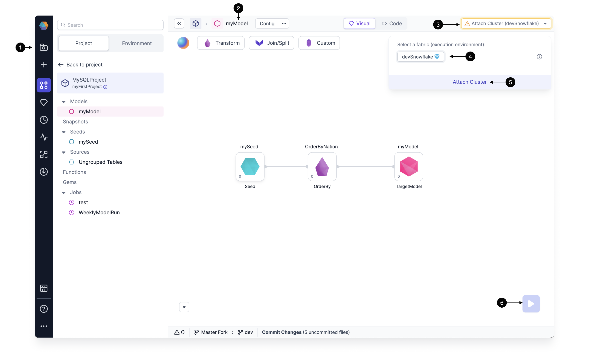

Snowflake has become a leading SQL Warehouse provider on the cloud. Follow the steps below to [Create a Fabric](./snowflake.md#create-a-fabric) in Prophecy so that you can execute data transformations on your Snowflake Warehouse. Power up Production models with [scheduled Jobs](./snowflake.md#schedule-jobs) on your Snowflake Warehouse using Airflow. Prophecy supports low-code development at every step.

## Create a Fabric

Create an entity by clicking the **plus** icon. Click to **Create a Fabric**.
There are two essential steps to creating a Fabric:

1. [Basic info](./snowflake.md#basic-info)
2. [Providers](./snowflake.md#provider)

### Basic Info

Each Fabric requires some **Basic information**

| Basic Info                                                                                                                                                                                       |
| ------------------------------------------------------------------------------------------------------------------------------------------------------------------------------------------------ |
| **1 Title** - Specify a title, like devSnowflake, for your Fabric. “dev” or “prod” are helpful descriptors for this environment setup. Also specify a description (optional).                    |
| **2 Team** - Select a team to own this Fabric. Click the dropdown to list the teams your user is a member. If you don’t see the desired team, ask a Prophecy Administrator to add you to a team. |
| **3 Continue** to the Provider step.                                                                                                                                                             |

### Provider

The SQL **Provider** is both the storage warehouse and the execution environment where your SQL code will run.

| Provider details                                                                                                                                                                                                                                                                                                                                                                       |
| -------------------------------------------------------------------------------------------------------------------------------------------------------------------------------------------------------------------------------------------------------------------------------------------------------------------------------------------------------------------------------------- |
| **1 Provider Type** - Select SQL as the Provider type. (Alternatively, create a Spark type Fabric using instructions [here](/docs/low-code-spark/fabrics/fabrics.md) or an Airflow type Fabric following these [instructions](/docs/low-code-jobs/airflow/setup/setup.md).)                                                                                                            |
| **2 Provider** - Click the dropdown menu for the list of supported Provider types. Select Snowflake.                                                                                                                                                                                                                                                                                   |
| **3 URL** - Add the Snowflake Account URL, which looks like this: `https://<org>-<account>.snowflakecomputing.com`                                                                                                                                                                                                                                                                    |
| **4 Username** - Add the username that Prophecy will use to connect to the Snowflake Warehouse.                                                                                                                                                                                                                                                                                        |
| **5 Password** - Add the password that Prophecy will use to connect to the Snowflake Warehouse. These username/password credentials are encrypted for secure storage. Also, each Prophecy user will provide their own username/password credential upon login. Be sure these credentials are scoped appropriately; Prophecy respects the authorization granted to this Snowflake user. |
| **6 Role** - Add the Snowflake [role](https://docs.snowflake.com/en/user-guide/security-access-control-overview#roles) that Prophecy will use to read data and execute queries on the Snowflake Warehouse. The role must be already granted to the username/password provided above and should be scoped according to the permission set desired for Prophecy.                         |
| **7 Warehouse** - Specify the Snowflake warehouse for default writes for this execution environment.                                                                                                                                                                                                                                                                                   |
| **8 Database and Schema** - Specify the desired Snowflake database (and below, the schema) for default writes for this execution environment.                                                                                                                                                                                                                                          |
| **9 Continue** to complete the Fabric creation.                                                                                                                                                                                                                                                                                                                                        |

:::info
Each user can read tables from each database and schema for which they have access. The default write database and schema is set here in the Fabric.
:::

Completed Fabrics will appear on the Metadata page and can be managed by Team admins.

Each team member can attach completed Fabrics to their Projects and Models.

| **Attach a Fabric to a Model**                                                                                                       |
| ------------------------------------------------------------------------------------------------------------------------------------ |
| **1 Metadata** - Click the Prophecy Metadata and search for a Project or Model of interest. Open the Model.                          |
| **2 Model** - Here we have opened a SQL model called "MyModel"                                                                       |
| **3 Attach Cluster** - This dropdown menu lists the Fabrics and execution clusters available to this Project, according to the Team. |
| **4 Snowflake Fabric** - The avaialable Fabrics appear here.                                                                         |
| **5 Attach Cluster** - The Snowflake Warehouse can be attached to the Model for execution.                                           |
| **6 Run Model** - Once a Fabric and Cluster are attached to the Project, the Model can be run interactively using the play button.   |

:::info
Remember, each user will be prompted to update the Fabric with their own credentials. Prophecy respects these credentials when reading Snowflake tables, databases, etc. User writes default to the database and schema defined in the Fabric.
:::

## Schedule Jobs

SQL models can be scheduled using Airflow to run on Snowflake. Create an [Airflow Fabric](https://docs.prophecy.io/low-code-jobs/airflow/setup/), and setup a [Snowflake Connection](https://docs.prophecy.io/low-code-jobs/airflow/setup/MWAA_fabric#setting-up-connections) that references the Snowflake Fabric created above. Prophecy supports Snowflake Connections from these three Airflow flavors: [Composer](https://docs.prophecy.io/low-code-jobs/airflow/setup/composer_fabric), [MWAA](https://docs.prophecy.io/low-code-jobs/airflow/setup/MWAA_fabric#setting-up-connections), and [Prophecy Managed Airflow](https://docs.prophecy.io/low-code-jobs/airflow/setup/prophecy-managed/connections/prophecy_managed_airflow_fabric_snowflake_connections).
