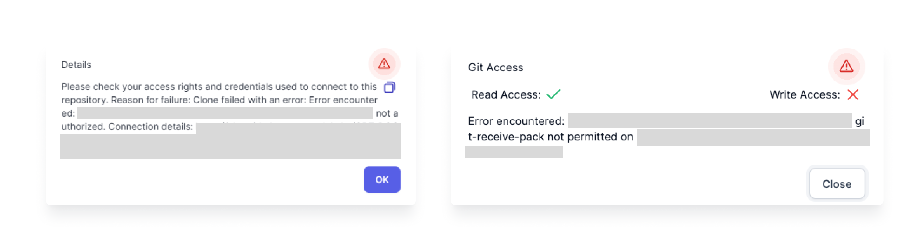

Sometimes there is an error when Prophecy tries to reach Git. This could be caused by your user's [authorization](#debugging-git-credentials), a [repository setting](debugging-repository-setttings), or a [network](#debugging-network-issues) issue. Fear not! This guide outlines what to do if you see error messages such as: ```not authorized```, ```git-upload-pack-not-permitted```, or ```git-recieve-pack-not-permitted```.




### Debugging Git Credentials

Sometimes your personal access token (PAT) has expired or lacks a certain permission.

#### Steps to fix: 
1. Check if your PAT has expired. If so, create a new one with sufficient read and write access to the repository of interest. Here are the instructions to locate existing tokens and create new tokens for [Github]((https://docs.github.com/en/enterprise-cloud@latest/authentication/keeping-your-account-and-data-secure/managing-your-personal-access-tokens#creating-a-personal-access-token-classic)), [Bitbucket](https://support.atlassian.com/bitbucket-cloud/docs/repository-access-tokens/), or [GitLab](https://docs.gitlab.com/ee/user/profile/personal_access_tokens.html#create-a-personal-access-token).
2. Open a terminal from a computer that can access your git repository. If you need help with this step, please reach out to your git administrator.
3. Have the new PAT ready; you'll use it in place of a password.
4. Check for read access by testing your ability to [clone](https://git-scm.com/docs/git-clone) a repo:  
```git clone```  
Here are the clone instructions for [Github](https://docs.github.com/en/enterprise-cloud@latest/authentication/keeping-your-account-and-data-secure/managing-your-personal-access-tokens#using-a-personal-access-token-on-the-command-line), [Bitbucket](https://support.atlassian.com/bitbucket-cloud/docs/clone-a-git-repository/), or [GitLab](https://docs.gitlab.com/ee/topics/git/clone.html).
5. Check for write access by testing your ability to [push](https://git-scm.com/docs/git-push) to a repo:  
```git push```  
Here are the push instructions for [Github](https://docs.github.com/en/enterprise-cloud@latest/get-started/using-git/pushing-commits-to-a-remote-repository), [Bitbucket](https://support.atlassian.com/bitbucket-cloud/docs/push-code-to-bitbucket/), or [GitLab](https://docs.gitlab.com/ee/topics/git/commands.html#git-push).
6. If your PAT lacks read or write permissions for the repository of interest, ask the repository admin to adjust these permissions. 
7. If access has changed recently, check with your github administrator to see if they have made any changes.

### Debugging Repository Settings

Sometimes a repository settings can restrict a user's permissions outside the user's profile settings page.

#### Steps to fix: 
1. Check if there are restrictions on writing to certain branches. 
2. Check if there are restrictions on commit hooks in the repository.
3. Check if there are restrictions on commit messages. 
4. Check if the user's role allows read and write access on the repository.
5. If access has changed recently, check with your github administrator to see if they have made any changes.

### Debugging Network Issues

If the PAT works outside the Prophecy UI as mentioned above but does not work inside the Prophecy UI then there may be network issues. If you're using app.prophecy.io, then seek a network admin to troubleshoot why Prophecy cannot read or write from the repository. If you're using a private Prophecy deployment, follow the instructions below.  

:::caution
The steps below are intended for Private SaaS deployments, i.e. Prophecy is deployed within your organization's network. The steps are intended for the person who owns the Prophecy deployment.
:::

#### Steps to fix:
1. Login to the metagraph pod.
2. If the remote repository is configured using SSL and the metagraph pod cannot reach the remote git server, then set ```SKIP_SSL_VERIFICATION``` to true.
3. If the remote repository is configured via a proxy and the metagraph pod cannot reach the remote git server, then add the proxy details to JVM options and restart.


If you're still facing issues, please don't hesitate to reach out to us by creating a Zendesk ticket or reaching out to your CSM.  
