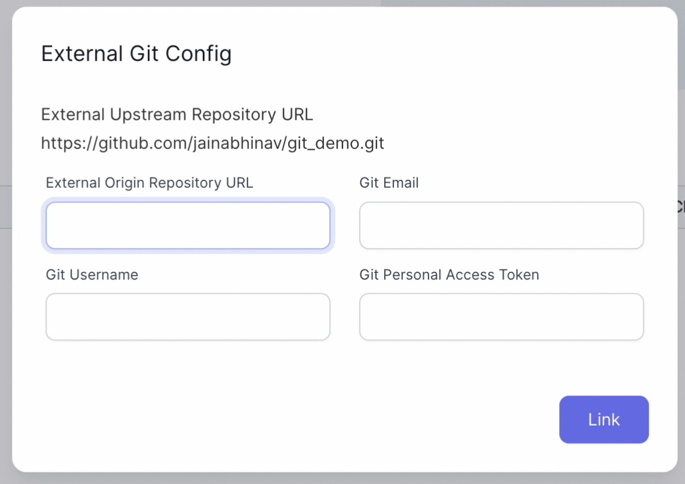
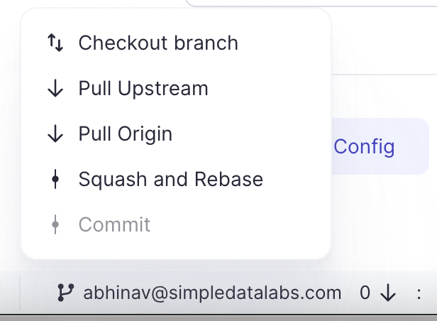

## How to connect to external Git

To connect to an external Git provider, Prophecy just need `Email`, `Username` and `Access Token`.

For Github Cloud we also have a first class integration to directly connect to your Github account by using `Login with Github` option.

Please refer below video for step-by-step example for how to set up your external Git provider:

<iframe src="https://user-images.githubusercontent.com/121796483/216262458-a2c4a45b-d999-4fe8-99eb-f39a494062ca.mp4" title="External Git" allow="autoplay;fullscreen" allowtransparency="true" frameborder="0" scrolling="no" class="wistia_embed" name="wistia_embed" msallowfullscreen width="100%" height="100%"></iframe>

Every user will have a `Prophecy Managed` Git provider already created in their account. You can just use this if you don't want to store your code to an external Git.

## How to create a new project with external Git provider

Once a Git Credential is created, these credentials can be used during project creation.

Please refer below video for step-by-step example

<iframe src="https://user-images.githubusercontent.com/121796483/216262055-a2507bfa-b363-4e41-8a32-c11896606173.mp4" title="External Git" allow="autoplay;fullscreen" allowtransparency="true" frameborder="0" scrolling="no" class="wistia_embed" name="wistia_embed" msallowfullscreen width="100%" height="100%"></iframe>

If you have not created your Git credentials already, you also have an option to create a new one from the project creation screen directly. They will also start reflecting in your Git screen and can be reused further for new projects.

## How to commit changes

When you create your first project, `dev` branch is automatically created for you. This is to ensure that no edits/commits are
made directly on the `main` branch and a proper CICD flow is followed during development.

Creation of first Pipeline and commit changes to `dev` branch:

<iframe src="https://user-images.githubusercontent.com/121796483/216262123-8f1c71d2-f4d9-40a4-bc6f-a11b81e2b68c.mp4" title="How to commit" allow="autoplay;fullscreen" allowtransparency="true" frameborder="0" scrolling="no" class="wistia_embed" name="wistia_embed" msallowfullscreen width="100%" height="100%"></iframe>

## How to create/checkout branch

Currently we are on `dev` branch which has our `first_pipeline`.
Now let's see how to go back to our `main` branch and also create a new `second_branch` from the main branch.

<iframe src="https://user-images.githubusercontent.com/103921419/174550774-0f71fd10-da7c-4ed5-bd7a-d724fe5aa7b7.mp4" title="How to create branch" allow="autoplay;fullscreen" allowtransparency="true" frameborder="0" scrolling="no" class="wistia_embed" name="wistia_embed" msallowfullscreen width="100%" height="100%"></iframe>

## How to merge changes

Let's merge our `first_pipeline` from `dev` branch into `main` branch.

<iframe src="https://user-images.githubusercontent.com/103921419/174550866-10de3632-0576-417f-99dd-8a71a916bed6.mp4" title="How to merge changes" allow="autoplay;fullscreen" allowtransparency="true" frameborder="0" scrolling="no" class="wistia_embed" name="wistia_embed" msallowfullscreen width="100%" height="100%"></iframe>

## How to Pull changes

Pulling changes from a branch is as simple as in any GUI based Git interface.
Let's pull our `main` branch into the empty `second_branch` which we created earlier. Please refer the below video for step-by-step example:

<iframe src="https://user-images.githubusercontent.com/103921419/174550900-b1f701bc-f1ef-4c5f-a39f-bd0378f71c27.mp4" title="How to pull changes" allow="autoplay;fullscreen" allowtransparency="true" frameborder="0" scrolling="no" class="wistia_embed" name="wistia_embed" msallowfullscreen width="100%" height="100%"></iframe>

:::note
Currently pull only from `main` branch to any specific branch is supported.
:::

## How to release a branch

Once the changes are merged, we can `release` a branch straight from the UI itself.

<iframe src="https://user-images.githubusercontent.com/103921419/174550916-7d8beb20-2013-401d-be30-67c02983958f.mp4" title="How to release a branch" allow="autoplay;fullscreen" allowtransparency="true" frameborder="0" scrolling="no" class="wistia_embed" name="wistia_embed" msallowfullscreen width="100%" height="100%"></iframe>

:::note
Databricks scheduler changes would only come into effect once the project is released.
:::

## How to resolve conflicts during merging

Now let's create a project in `third_branch` with same name as `first_pipeline` and put a different path in Dataset.
Post this once we pull the changes from `main` into this branch, it would have conflicts as `first_pipeline` exists both in
`main` and `current` branch.

One way is to use the Git interface directly to resolve conflicts between branches.

Or we can use the simple merge UI on Prophecy to resolve the conflicts

Let's see in the video below on how to resolve conflicts using simple merge on Prophecy:

<iframe src="https://user-images.githubusercontent.com/103921419/174733075-b878a77d-97df-4bc9-8baf-5fcc72e268db.mp4" title="How to resolve conflicts" allow="autoplay;fullscreen" allowtransparency="true" frameborder="0" scrolling="no" class="wistia_embed" name="wistia_embed" msallowfullscreen width="100%" height="100%"></iframe>

## How to use fork per user Git storage model

During the creation of project there is an option to choose fork per usage as Git Storage model.
When you fork a repository, you create a copy of the original repository (upstream repository) but the repository remains on your GitHub account.

When using the fork per usage Git storage model while creating a new project, apart from the `upstream repository` details, below extra
pop-up would come for details of `forked repository`.

Let's create a fork of our original repository and pull `main` branch from original repository to our newly created forked repository.

<iframe src="https://user-images.githubusercontent.com/103921419/174733053-a45b61e3-1ebb-4ca2-99d9-5ad0d8b67ddb.mp4" title="How to create fork" allow="autoplay;fullscreen" allowtransparency="true" frameborder="0" scrolling="no" class="wistia_embed" name="wistia_embed" msallowfullscreen width="100%" height="100%"></iframe>

Now to pull main branch from upstream repository or from origin of current repository is as simple as clicking on below
`Pull Upstream` or `Pull Origin` options

:::note

1. Any changes made in forked repository would not effect the `upstream repository` and would only reflect in the `forked repository`.
2. Please follow the normal Gßit flow for raising pull requests to the `original repository` (upstream repository) from the `forked repository`.

:::
