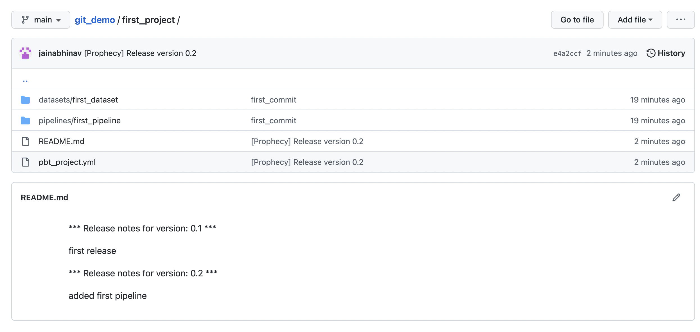

### External GIT integration

To connect to an external git, the process is as easy as configuring your:

1. GIT Repo URL: e.g. `https://github.com/user/git_demo.git`
2. Path: path to project inside the repo. e.g. `/first_project`
3. Email and username
4. Access token

Please refer the below video for step by step example:

<iframe src="https://user-images.githubusercontent.com/103921419/174399585-40067429-953e-4157-a5db-d80e25713d24.mp4" title="Avro Source" allow="autoplay;fullscreen" allowtransparency="true" frameborder="0" scrolling="no" class="wistia_embed" name="wistia_embed" msallowfullscreen width="100%" height="100%"></iframe>

### How to commit changes

When you create your first project, `dev` branch is automatically created for you. This is to ensure that no edits/commits are
made directly on the `main` branch and a proper CICD flow is followed during development.

Creation of first project and commit changes to `dev` branch:

<iframe src="https://user-images.githubusercontent.com/103921419/174399585-40067429-953e-4157-a5db-d80e25713d24.mp4" title="Avro Source" allow="autoplay;fullscreen" allowtransparency="true" frameborder="0" scrolling="no" class="wistia_embed" name="wistia_embed" msallowfullscreen width="100%" height="100%"></iframe>

### How to create/checkout branch

Currently we are on `dev` branch which has our first_pipeline.
Now let's see how to go back to our `main` branch and also create a new `second_branch` from the main branch.

<iframe src="https://user-images.githubusercontent.com/103921419/174399585-40067429-953e-4157-a5db-d80e25713d24.mp4" title="Avro Source" allow="autoplay;fullscreen" allowtransparency="true" frameborder="0" scrolling="no" class="wistia_embed" name="wistia_embed" msallowfullscreen width="100%" height="100%"></iframe>

### How to merge changes

Let's merge our `first_pipeline` from `dev` branch into `main` branch.

<iframe src="https://user-images.githubusercontent.com/103921419/174399585-40067429-953e-4157-a5db-d80e25713d24.mp4" title="Avro Source" allow="autoplay;fullscreen" allowtransparency="true" frameborder="0" scrolling="no" class="wistia_embed" name="wistia_embed" msallowfullscreen width="100%" height="100%"></iframe>

### How to Pull changes

Pulling changes from a branch is as simple as in any GUI based git interface.
Let's pull our `main` branch into the empty `second_branch` which we created earlier. Please refer the below video for step by step example:

<iframe src="https://user-images.githubusercontent.com/103921419/174399585-40067429-953e-4157-a5db-d80e25713d24.mp4" title="Avro Source" allow="autoplay;fullscreen" allowtransparency="true" frameborder="0" scrolling="no" class="wistia_embed" name="wistia_embed" msallowfullscreen width="100%" height="100%"></iframe>

### How to release a branch

Once the changes are merged, we can `release` a branch straight from the UI itself.

<iframe src="https://user-images.githubusercontent.com/103921419/174399585-40067429-953e-4157-a5db-d80e25713d24.mp4" title="Avro Source" allow="autoplay;fullscreen" allowtransparency="true" frameborder="0" scrolling="no" class="wistia_embed" name="wistia_embed" msallowfullscreen width="100%" height="100%"></iframe>

:::note
Databricks scheduler changes would only come into effect once the project is released.
:::

### How to resolve conflicts during merging

Now let's create a project in `third_branch` with same name as `first_pipeline` and put a different path in dataset.
Post this once we pull the changes from `main` into this branch, it would have conflicts as first_pipeline exists both in
`main` and `current` branch.

Let's see in the video below on how to resolve conflicts:

TODO

### How to fork per usage GIT storage model

TODO
