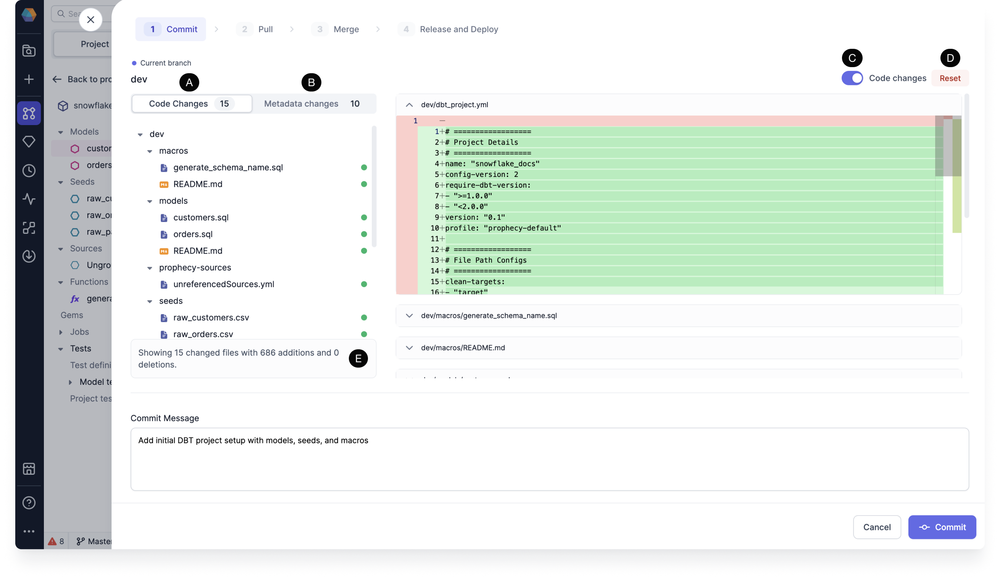

This page describes how to commit your changes and create new branches from the main branch.

## Commit changes into the dev branch

When you create your first Project, `dev` branch is automatically created for you. This is to ensure that no edits/commits are made directly on the `main` [branch](/concepts/Project/#Project-commits).

Within a Project, create a Pipeline and commit changes to the `dev/$USERNAME` branch:

<iframe src="https://user-images.Githubusercontent.com/121796483/216262123-8f1c71d2-f4d9-40a4-bc6f-a11b81e2b68c.mp4" title="How to commit" allow="autoplay;fullscreen" allowtransparency="true" frameborder="0" scrolling="no" class="wistia_embed" name="wistia_embed" msallowfullscreen width="100%" height="100%"></iframe>

code-based changes, Allows the users to compare the changed SQL code, on commits, between branches and on merge conflicts. Detailed specification pending.

Granular Change Visibility: Users need a way to understand detailed changes to their pipelines, datasets, and other entities for each branch and commit.

View changes to all files

Toggle Code changes to see

Changed files - A hierarchical tree view on the left side displays all files that have been created, modified, or deleted in the current branch. This list is split into two subviews:
“Code changes” - Includes all standard code changes in pipelines, datasets, etc., represented by readable SQL, Python, or YAML files.
“Prophecy metadata changes” - Contains proprietary metadata files specific to Prophecy. These are separated as they can usually be ignored and ideally should not be present in Git repositories.

Reset if you’d like to revert changes

## Create or checkout a branch

Currently we are on `dev` branch which has our `first_Pipeline`.
Now let's see how to go back to our `main` branch and also create a new `second_branch` from the main branch.

<iframe src="https://user-images.Githubusercontent.com/103921419/174550774-0f71fd10-da7c-4ed5-bd7a-d724fe5aa7b7.mp4" title="How to create branch" allow="autoplay;fullscreen" allowtransparency="true" frameborder="0" scrolling="no" class="wistia_embed" name="wistia_embed" msallowfullscreen width="100%" height="100%"></iframe>

