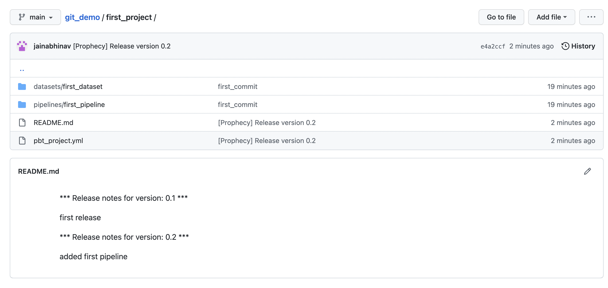

This page describes how to merge your changes into the main branch. You can also pull changes from the main branch into a new branch. Once you're done with merging, you can release your branch.

## Merge changes into the main branch

Let's merge our `first_Pipeline` from `dev` branch into `main` branch.

<iframe src="https://user-images.Githubusercontent.com/103921419/174550866-10de3632-0576-417f-99dd-8a71a916bed6.mp4" title="How to merge changes" allow="autoplay;fullscreen" allowtransparency="true" frameborder="0" scrolling="no" class="wistia_embed" name="wistia_embed" msallowfullscreen width="100%" height="100%"></iframe>

## Pull changes

Pulling changes from a branch is as simple as in any GUI based Git interface.
Let's pull our `main` branch into the empty `second_branch` which we created earlier. Please refer the below video for step-by-step example:

<iframe src="https://user-images.Githubusercontent.com/103921419/174550900-b1f701bc-f1ef-4c5f-a39f-bd0378f71c27.mp4" title="How to pull changes" allow="autoplay;fullscreen" allowtransparency="true" frameborder="0" scrolling="no" class="wistia_embed" name="wistia_embed" msallowfullscreen width="100%" height="100%"></iframe>

:::note
Currently pull only from `main` branch to any specific branch is supported.
:::

## Release a branch

Once the changes are merged, we can `release` a branch straight from the UI itself.

<iframe src="https://user-images.Githubusercontent.com/103921419/174550916-7d8beb20-2013-401d-be30-67c02983958f.mp4" title="How to release a branch" allow="autoplay;fullscreen" allowtransparency="true" frameborder="0" scrolling="no" class="wistia_embed" name="wistia_embed" msallowfullscreen width="100%" height="100%"></iframe>

:::note
Databricks scheduler changes would only come into effect once the Project is released.
:::
