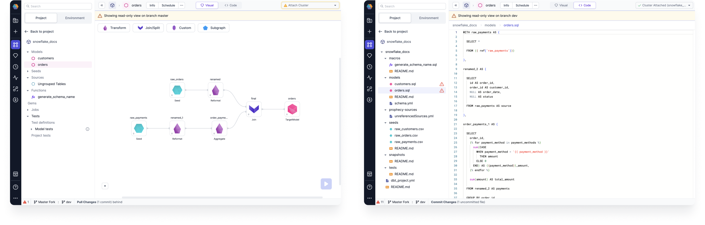

This page describes how to resolve conflicts that you may run into while merging your changes.

## Resolve conflicts during merging

Now let's create a Project in `third_branch` with same name as `first_Pipeline` and put a different path in Dataset.
Post this once we pull the changes from `main` into this branch, it would have conflicts as `first_Pipeline` exists both in
`main` and `current` branch.

One way is to use the Git interface directly to resolve conflicts between branches.

Or we can use the simple merge UI on Prophecy to resolve the conflicts

Let's see in the video below on how to resolve conflicts using simple merge on Prophecy:

<iframe src="https://user-images.Githubusercontent.com/103921419/174733075-b878a77d-97df-4bc9-8baf-5fcc72e268db.mp4" title="How to resolve conflicts" allow="autoplay;fullscreen" allowtransparency="true" frameborder="0" scrolling="no" class="wistia_embed" name="wistia_embed" msallowfullscreen width="100%" height="100%"></iframe>

For SQL, you code-based merge

Effective Conflict Resolution: Users require a mechanism to resolve merge conflicts for these granular changes efficiently.

Choose left or Right, Next, (Conflict resolved), Can toggle Code changes to view the code before validating.
Compile the files

View on branch master on the left, view on branch dev on the right.

Diagnostics
File icon here as well
Errors caused by conflict resolution
"Compilation failed due to errors. Please fix them before proceding."
Bottom Diagnostics, "Please connect the input port."
:::info Invalid coordinates
In rare cases, your dependency might be only accessible to the Spark cluster or the build system but not Prophecy
itself. If you're confident that the dependency is correct, but the validation error shows up, it's safe to press **Save
Anyways** to ignore that warning.
"Ignore Errors" or "Try Again" after fixing the errors.
:::

if the remote branch in a repo has a different commit history than the local copy of the branch then we will get an error.
In this case the only way to move forward would be to delete the local copy of the branch and then check it out again to pull the correct reference from the remote (origin).
Shouldn’t even arise, but if they did then they probably refreshed on screen
This doesn’t fix that
