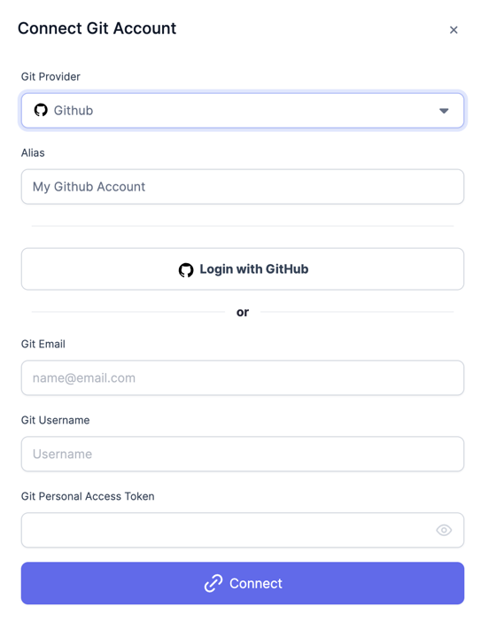
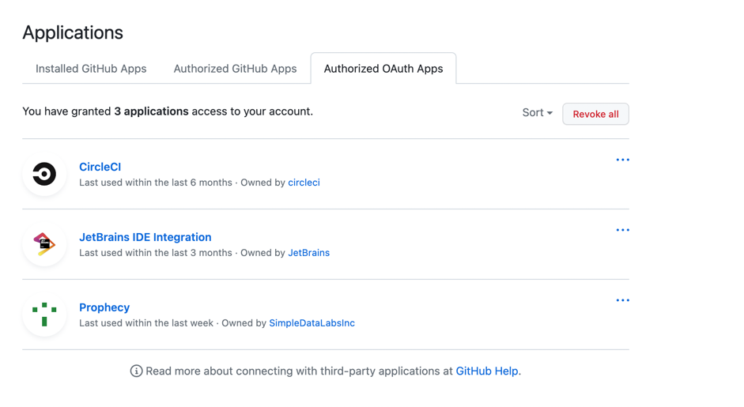
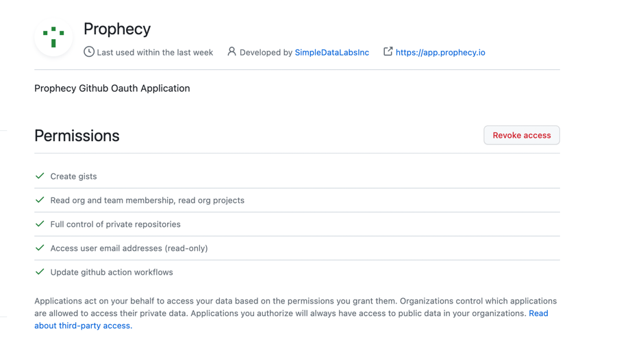

You must connect a Git account and authorize the Prophecy OAuth App in order to make commits and other changes to your Prophecy Project.

## How to connect to external Git

Configure your user's [Settings](https://app.prophecy.io/metadata/settings) with a new `Git` provider: enter `Email`, `Username` and `Personal Access Token`, or simply `Login with Github`.



The video below walks through connecting to an external Git provider:

<div class="wistia_responsive_padding" style={{padding:'56.25% 0 0 0', position:'relative'}}>
<div class="wistia_responsive_wrapper" style={{height:'100%',left:0,position:'absolute',top:0,width:'100%'}}>
<iframe src="https://user-images.Githubusercontent.com/121796483/216262458-a2c4a45b-d999-4fe8-99eb-f39a494062ca.mp4" title="External Git" allow="autoplay;fullscreen" allowtransparency="true" frameborder="0" scrolling="no" class="wistia_embed" name="wistia_embed" msallowfullscreen width="100%" height="100%"></iframe>
</div></div>

Every user will have a `Prophecy Managed` Git provider already created in their account. You can just use this if you don't want to store your code to an external Git.

## Authorizing Prophecy OAuth App

If you are a member of a GitHub Organization, it's important to note that you may need to [authorize our application](https://docs.github.com/en/apps/oauth-apps/using-oauth-apps/authorizing-oauth-apps) to access your organization. This authorization step is necessary to ensure that our application can authenticate the APIs required to access the repositories.

To grant authorization, follow the steps below:

1. Go to the [Authorized OAuth Apps settings page](https://github.com/settings/applications) on GitHub.
2. Look for our application named Prophecy in the list of authorized apps and click on the entry to view its details.



3. On the application details page, you should see an option to grant access to your organizations. Enable the necessary organization access permissions to allow our application to interact with your organization's repositories effectively. Please refer below image for permissions required.



After selecting the appropriate organization access permissions, click the Save or Authorize button to save your changes and grant access to our application.

If you encounter any issues during the authorization process or have any questions regarding organization access, please reach out to us at [contact us](mailto:success@Prophecy.io) for assistance.

## How to create a new Project with external Git provider

Once a Git Credential is created, it can be used during Project creation (video below). Later, this credential will be used to commit and release changes to Git for the entire Project.

<div class="wistia_responsive_padding" style={{padding:'56.25% 0 0 0', position:'relative'}}>
<div class="wistia_responsive_wrapper" style={{height:'100%',left:0,position:'absolute',top:0,width:'100%'}}>
<iframe src="https://user-images.Githubusercontent.com/121796483/216262055-a2507bfa-b363-4e41-8a32-c11896606173.mp4" title="External Git" allow="autoplay;fullscreen" allowtransparency="true" frameborder="0" scrolling="no" class="wistia_embed" name="wistia_embed" msallowfullscreen width="100%" height="100%"></iframe>
</div></div>

If you have not created your Git credentials already, you also have an option to create a Git credential from the Project creation screen directly. This Git credential can be reused for new Projects.

Note that each Project is associated with a repository. This is the location Prophecy will store the Project's code. Select a default branch and path within that repository.

:::info
To see a dropdown of repositories accessible to the Git user, be sure to connect from Prophecy using the native GitHub OAuth method, i.e. **Login with GitHub**. The dropdown list of repositories is not accessible to Prophecy if the Git connection uses the Personal Access Token method of authentication.
:::

## What's next

To commit and merge changes, and learn how to resolve conflicts, see the following pages:

```mdx-code-block
import DocCardList from '@theme/DocCardList';
import {useCurrentSidebarCategory} from '@docusaurus/theme-common';

<DocCardList items={useCurrentSidebarCategory().items}/>
```
