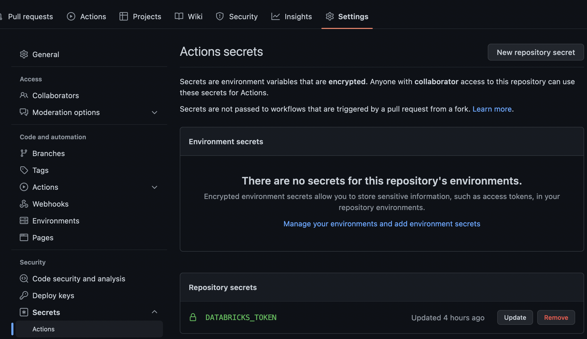

**Prophecy-built-tool** (PBT) allows you to quickly build, test and deploy projects generated by Prophecy (your standard Spark Scala and
PySpark Pipelines) to integrate with your own CI / CD (e.g. Github Actions), build system (e.g. Jenkins), and
orchestration (e.g. Databricks Workflows).

## Features (v1.0.4.1)

- Build and unit test all Pipelines in Prophecy projects (Scala and Python)
- Deploy Jobs with built Pipelines on Databricks
- Deploying Jobs filtered with Fabric ids on Databricks
- Integrate with CI/CD tools like GitHub Actions
- Verify the project structure of Prophecy projects
- Deploying Pipeline Configurations

## Requirements

- Python >=3.6 (Recommended 3.9.13)
- pip
- `pyspark` (Recommended 3.3.0)

## Installation

To install PBT, simply run:

```
pip3 install prophecy-build-tool
```

## Quickstart

### Usage

```shell
Usage: pbt [OPTIONS] COMMAND [ARGS]...

Options:
  --help  Show this message and exit.

Commands:
  build
  deploy
  test
```

### Running locally

The PBT cli can be used to build, test and deploy projects created by Prophecy that are present in your local filesystem.

Please make sure the **DATABRICKS_URL** and **DATABRICKS_TOKEN** environment variables are set appropriately pointing to your Databricks workspace before running any PBT commands.
Example:

```shell
export DATABRICKS_HOST="https://example_databricks_host.cloud.databricks.com"
export DATABRICKS_TOKEN="exampledatabrickstoken"
```

#### Building Pipelines and deploying Jobs

PBT can build and deploy Jobs inside your Prophecy project to the Databricks environment defined by the `DATABRICKS_HOST` and `DATABRICKS_TOKEN`
environment variables.

Since v1.0.3 PBT supports new input parameters that are used to determine the DBFS path where your project's artifacts would
be uploaded. These are the `--release-version` and `--project-id` parameters which would be used to replace the `__PROJECT_RELEASE_VERSION_ PLACEHOLDER__` and `__PROJECT_ID_PLACEHOLDER__` placeholders that would already be present in your Job's definition file
(`databricks-job.json`). Using a unique release version of your choice and the project's Prophecy ID
(as seen in the project's URL on the Prophecy UI) is recommended.

Example deploy command:

```shell
pbt deploy --path /path/to/your/prophecy_project/ --release-version 1.0 --project-id 10
```

Sample output:

```shell
Prophecy-build-tool v1.0.4.1

Found 1 jobs: daily
Found 1 pipelines: customers_orders (python)

Building 1 pipelines 🚰

  Building pipeline pipelines/customers_orders [1/1]

✅ Build complete!

Deploying 1 jobs ⏱

  Deploying job jobs/daily [1/1]
    Uploading customers_orders-1.0-py3-none-any.whl to
dbfs:/FileStore/prophecy/artifacts/...
Querying existing jobs to find current job: Offset: 0, Pagesize: 25
    Updating an existing job: daily

✅ Deployment completed successfully!
```

The `deploy` command also supports an advanced option `--dependent-projects-path` if there is a need to build projects other than the main project that has to be deployed.
This would be useful if there are dependent Pipelines whose source code can be cloned into a different directory accessible to PBT
while running `deploy` for the main project. This option supports only one path as argument but the path itself can contain multiple Prophecy projects within it in different
subdirectories.

Example deploy command:

```shell
pbt deploy --path /path/to/your/prophecy_project/ --release-version 1.0 --project-id 10 --dependent-projects-path /path/to/dependent/prophecy/projects
```

The `deploy` command also supports an advanced option `--fabric-ids` ( comma separated if more than one ), if there is a need to only deploy Jobs associated with certain Fabric ids,
you can find the Fabric id in your Prophecy metadata page.
following command will filter out and only deploy the jobs associated with given Fabric ids.
Example deploy:

```shell
pbt deploy --fabric-ids 647,1527 --path /path/to/your/prophecy_project/
```

Sample output:

```shell
Project name: HelloWorld
Found 2 jobs: ashish-TestJob2, ashish-TestJob
Found 4 pipelines: customers_orders (python), report_top_customers (python), join_agg_sort (python),
farmers-markets-irs (python)
[SKIP]: Skipping builds for all pipelines as '--skip-builds' flag is passed.

 Deploying 2 jobs
Deploying jobs only for given Fabric IDs: ['647', '1527']

[START]:  Deploying job jobs/TestJob2 [1/2]
[DEPLOY]: Job being deployed for fabric id: 1527
    Pipeline pipelines/farmers-markets-irs might be shared, checking if it exists in DBFS
    Dependent package exists on DBFS already, continuing with next pipeline
    Pipeline pipelines/report_top_customers might be shared, checking if it exists in DBFS
    Dependent package exists on DBFS already, continuing with next pipeline
    Querying existing jobs to find current job: Offset: 0, Pagesize: 25
    Updating an existing job: ashish-TestJob2

[START]:  Deploying job jobs/TestJob [2/2]
[DEPLOY]: Job being deployed for fabric id: 647
    Pipeline pipelines/customers_orders might be shared, checking if it exists in DBFS
    Dependent package exists on DBFS already, continuing with next pipeline
    Pipeline pipelines/join_agg_sort might be shared, checking if it exists in DBFS
    Dependent package exists on DBFS already, continuing with next pipeline
    Pipeline pipelines/report_top_customers might be shared, checking if it exists in DBFS
    Dependent package exists on DBFS already, continuing with next pipeline
    Querying existing jobs to find current job: Offset: 0, Pagesize: 25
    Updating an existing job: ashish-TestJob

✅ Deployment completed successfully!
```

By default, `deploy` command builds all pipelines and then deploys them, if you want to skip building all pipelines
( this could be useful, if you are running a `deploy` command after running `deploy` or `build` previously.)

```shell
pbt deploy --skip-builds --path /path/to/your/prophecy_project/
```

Complete list of options for PBT `deploy`:

```shell
pbt deploy --help
Prophecy-build-tool v1.0.4.1

Usage: pbt deploy [OPTIONS]

Options:
  --path TEXT                     Path to the directory containing the
                                  pbt_project.yml file  [required]
  --dependent-projects-path TEXT  Dependent projects path
  --release-version TEXT          Release version to be used during
                                  deployments
  --project-id TEXT               Project Id placeholder to be used during
                                  deployments
  --prophecy-url TEXT             Prophecy URL placeholder to be used during
                                  deployments
  --fabric-ids TEXT               Fabric IDs(comma separated) which can be
                                  used to filter jobs for deployments
  --skip-builds                   Flag to skip building Pipelines
  --help                          Show this message and exit.
```

#### Running all unit tests in project

PBT supports running unit tests inside the Prophecy project. Unit tests run with the `default` configuration present in the
Pipeline's `configs/resources/config` directory.

To run all unit tests present in the project, use the `test` command as follows:

```shell
pbt test --path /path/to/your/prophecy_project/
```

Sample output:

```shell
Prophecy-build-tool v1.0.1

Found 1 jobs: daily
Found 1 pipelines: customers_orders (python)

  Unit Testing pipeline pipelines/customers_orders [1/1]

    ============================= test session starts ==============================
    platform darwin -- Python 3.8.9, pytest-7.1.2, pluggy-1.0.0 -- /Library/Developer/CommandLineTools/usr/bin/python
    cachedir: .pytest_cache
    metadata: None
    rootdir: /path/to/your/prophecy_project/pipelines/customers_orders/code
    plugins: html-3.1.1, metadata-2.0.2
    collecting ... collected 1 item

    test/TestSuite.py::CleanupTest::test_unit_test_0 PASSED                  [100%]

    ============================== 1 passed in 17.42s ==============================

✅ Unit test for pipeline: pipelines/customers_orders succeeded.
```

#### Validating project

PBT supports validating all pipelines inside the Prophecy project. This allows users to check pipelines before deploying. Validation involves checking if the pipelines have any diagnostics. These are the same diagnostics which are shown on our Visual IDE.

To run validate all pipelines present in the project, use the `validate` command as follows:

```shell
pbt validate --path /path/to/your/prophecy_project/
```

Sample output:

```shell
Prophecy-build-tool v1.0.3.4

Project name: HelloWorld
Found 1 jobs: default_schedule
Found 4 pipelines: customers_orders (python), report_top_customers (python), join_agg_sort (python), farmers-markets-irs (python)

Validating 4 pipelines

  Validating pipeline pipelines/customers_orders [1/4]

 Pipeline is validated: customers_orders

  Validating pipeline pipelines/report_top_customers [2/4]

 Pipeline is validated: report_top_customers

  Validating pipeline pipelines/join_agg_sort [3/4]

 Pipeline is validated: join_agg_sort

  Validating pipeline pipelines/farmers-markets-irs [4/4]

 Pipeline is validated: farmers-markets-irs
```

## Integrating with GitHub Actions

PBT can be integrated with your own CI/CD solution to build, test and deploy Prophecy code. The steps for setting up PBT with Github Actions on your repository containing a Prophecy project is mentioned below.

### Pre-requisite

- A Prophecy project that is currently hosted in a Github repository

### Setting up environment variables and secrets

PBT requires environment variables **DATABRICKS_URL** and **DATABRICKS_TOKEN** to be set for complete functionality.

The **DATABRICKS_TOKEN** that needs to be used can be set as a secret inside the Github repository of the project.
Steps:

- Go to Settings > Secrets > Actions from the repository menu
- Click ‘New Repository secret’
- Add the secret with name DATABRICKS_TOKEN and value of the Databricks token to be used by PBT.

Screenshot after setting DATABRICKS_TOKEN secret:


The environment variables can now be all set within the Github actions YML file as follows:

```yaml
env:
  DATABRICKS_HOST: "https://sample_databricks_url.cloud.databricks.com"
  DATABRICKS_TOKEN: ${{ secrets.DATABRICKS_TOKEN }}
```

The complete YML file definition is discussed in the next section.

### Setting up a GitHub Actions Workflow on every push to main branch

We’re now ready to setup CI/CD on the Prophecy project.
To setup a workflow to build, run all unit tests and then deploy the built jar (Scala)/ whl (Python) on Databricks on every push to the main automatically:

- Create a .YML file in the project repository at the below location (relative to root)

```
.github/workflows/exampleWorkflow.yml
```

- Add the below contents to **exampleWorkflow.yml**

```yaml
name: Example CI/CD with Github actions

on:
  push:
    branches:
      - "main"

env:
  DATABRICKS_HOST: "https://sample_databricks_url.cloud.databricks.com"
  DATABRICKS_TOKEN: ${{ secrets.DATABRICKS_TOKEN }}

jobs:
  build:
    runs-on: ubuntu-latest

    steps:
      - uses: actions/checkout@v3
      - name: Set up JDK 11
        uses: actions/setup-java@v3
        with:
          java-version: "11"
          distribution: "adopt"
      - name: Set up Python 3.9.13
        uses: actions/setup-python@v4
        with:
          python-version: "3.9.13"
      # Install all python dependencies
      # prophecy-libs not included here because prophecy-build-tool takes care of it by reading each pipeline's setup.py
      - name: Install dependencies
        run: |
          python3 -m pip install --upgrade pip
          pip3 install build pytest wheel pytest-html pyspark==3.3.0  prophecy-build-tool
      - name: Run PBT build
        run: pbt build --path .
      - name: Run PBT test
        run: pbt test --path .
      - name: Run PBT deploy
        run: pbt deploy --path . --release-version 1.0 --project-id example_project_id
```

The above workflow does the following in order:

1. Triggers on every change that is pushed to the branch ‘main’.
2. Sets the environment variables required for PBT to run: DATABRICKS_HOST and DATABRICKS_TOKEN.
3. Sets up JDK 11, Python 3 and other dependencies required for PBT to run.
4. Builds all the Pipelines present in the project and generates a .jar/.whl file. If the build fails at any point a non-zero exit code is returned which stops the workflow from proceeding further and the workflow run is marked as a failure.
5. Runs all the unit tests present in the project using FABRIC_NAME(optional) as the configuration. If any of the unit test fails a non-zero exit code is returned which stops the workflow from proceeding further and the workflow run is marked as a failure.
6. Deploys the built .jar/.whl to the Databricks location mentioned in `databricks-job.json` mentioned in the `jobs` directory of the project. If the Job already exists in Databricks it is updated with the new .jar/.whl.
7. Deploys Pipeline configurations, if present, to the DBFS path mentioned in `databricks-job.json`.
8. If this process fails at any step, a non-zero exit code is returned which stops the workflow from proceeding further and the workflow run is marked as a failure.
