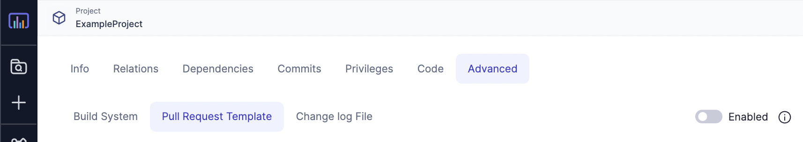
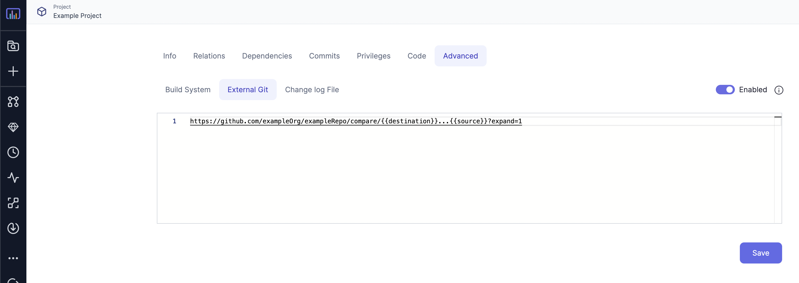
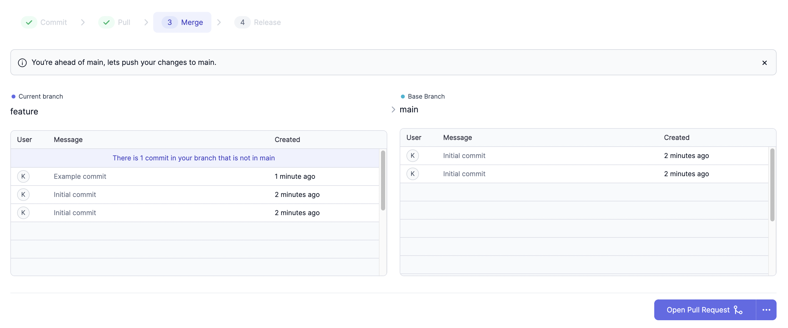

Prophecy supports opening pull requests on your external Git provider to merge
development branches to the base branch of a project's remote repository.
The below sections mention how to configure your repository to use this feature.

## Configuring PR templates

During the PR creation process, Prophecy will redirect users to their
external Git provider based on the template defined in the Advanced > External Git tab in the project's settings.



The PR template URL requires two variables which are used to build a URL string.
The `{{source}}` variable represents the active development branch, and the
`{{destination}}` variable
represents the base branch to which the feature/development branches need to be merged to
, eg. `main`.

Example template for a Github repository:

```shell
https://github.com/exampleOrg/exampleRepo/compare/{{destination}}...{{source}}?expand=1
```

An example pull request URL generated from the above template for merging a branch named `feature`
to branch `main` would look like:

```shell
https://github.com/exampleOrg/exampleRepo/compare/main...feature?expand=1
```

:::info
The pull request template would be automatically generated and populated in the Advanced > External Git
settings depending on your configured external Git provider. This auto-generation is
currently being done for Github, Github Enterprise, Gitlab, Gitlab Enterprise, BitBucket and Azure Devops repositories.
Users will be able to edit the autogenerated templates as well.
:::
An example of an autogenerated PR template for a project linked with GitHub:


## Raising pull requests

If the pull request template is configured correctly and enabled, users will be able to raise pull requests
during the `Merge` step of the `Commit` > `Pull` > `Merge` > `Release` process. Clicking on the `Open Pull Request` button would redirect
the user the external Git provider's pull request generation page.


