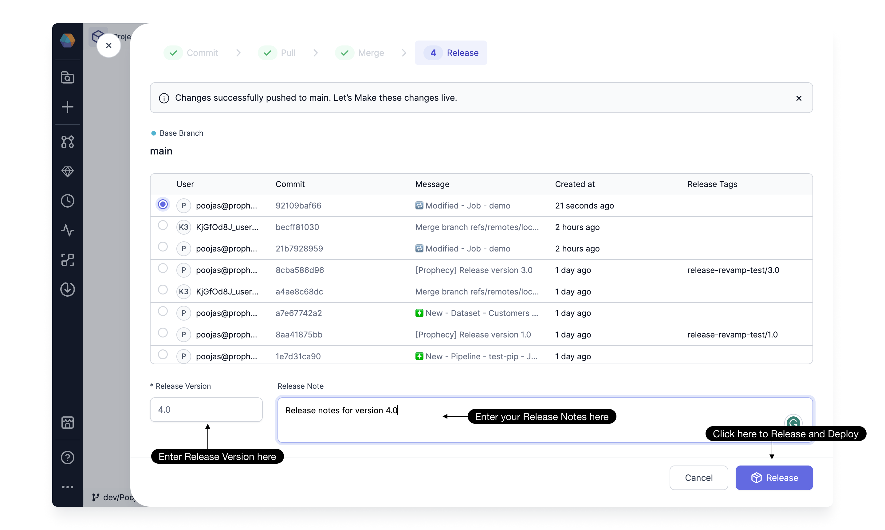

Once you have developed and tested your custom components like Gems, Pipelines, Models, or Jobs in Prophecy, the next step is to make them available for use. This involves Releasing and Deploying them to the respective environments.

## Overview

As part of the release process, we start by creating a [Git Tag](https://git-scm.com/book/en/v2/Git-Basics-Tagging) with a specified version. This tag is then pushed to your configured Git repository. Following this, the Pipelines, Gems, and Jobs in the Project are built and deployed to the respective environments.
Here's a breakdown of what deploying means for each component:

1. **Gems**: With Prophecy 3.2, you can create [Custom Gems](/docs/package-hub/package-builder/gem-builder.md) and use in your Pipelines. During the release, these gems are built and uploaded to an internal Artifactory. They aren't directly copied to your environments, as they are used in generating code for the Pipelines, not during Job/Pipeline execution.

2. **Pipelines**: Each Pipeline in the project is compiled and built into an artifact (Wheel file for Python and Jar file for Scala). These artifacts are then uploaded to your environment as part of the release process.

3. **Jobs**: Depending on the type of Job (Databricks or Airflow), the Job is copied to the respective environments as a Json file for Databricks Jobs and as a Python DAG for Airflow.

There is no specific deployment step needed for other entities.

## How to Release a Project

Once you've [committed](/docs/metadata/git.md#how-to-commit-changes) and [merged](/docs/metadata/git.md#how-to-merge-changes) your changes, you're ready to release them. To do this, Simply proceed with the [Release](/docs/metadata/git.md#how-to-release-a-branch), which takes care of both the release and deployment of Pipelines, Gems, and Jobs to respective environments.

:::info
Only an Admin user of the team can initiate a project release.
:::

## Advanced Release Settings

For most users, a regular project release takes care of both the release and deployment of Pipelines, Gems, and Jobs to respective environments. However, for users who want more control over their deployment process, we offer some advanced options in Project Settings.

:::info
Only an Admin user can modify these deployment settings for a project.
:::

When you navigate to Settings and Deployment, you'll find the following options:

### Auto-deploy

This option is enabled by default, meaning the release and deployment happen in a single step. The Release button handles building and deploying all Pipelines, Gems, and Jobs, and uploading the required artifacts to the respective environments. You can turn this off to break down the process into two steps: **Release** and **Deploy**.

Todo: Inset Image

#### Release

With Auto-deploy turned off, the Release step only creates a [Git Tag](https://git-scm.com/book/en/v2/Git-Basics-Tagging) and pushes it to your Git repository. It doesn't build or upload any artifacts. This speeds up the release process for larger projects with numerous pipelines and jobs.

#### Deploy

After the release, you can proceed to deploy directly or choose to deploy later from the Deploy option. This Deploy step builds all the Pipelines and Gems, uploads the artifacts, and schedules all the Jobs in the Project to the respective environments.
Todo: Inset image

#### Override Fabric

In the Deploy step, you have the option to choose a specific environment (Fabric) for deploying the Jobs. This is useful for testing purposes, allowing you to deploy all Jobs to a designated test environment.
:::note
This is an optional step and overrides the environment for this particular Job deployment. Leave it blank to use the Job-selected fabrics.
:::

### Selective Job Deployment

This option is disabled by default and cannot be used in conjunction with Auto-deploy. You can enable this if you want to select specific Jobs during the Deploy step. This is helpful when you have many Pipelines and Jobs in the same project and only want to deploy a few at a time. It also speeds up the overall process by only building the Pipelines used in the selected Jobs.

With this option enabled, you can select the Jobs you wish to deploy during the deploy step.
:::caution
Different versions of pipelines, datasets, and subgraphs may coexist within the same environment when selectively deploying jobs. Only the deployed jobs will use the latest versions of pipelines, datasets, and subgraphs.
:::

## Releases and Deployment History

The Releases and Deployments tab in the Project Metadata displays the release history and the currently deployed Jobs.

### Releases

In the Releases tab, you'll find a list of all tags, who created them, when they were created, and the latest tag. It also provides a link to the logs of the latest deployment associated with that tag.

You can even use the Refresh icon to pull release tags created outside of Prophecy directly into your Git.

### Deployments

In this tab, you can view the current state of all deployed Jobs per environment. Select the environment you want to see the deployed Jobs for, and it will list all the Jobs deployed in that environment, along with their versions and deployment logs.

:::note
Coming soon: We'll soon be adding a way to view the history of all deployments triggered by any user, including logs for any failed deployments.
:::
