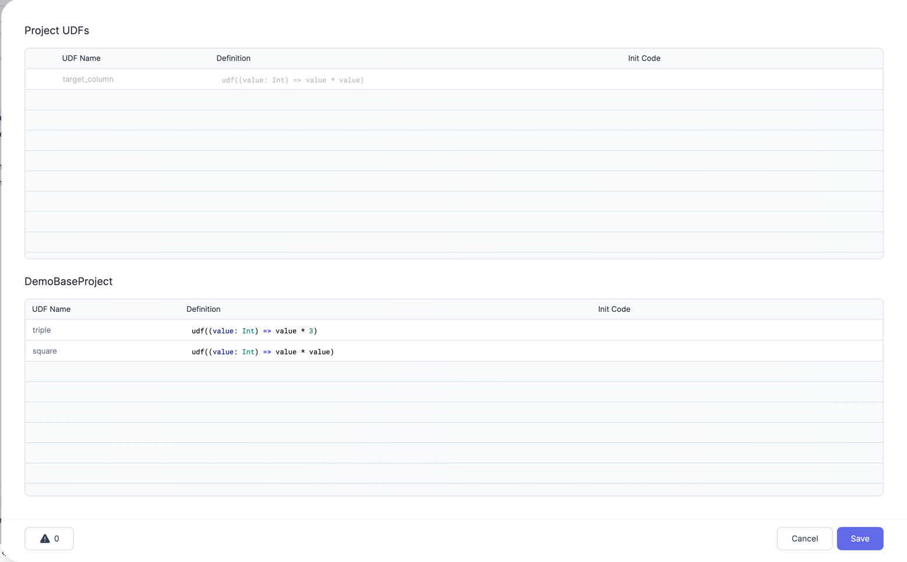
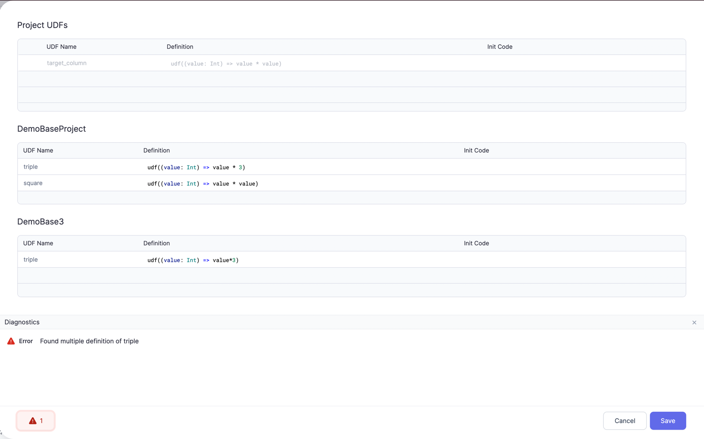

Users can share the [user-defined functions (UDF)](/docs/Spark/extensibility/user-defined-functions.md) across their Pipelines and Projects.

## Across Pipelines

Any UDF defined in a Pipeline is defined at the Project level by default. So, it is accessible to all Pipelines in the Project immediately.
As a user opens a Pipeline, the UDFs are also copied to the Code of that Pipeline. They would also see the same changes reflected in the uncommitted changes for their Pipeline.

See this video for an example:

   <iframe src="https://www.loom.com/embed/94c362dcffe04a66be6d63502f0c0cfb" frameborder="0" webkitallowfullscreen mozallowfullscreen allowfullscreen
      style={{position: 'absolute', top: 0, left: 0, width: '100%', height: '100%'}}></iframe>

:::warning

Note that UDF code is only copied to Code for that Pipeline once the Pipeline is opened.
So, if a user has edited or added UDF in a Pipeline, you might see uncommitted changes for another Pipeline whenever you open it.

:::

## Across Projects

Once a Project (let's call it _BaseProject_) is added as a [Dependency](/docs/package-hub/package-hub.md#use-a-package) to another Project (let's call it _AppProject_), all Project-level UDFs from _BaseProject_ are available in all Pipelines of _AppProject_.

For example:

:::info

Please note that all these UDF are ready only in _AppProject_ and can only be edited in _BaseProject_.

:::

Also, if a User has UDFs coming from two different Projects with conflicting definitions, they will see an error diagnostics in the UDF screen as below.

If a UDF is modified or a new UDF is added in _BaseProject_, these changes will only reflect in _AppProject_ after the user Releases the _BaseProject_ again, and updates dependency in _AppProject_
