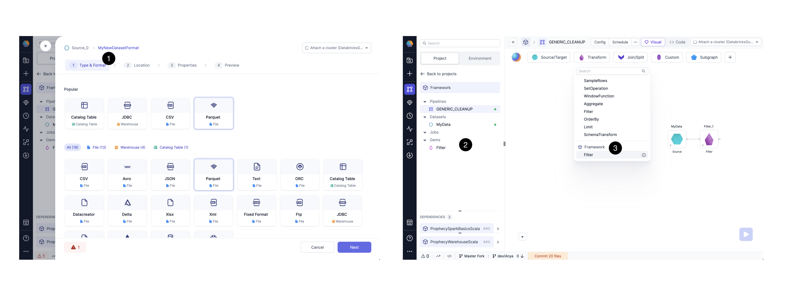
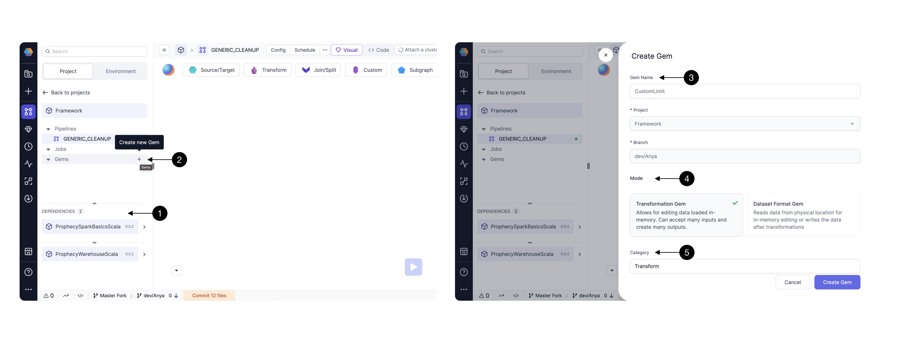
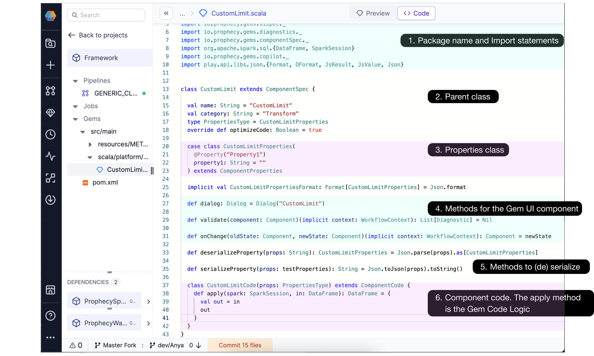
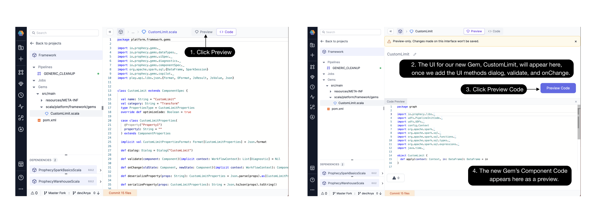
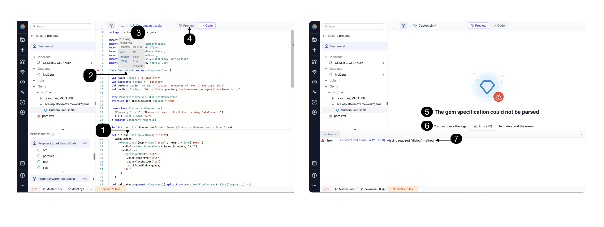
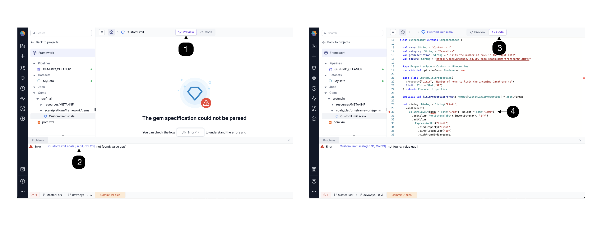
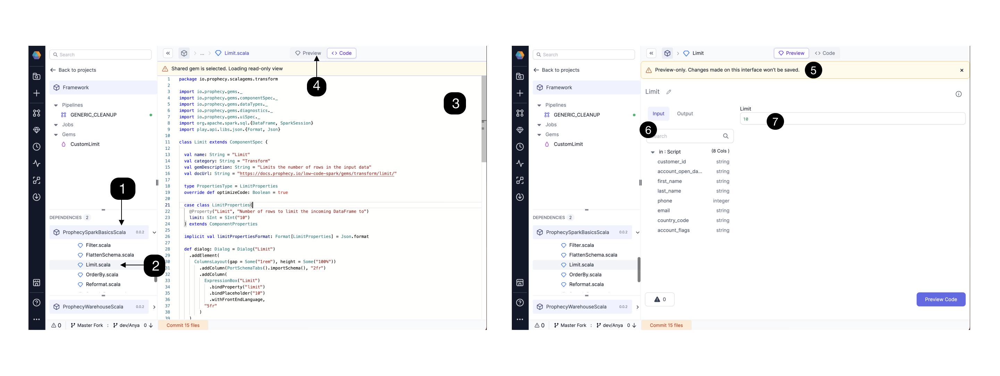
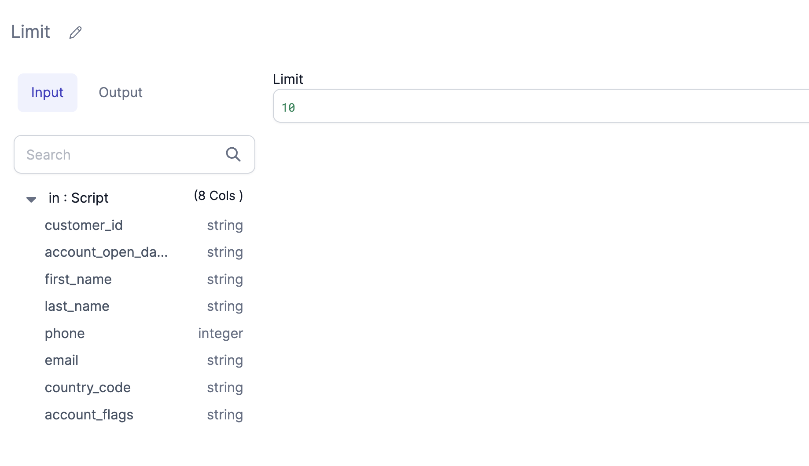
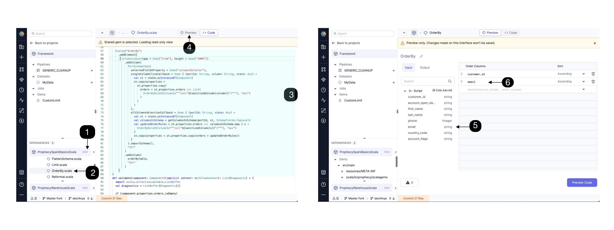

While Prophecy offers dozens of Gems out-of-the-box, some data practitioners want to extend this idea and create their own Gems. Incorporate your custom code into a Prophecy Gem. As part of Prophecy’s **Package Builder**, publish your custom Gem with the entire Project to the **[Package Hub](/docs/package-hub/package-hub.md)** or share with selected teams.

## Quickstart

When you’re ready to create a package, everything within the selected project will be part of the package. That includes Pipelines, subgraphs, jobs, custom Gems, etc. This document explores the most important part of the package: Custom Gems.

### Quicksteps to create and share a custom Gem

1. Create a new Spark (Python / Scala) or SQL Project or open an existing project. While this document is focused on Python and Scala, [SQL coders can also create Gems using Macros](/docs/package-hub/package-builder/gem-builder.md#faq).
2. [Add](/docs/package-hub/package-builder/gem-builder.md#add-gem) a new Gem.
   Notice some skeleton (guide) code to get started. Click Preview to review the user interface (UI) for your custom Gem.
3. [Edit](/docs/package-hub/package-builder/gem-builder.md#edit-gem) the Gem: Paste/Write your code specification at the prompt. Use the [Gem Structure](/docs/package-hub/package-builder/gem-builder.md#gem-structure) to understand each code section.
4. [Update](/docs/package-hub/package-builder/gem-builder.md#update-gem) the Gem. Release the Project. The new custom Gem is included in the versioned Package on Git with the rest of the elements of the Project. Share the Package with specific teams or publish to the Package Hub for better visibility.

That’s it! Creating a custom Gem in Prophecy is easy. Now the Package can be named as a dependency and used across Projects. Let’s dig into the steps in detail below.

## Add Gem

### Gem modes

There are two Gem modes:

#### Dataset Format

1. This mode allows for the custom definition of Dataset Formats beyond the provided formats (xml, csv, avro, parquet, json, etc).
2. Select whether you'd like your data to be read as a batch, which can be defined incrementally, or as a stream in real time.
3. When a Dataset Format Gem is created, the new format can be used when creating Datasets. Find a new card for your custom DatasetFormat Gem in the **(1) Dataset Type and Format** listing. See the image below.

#### Transformation

1. These Gems apply transformations/joins/any other custom logic onto any DataFrame(s) that are passed into them.
2. When a new Transformation Gem is created, the user will be able to drag-and-drop the new Gem from the list in the **(2) Project Browser** or **(3) Gem dropdown menu.**



Programmatically, a Gem is a component with the following parts:

- The **Gem UI Component** to get user information from the screen. (This code is rendered on the Prophecy UI).
- The **Gem Code Logic** which is how the Gem acts within the context of a Pipeline.

### Create Gem

When you create a new project, notice there are **(1) default dependencies** included and there’s a new entity inside each project called **(2) “Gems.”** Click the + icon to create a new Gem. **(3) Name** your Gem, **(4) select** mode (either transformation or Dataset format), and select the **(5) category.** In this simple example, we name our Gem “Custom Limit.”


Together you and Prophecy will create code that will later be committed to your repository. Prophecy starts by providing skeleton code to get started.

### Skeleton Code

Lets explore the skeleton code and see which aspects should always be included. There are several aspects to note in the basic skeleton:

The skeleton code includes the **(1) package name** and **import statements**, definition for the new Gem’s **(2) parent class** and **(3) properties class**, methods to define the **(4) Gem’s User Interface**, methods to **(5) serialize and deserialize**, and the **(6) component code** for the new Gem.

With this code skeleton, you’ll already have a basic UI to get started. Get familiar with the basic UI:

To see the UI, click **(1) Preview**. The **(2) UI** appears basic and is ready for us to customize it. We’ll do that next. **(3) Preview Code** is a handy button to view the **(4) Component Code**.

### Viewing errors

Errors are surfaced in the GemBuilder UserInterface (UI). If there’s an error on any of the [required] methods, the UI will inform you this way:


If there is a **(1) typo / error** in a required method, eg dialog1 instead of dialog, Prophecy will direct your attention to a particular line of code. Click the **(2) underlined code**, and notice a **(3) detailed error message**. Click **(4) Preview** to see how the Gem will look as rendered in the UI. If a value is incorrect, the Gem will not be able to be parsed, and a very clear error will appear **(5) here** as well. Click the **(6) Errors** button to see the **(7) full error message**.

:::caution

“The Gem specification could not be parsed” means that there’s an error in one or more required methods, classes, or properties. These components could not be analyzed and/or converted into the Gem User Interface (UI).

:::


If you find yourself in the **(1) Preview** screen unsure what has caused your error, click the link in the **(2) error message** to reach the **(3) code view** and find the **(4) underlined problematic value**.

## Edit Gem

In our “CustomGem,” we don’t see any UI components yet because we need to add them. Let’s take inspiration from the **Limit** Gem code that’s provided in the **SparkBasicsScala** package.



**(1) Open the SparkBasicsScala dependency**. (If you’re using a Python project, then open the SparkBasicsPython dependency). **(2) Click Limit**, an existing Gem we can use for inspiration. Explore the **(3) Limit Gem code**. We will use some or all the code for our new Custom Limit Gem. **(4) Click Preview** and **(5) view the UI** for the Limit Gem. This UI has an example **(6) Input schema** so we can see how the user would interact with the Gem’s interface. The user will be able to view input/output schema and enter a **(7) value** in the Limit field.

The Limit Gem’s code is explained in detail in the Gem Structure [sections](#gem-structure) below. [Extend](#extend) the classes and make a change, for example change the default limit value from 10 to 50. Your new Gem is available to drag-n-drop into the Pipeline canvas as demonstrated in the short video below. Test it out in a Pipeline! Make any changes needed on the feature branch.

<div class="wistia_responsive_padding" style={{padding:'56.25% 0 0 0', position:'relative'}}>
<div class="wistia_responsive_wrapper" style={{height:'100%',left:0,position:'absolute',top:0,width:'100%'}}>
<iframe src="https://fast.wistia.net/embed/iframe/7jd6ns0m0b?seo=false?videoFoam=true" title="Getting Started With SQL Video" allow="autoplay; fullscreen" allowtransparency="true" frameborder="0" scrolling="no" class="wistia_embed" name="wistia_embed" msallowfullscreen width="100%" height="100%"></iframe>
</div></div>
<script src="https://fast.wistia.net/assets/external/E-v1.js" async></script>

## Update

Once you have tested your Gem in the canvas, and you are happy with both the **Gem UI Component** and **Gem Code Logic**, you will want to update the Gem by releasing a tagged version. Continue developing and releasing new versions as incremental improvements! When you’re ready to re-use this code in other projects, share with specific teams or publish to the Package Hub. See the [Package Hub](/docs/package-hub/package-hub.md#build-a-package) page for details.

## Gem structure

The best way to learn how to create new Gems is to learn by example from the existing Gems. Find below a detailed Transform Gem Example, the Limit Gem. Afterward, extend your Gem by using examples as inspiration.

:::important

Every Gem must have package and import statements, parent class, properties class, required methods (dialog, validation, onChange, serialize/deserialize for Scala, apply), and component code.

:::

### Transform Gem Example

Here we break down the code for the Limit Gem section by section.

#### Package and Import statements

:::note

For Scala, be sure to update package to reflect your Gem’s Project name. In this case, my CustomLimit Gem is created in my Framework Project. So I will use the statement `package platform.framework.Gems`

:::

````mdx-code-block
import Tabs from '@theme/Tabs';
import TabItem from '@theme/TabItem';

<Tabs>
<TabItem value="py" label="Python">

```py
from prophecy.cb.server.base.ComponentBuilderBase import *
from pyspark.sql import *
from pyspark.sql.functions import *

from prophecy.cb.server.base.datatypes import SInt
from prophecy.cb.ui.uispec import *
from prophecy.cb.server.base import WorkflowContext

```

</TabItem>

<TabItem value="Scala" label="Scala">

```Scala

package platform.< project name >.Gems
import io.prophecy.Gems._
import io.prophecy.Gems.componentSpec._
import io.prophecy.Gems.dataTypes._
import io.prophecy.Gems.diagnostics._
import io.prophecy.Gems.uiSpec._
import org.apache.spark.sql.{DataFrame, SparkSession}
import play.api.libs.json.{Format, Json}

```

</TabItem>
</Tabs>

````

#### Parent Class

Every Gem class needs to extend a parent class from which it inherits the representation of the overall Gem. This includes the UI and the logic. For transform Gems, you need to extend ComponentSpec .

Next provide the name and category of your Gem, "Limit" and "Transform" in this example.

Another thing to note here is optimizeCode. This flag can be set to True or False value depending on whether we want the Prophecy Optimizer to run on this code to simplify it. In most cases, it's best to leave this value as True.

````mdx-code-block

<Tabs>
<TabItem value="py" label="Python">

```py
class Limit(ComponentSpec):
    name: str = "Limit"
    category: str = "Transform"
    GemDescription: str = "Limits the number of rows in the output"
    docUrl: str = "https://docs.prophecy.io/Spark/Gems/transform/limit/"

    def optimizeCode(self) -> bool:
        return True

    @dataclass(frozen=True)

```

</TabItem>

<TabItem value="Scala" label="Scala">

```Scala

class Limit extends ComponentSpec {

  val name: String = "Limit"
  val category: String = "Transform"
  val GemDescription: String = "Limits the number of rows in the input data"
  val docUrl: String = "https://docs.prophecy.io/Spark/Gems/transform/limit/"

  type PropertiesType = LimitProperties
  override def optimizeCode: Boolean = true
  ...
```
</TabItem>
</Tabs>

````

For our CustomLimit Gem, we can take the same code as the Limit Gem, just changing the class name and the val name.

#### Properties Class

There is one class (seen here as LimitProperties) that contains a list of the properties to be made available to the user for this particular Gem. Think of these as all the values a user fills out within the interface of this Gem, or any other UI state that you need to maintain (seen here as limit).

:::caution

The content of these Properties classes is persisted in JSON and stored in Git.

:::

These properties are available in validate, onChange and apply and can be set from dialog, functions.

````mdx-code-block

<Tabs>
<TabItem value="py" label="Python">

```py
    class LimitProperties(ComponentProperties):
        limit: SInt = SInt("10")

```

</TabItem>

<TabItem value="Scala" label="Scala">

```Scala

  case class LimitProperties(
    @Property("Limit", "Number of rows to limit the incoming DataFrame to")
    limit: SInt = SInt("10")
  ) extends ComponentProperties

```
</TabItem>
</Tabs>

````

For our CustomLimit Gem, we can take the same case class as the Limit Gem, maybe changing the default limit value.

Now let’s take a look at the methods for the UI Gem component.

#### Dialog

The dialog function contains code specific to how the Gem UI should look to the user.

````mdx-code-block
<Tabs>
<TabItem value="py" label="Python">

```py
 def dialog(self) -> Dialog:
        return Dialog("Limit").addElement(
            ColumnsLayout(gap="1rem", height="100%")
                .addColumn(PortSchemaTabs().importSchema(), "2fr")
                .addColumn(
                ExpressionBox("Limit")
                    .bindPlaceholder("10")
                    .bindProperty("limit")
                    .withFrontEndLanguage(),
                "5fr"
            )
        )


```

</TabItem>

<TabItem value="Scala" label="Scala">

```Scala
 def dialog: Dialog = Dialog("Limit")
    .addElement(
      ColumnsLayout(gap = Some("1rem"), height = Some("100%"))
        .addColumn(PortSchemaTabs().importSchema(), "2fr")
        .addColumn(
          ExpressionBox("Limit")
            .bindProperty("limit")
            .bindPlaceholder("10")
            .withFrontEndLanguage,
          "5fr"
        )
    )
```

</TabItem>
</Tabs>

````

The above Dialog function in the limit Gem is rendered on the UI like this:


There are various UI components that can be defined for custom Gems such as scroll boxes, tabs, buttons, etc.

These UI components can be grouped together in various types of panels to create a custom user experience when using the Gem. After the Dialog object is defined, it's serialized as JSON, sent to the UI, and rendered there.

Depending on what kind of Gem is being created, either a Dialog or a DatasetDialog needs to be defined. See Transformation vs DatasetFormat Gems for details.

Take a look through the Gems inside SparkBasicsScala and SparkBasicsPython Projects to for more example dialog methods.

#### Validation

The validate method performs validation checks so that in the case where there's any issue with any inputs provided for the user an Error can be displayed. In our example case the Limit condition must be an integer within a defined range. Similarly, you can add any validation on your properties.

````mdx-code-block

<Tabs>
<TabItem value="py" label="Python">

```py
 def validate(self, context: WorkflowContext, component: Component[LimitProperties]) -> List[Diagnostic]:
        diagnostics = []
        limitDiagMsg = "Limit has to be an integer between [0, (2**31)-1]"
        if component.properties.limit.diagnosticMessages is not None and len(component.properties.limit.diagnosticMessages) > 0:
            for message in component.properties.limit.diagnosticMessages:
                diagnostics.append(Diagnostic("properties.limit", message, SeverityLevelEnum.Error))
        else:
            resolved = component.properties.limit.value
            if resolved <= 0:
                diagnostics.append(Diagnostic("properties.limit", limitDiagMsg, SeverityLevelEnum.Error))
            else:
                pass
        return diagnostics
```

</TabItem>

<TabItem value="Scala" label="Scala">

```Scala
 def validate(component: Component)(implicit context: WorkflowContext): List[Diagnostic] = {
    import Scala.collection.mutable.ListBuffer

    val diagnostics = ListBuffer[Diagnostic]()

    val (diag, limit) = (component.properties.limit.diagnostics, component.properties.limit.value)
    diagnostics ++= diag

    val limitDiagMsg = "Limit has to be an integer between [0, (2**31)-1]"
    if (limit.isDefined) {
      if (limit.get < 0)
        diagnostics += Diagnostic("properties.limit", limitDiagMsg, SeverityLevel.Error)
    }
    diagnostics.toList
  }

```

</TabItem>
</Tabs>

````

#### State Changes

The onChange method is given for the UI State transformations. You are given both the previous and the new incoming state and can merge or modify the state as needed. The properties of the Gem are also accessible to this function, so functions like selecting columns, etc. are possible to add from here.

````mdx-code-block

<Tabs>
<TabItem value="py" label="Python">

```py
    def onChange(self, context: WorkflowContext, oldState: Component[LimitProperties], newState: Component[LimitProperties]) -> Component[
        LimitProperties]:
        return newState
```

</TabItem>

<TabItem value="Scala" label="Scala">

```Scala
  def onChange(oldState: Component, newState: Component)(implicit context: WorkflowContext): Component = newState
```

</TabItem>
</Tabs>

````

#### Serialize/Deserialize

Serialize and deserialize methods in Scala are now open source and exposed to the user, so you could extend your own serializer classes if desired, using Play JSON [library](https://www.playframework.com/documentation/2.8.x/ScalaJson) or any other format.

````mdx-code-block

<Tabs>
<TabItem value="py" label="Python">

```py
< not applicable for Python >
```

</TabItem>

<TabItem value="Scala" label="Scala">

```Scala

 override def deserializeProperty(props: String): PropertiesType = Json.parse(props).as[PropertiesType]

  override def serializeProperty(props: PropertiesType): String = Json.stringify(Json.toJson(props))

```

</TabItem>
</Tabs>

````

:::note
For Scala, this snippet binds the UI Properties to the case class:

`(props: testProperties): String = Json.toJson(props).toString()`
:::

#### Component code

The last class used here is LimitCode which is inherited from ComponentCode class. This class contains the actual Spark code that needs to run on your Spark cluster. The Spark code for the Gem logic is defined in the apply function. Input/Output of apply method can only be DataFrame or list of DataFrames or empty. For example, we are calling the .limit() method in this example in the apply function.

````mdx-code-block

<Tabs>
<TabItem value="py" label="Python">

```py

    class LimitCode(ComponentCode):
        def __init__(self, newProps):
            self.props: Limit.LimitProperties = newProps

        def apply(self, spark: SparkSession, in0: DataFrame) -> DataFrame:
            return in0.limit(self.props.limit.value)

```

</TabItem>

<TabItem value="Scala" label="Scala">

```Scala
class LimitCode(props: PropertiesType) extends ComponentCode {

    def apply(spark: SparkSession, in: DataFrame): DataFrame = {
      val out = in.limit(props.limit)
      out
    }

  }
```

</TabItem>
</Tabs>

````

You can go ahead and preview the component to see how it looks. Note some Gem examples have functions defined within the apply method.

That’s all the code for our example Transformation, the Limit Gem. We walked through the package and import statements, parent class, and properties class. We explored the required methods dialog, validation, onChange, (de)serializeProperty. Finally we saw the Limit Gem’s component code. Now we have a basic understanding of the components needed for any Transformation Gem.

:::info
If you are using an existing Gem as a guide to creating your new Gem, you will need to change the following at a minimum: ComponentSpec, ComponentProperties, and ComponentCode.
:::

## Extend

Now for the fun part! We understand a Transform example, and now we want to explore extending to our custom Gem needs. There are several ways to extend your custom Gem.

Looking to craft or adjust a UI element for your custom Gem? Get inspiration from the existing Gems. Find a Gem that has a UI element you want to use - like ColumnsLayout - and use that Gem’s code.

Looking to supply your own function for your custom Gem? Add your function in the ComponentCode’s apply method.

Looking to read or write to a data format beyond the (filetypes, warehouses, and catalog) provided out of the box? GemBuilder is not just for Transformations. Design a new DatasetFormat with GemBuilder using some modifications from the Transformation example.

### Extend the Gem UI Component

#### Dialog Method: ColumnsLayout

Let’s see how to use the ColumnsLayout UI element in detail:


Open the **(1) SparkBasics** package dependency for Python or Scala. Explore and scroll to find a Gem, eg **(2) OrderBy** with the desired visual component, in this case ColumnsLayout. Find the **(3) relevant code** for the visual element and click **(4) Preview** to see how this visual element is rendered. Try it out! Click on the **(5)customer_id and email** columns, and note these columns now **(6) appear** in the Order Columns list.

If you like the column layout, then add the ColumnsLayout element to your custom Gem. Each time you edit the code, you can click “Preview” to test the change in the UI.

### Extend the Component Code with functions

The ComponentCode contains the actual Spark code that needs to run on your Spark cluster. Functions are supported inside the apply method; just define and call the function.

For example, the existing Filter ComponentCode can be **(1) edited** by adding the withColumn function:

Clicking **(2) Preview** will allow you to view the Gem’s **(3) UI**. Clicking **(4) Preview Code** will allow you to view the Gem’s **(5) code** together with the **(3) UI**, facilitating iteration. See the code samples below in Scala.

filter ComponentCode:

```
  class FilterCode(props: PropertiesType)(implicit context: WorkflowContext) extends ComponentCode {

    def apply(spark: SparkSession, in: DataFrame): DataFrame = {
      val out = in.filter(props.condition.column)
      out
    }

  }
```

filter ComponentCode with the added withColumn function:

```
  class FilterCode(props: PropertiesType)(implicit context: WorkflowContext) extends ComponentCode {

    def apply(spark: SparkSession, in: DataFrame): DataFrame = {
      import org.apache.spark.sql.functions._

      def func(df: DataFrame): DataFrame = {
        df.withColumn("test_col", lit(123))
          .where("1 == 1")
      }

      val out = in.filter(props.condition.column)
      func(out)
    }

  }
```

### Extend the read/write capabilities with Dataset Format Gems

You may also wish to create a source or target Dataset format beyond the [provided formats](https://docs.prophecy.io/Spark/Gems/source-target/). With GemBuilder, it’s possible to create custom Dataset formats! You’ll need to know how the Custom [DatasetFormat](https://docs.prophecy.io/Spark/Gems/source-target/) Gems differ from Transformation Gems.

The DatasetFormat Gem:

1. class extends DatasetSpec
2. has two Dialog functions: sourceDialog and targetDialog . They both return a DatasetDialog object, whereas for any Transform Gem, the dialog function returns a Dialog object.
3. The ComponentCode class has two apply functions: sourceApply and targetApply for Source and Target modes respectively.

There is no distinction between Transformation and DatasetFormat Gem onChange and validate functions. Check the [Gem list](https://docs.prophecy.io/Spark/Gems/source-target/) for code examples of DatasetFormat Gems.

### What’s next?

We learned the essential code for all Transform Gems using the Limit Gem as an example, and we saw a few ways to extend from the example to our custom Gem needs. Stay tuned for more ways to use Prophecy’s code as building blocks to create new Gem user interfaces, and build even better packages from these custom Gems.

## FAQ

**How does Gem builder work for projects aside from Python and Scala?** Package Hub supports re-usable components in SQL, for example, to create a Macro to use custom Jinja logic. A user can create a Custom Gem to be used within the same project using Macros. As of Prophecy Version 3.2, support for reusable components in SQL is in “beta” release. It has the following limitation:

- A SQL project cannot be marked as package. Therefore, it won't show on package hub.
