Prophecy introduces **Package Hub,**  which enables data practitioners to create and share pipeline components.

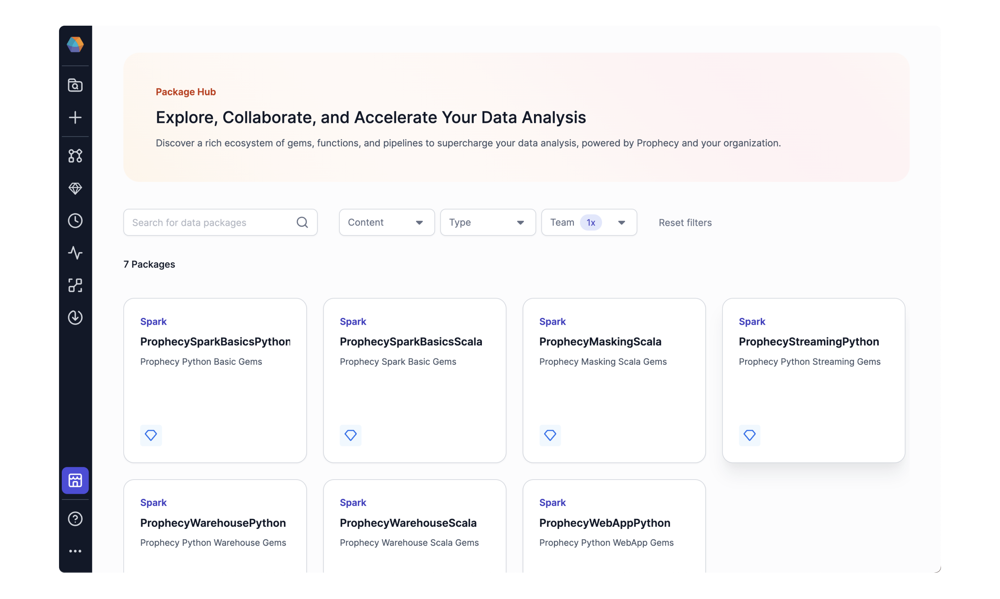

A Package is a versioned Project that can be shared across teams. As such, a Package can contain Pipeline templates, custom Gems, functions, subgraph templates, etc - a reusable version of everything a Project contains. Package dependencies allow us to re-use components so we don’t have to rebuild them. The coding community has been using packages for ages, and finally the low-code community can take advantage of the same idea. Packages are shareable within and across teams. For extra visibility, the Package Hub is a curated selection of Packages that your teams create and publish for other users to leverage.


Just include a Package as a dependency to take advantage of its contents.
* **Pipelines** in Packages can be used as templates in new or existing projects. Pass configuration variables to a template Pipeline to re-use in a new Project. For example, read/write from configured table names using a template Pipeline.
* **Custom Gems** in Packages can be dragged and dropped into new or existing projects as you would any Gem. Configure the Custom Gem visually, execute, and view data previews.
* **Subgraphs** in Packages can also be used as templates in new or existing Projects, very similar to Pipelines. (A Subgraph is essentially a mini Pipeline that can be called within a Pipeline.)
* **User Defined Functions (UDFs)** are custom functions that can be re-used across projects by calling the function inside the Gem expressions. Sharing UDFs in packages is a feature that will be coming soon after the Prophecy 3.2 release. 
* **Jobs** in Packages can be used across projects as a configured instance.  Sharing Jobs in Packages is a feature that will be coming soon after the Prophecy 3.2 release.
* **Datasets** in Prophecy are pointers to actual data in your data storage solution. Prophecy doesn’t store any data, and we recommend not to treat datasets in Packages as “data products.” That is, we recommend not to configure datasets in a Package. Instead, leave datasets configurable in the project where they are used. Importantly, access to the actual data remains dependent upon the user’s personal access token or username/password credential. To access the data in a new project, the user must select a fabric with access permissions for that data.


See the sections below for step-by-step instructions on how to [use](/docs/package-hub/package-hub.md#Use-a-package), [build](/docs/package-hub/package-hub.md#build-a-package), and [share](/docs/package-hub/package-hub.md#share-a-package) Packages.

# Use a package

Open the helloworld project or create a new project. Notice the dependencies include `SparkBasics` Project:


On opening a NewPipeline, notice all the transformation dropdown gems are from `SparkBasics` package. Drag and drop a gem, eg Deduplicate, from SparkBasics package to use in a NewProject Pipeline.


Already you are employing an engineering best practice: package dependencies! When we say that a project USES a package, another way to say it is “a Project has a dependency on the Package.” `NewProject` has a dependency on SparkBasics Package. But don’t stop there. You’ll want to use packages shared by your teammates!

Adding a Package to your Project is easy. From a Pipeline, just **(1)Add a new Package.** Now the Package and all of the contents - pipeline templates, custom gems, jobs, UDFs, etc - will be accessible in your pipeline and the entire Project. Want to see the list of Packages available for your Project? From the **(2)Project page,** click **(3)Dependencies** to see the Packages listed as Dependencies for your Project. **(4)Add or remove** dependencies using the dropdown.


Another great way to find Packages is via the **(1)Package Hub.** This Hub serves to give visibility to the best, curated Packages that Teams want to highlight. Therefore, only Published Packages appear in the PackageHub. Search for a Package by search string, or filter by content, type, or team. **(2)Select a package card** and **(3)Use** the Package as a dependency to a new or existing project.


A Package can contain Pipeline templates, custom Gems, Subgraph templates, Functions, and more. In fact, a Package can contain anything a Project contains. Why? **A Package is a Project that has been Released with a version.**

A Package is a set of logic to apply in various situations. Any changes to this logic would be done via versioned package release. For this reason, the projects that USE the package will not be able to change the package.

Let’s diagram a slightly more complex scenario that represents how your teams might use Packages. (So far we’ve considered `SparkBasics`, a Project created by the engineering team at Prophecy which only contains the Gems we already know and love.) We need a slightly more complex scenario to explore re-using Pipeline templates and custom Gems. (Detailed pages exploring re-usable subgraphs, UDFs, and jobs will be available in the near future.)

Consider now the `Framework` Project and two Projects that have dependencies on the `Framework` Project.


## Re-using Pipelines

Since `MarketingLeads` Project lists package `Framework` as a dependency, any pipelines from `Framework` will be accessible in `MarketingLeads` by passing [configurable variables.](https://docs.prophecy.io/low-code-spark/configuration/#pipeline-configuration-instances) The `MarketingLeads` Project cannot change the Framework pipelines. This is a good thing - the Platform team decides how `Framework` will evolve.

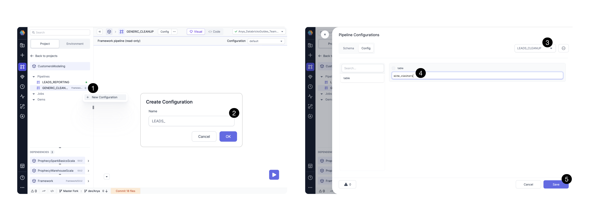
The MarketingAnalytics team can create a **(1)new Pipeline configuration** and **(2)name** it `LeadsCleanup`. Then **(3)select** that configuration, perhaps change the variable “table” value from default to a more interesting **(4)value** for their use case. `LeadsCleanup` is a configuration instance of the `GenericCleanup` Pipeline template.

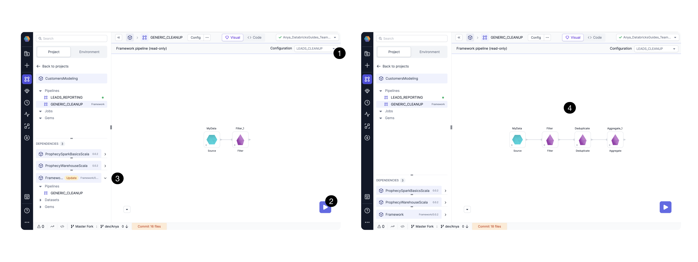

Now, in the same `CustomersModeling` Project, **(1)select** the desired configuration instance, and **(2)run** the pipeline with that configuration. Here the `GenericCleanup` Pipeline is a readonly template, so the MarketingAnalytics team gets to take advantage of the logic while passing configurations relevant for their own use cases.

If a change is needed in the `Framework` Pipelines, the changes must be made in the `Framework` Project. When the `Framework` Project is released with the changes, `MarketingLeads` Project can **(3)update** the dependency. With `Framework v0.0.2`, the `GenericCleanup` Pipeline has been updated with  **(4)additional Gems** which can now be used with the `LeadsCleanup` configuration.

## Re-using custom Gems

Configuring pipelines is just one way to take advantage of the shared, reusable components in a Package. Another (very powerful) way is to use custom Gems.

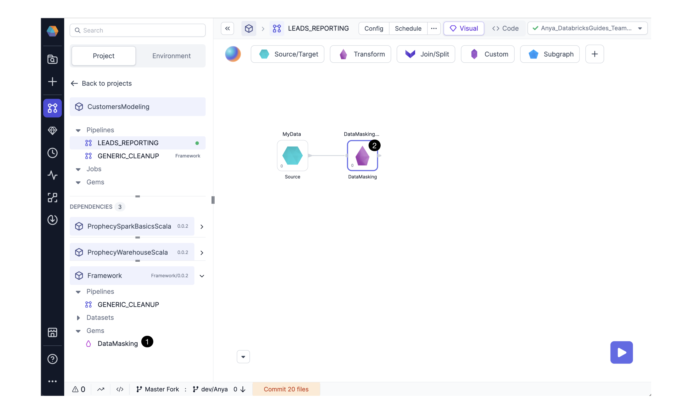

If the MarketingAnalytics team wishes to use one of the custom Gems from `Framework` in a new Pipeline, just **(1)drag-and-drop the Gem**, eg DataMasking , to the Pipeline canvas. **(2)Visually configure** the Gem and execute the pipeline as you would for any Transformation Gem.

Likewise, new Dataset Format Gems from `Framework` can be used in a new Pipeline.

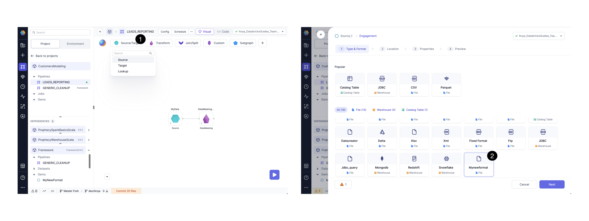

Select from the **(1)source/target** dropdown menu, and **(2)select** the new dataset format card from the options. The Platform and MarketingAnalytics teams are using the industry best-practice for re-usable components.

Try this out for yourself! In the next sections, we’ll walk through how to [build](/docs/package-hub/package-hub.md#build-a-package) and [share](/docs/package-hub/package-hub.md#share-a-package) a package.

# Build a package

A package is simply a released project. The project can contain pipeline templates, functions, subgraph templates, custom gems, etc. The most important of these components are custom Gems, so we’ll focus on building a Package with a Custom Gem here.

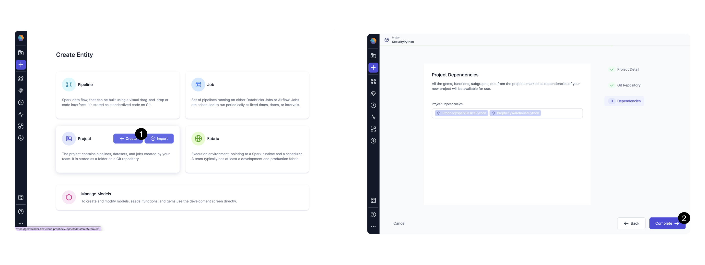

Start by **(1)creating** a new Project called `SecurityPython`. There are no changes needed; use the default settings to **(2)Complete** Project creation.

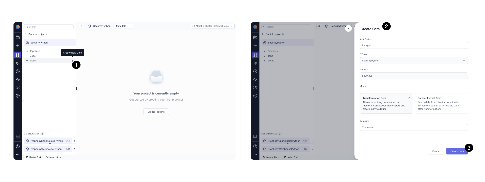

From the Project Browser, **(1)Create a new Gem.** Give the Gem a **(2)name** like `Encrypt`. This will be a Transformation Gem; another time try  creating a different Gem mode or category.

Next specify the Gem’s code.

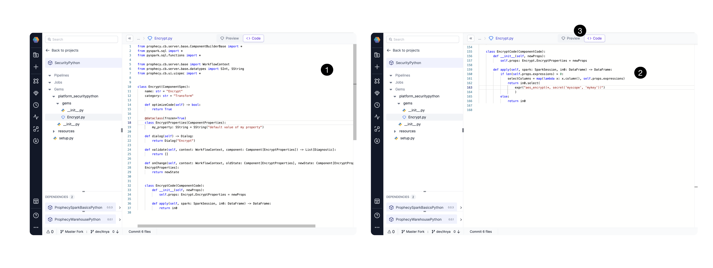

When you create a new Gem, a **(1)code guide** appears. Use the guide or replace with your **(2)custom code.** Explore the [Gem Structure](/docs/package-hub/gem-builder/gem-builder.md) to understand the code requirements. Then go to the **(3)Visual View** and make sure the UI appears with [no errors.](/docs/package-hub/gem-builder/gem-builder.md) Now the Custom Gem is ready to try in the canvas.

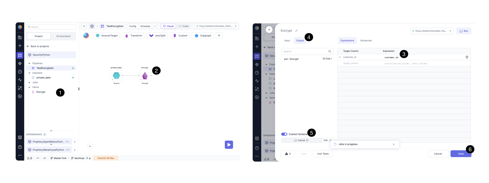

**(1)Click and drag** the custom Gem Encrypt (in the list of gems within the SecurityPython Project) to a new or existing Pipeline canvas. **(2) Configure** the custom Gem as with any other Gem: **(3)define expressions,** check the **(4)output** column list, even **(5)infer** the schema based on the attached fabric. **(6)Save** the configured Gem to start using it.

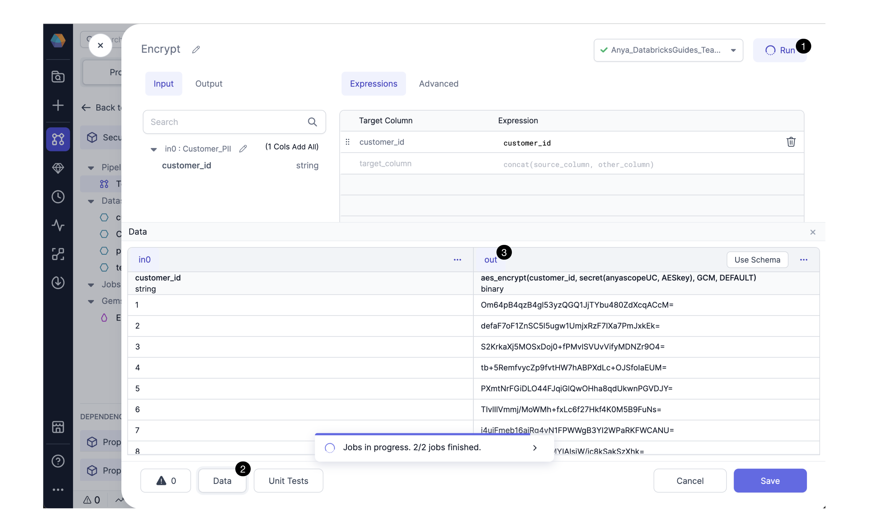

**(1)Run** the custom Gem to check whether the functionality works as expected. Click **(2)Data** to view the data input and **(3)(output)** preview. The customer_id is encrypted after our function is applied.

For more details on building Packages with Custom Gems, see the [gembuilder documentation](/docs/package-hub/gem-builder/gem-builder.md)

Once you have tested your Gem in the canvas, and you are happy with both the **Gem UI Component** and **Gem Code Logic**, you will want release a tagged version.

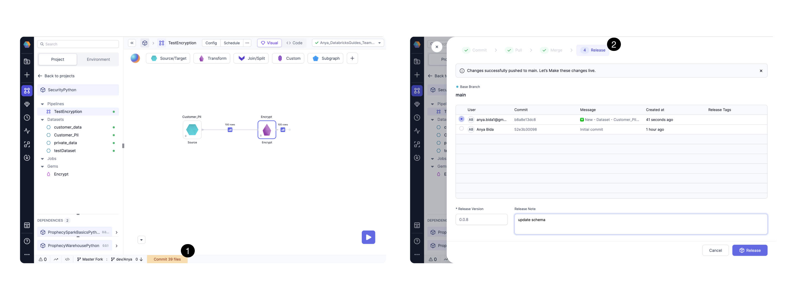

**(1) Commit** and **(2)Release** the Project, including the Custom Gem.  Continue developing and releasing new versions as incremental improvements!

```
Note: 
The release must be made from the branch specified on project creation, usually main or master.
This implementation ensures teams will review code before releasing.
```

Now we have built a package! Now other projects owned by the same team can use the package as a versioned dependency.

# Share a package

The entire Project is **(1)packaged** into a jar or wheel file and uploaded to Prophecy’s artifactory. Once the Package is successfully released, it can be shared with specific teams or highlighted by publishing to the Package Hub.

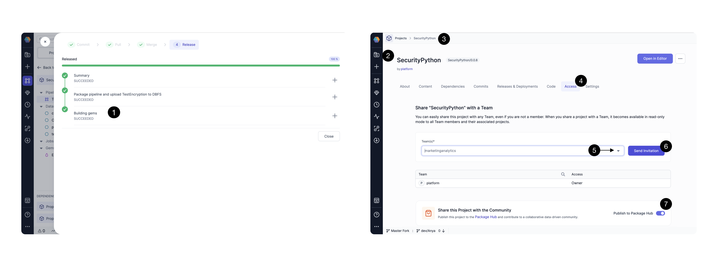

Select the **(2) Metadata** tab, then select your **(3)Project’s page**. Then select **(4)Access**, select the **(5)Teams** that should have access to the package. **(6)Send an invitation** to those teams. For the team’s best  packages that are intended for broad consumption, **(7)Publish** to the Package Hub.


If another team wants to use the `SecurityPython` package in their newProject, just add `SecurityPython` as a dependency for `newProject`. Now the user can see and use the `Encrypt` custom Gem.


We have built and shared our package with a custom `Encrypt` Gem!

```!Information
Coming soon: 
Administer using HubManager (coming post 3.2)
Admin users can manage which packages show up on the PackageHub, and which users can access
```


With Package Hub, Platform teams can build solutions once, and re-use the logic for additional cases. Errors can be handled just once. Updated Packages take advantage of logic updates and error-fixes. Data Analyst teams will build Pipelines faster by taking advantage of the building blocks - custom Gems, UDFs - provided by the Platform team. Or, Data Analyst teams might create their own building blocks! Everyone can create and share pipeline components with Package Hub. We’d love to hear how your teams are creating, sharing, and even curating Packages. Drop us a line at contact.us@prophecy.io -  we would LOVE to hear your feedback!

# FAQ

Q: I shared a dependency to a team, but we don’t see any email notification.
A: The share “invitation” is not sent via email. Rather, the team would be able to add that project as a dependency to their new or existing projects.

Q: I shared a dependency to a team, but they don’t see the package listed when they try to add as a dependency.
A: Be sure the new project and dependent project are using the same language, eg Scala or Python. If the new project is a Scala project, only Scala Packages can be added as dependencies.

Q: How do I use subgraphs from a dependency?
A: Like Pipelines, Subgraphs can be used by dependent projects via [configurable variables.](https://docs.prophecy.io/low-code-spark/pubsub/shareable-subgraphs/#configurable-subgraphs)

Q: Do you have a DataQuality Package?
A: Not yet, but coming soon!

Q: How would I take a Package built by another team and evolve it in a new direction? That is, how can two teams take a single project in two different directions?
A: One excellent option here is to Clone the Project instead of use as a Package Dependency. For example, let’s say the MarketingAnalytics team loved the Framework Package and wanted it to become a holding place for all the Marketing pipelines. The Platform team, however, wants to keep the Framework Project as general as possible. How can the two teams each take a version of the project in their own direction?

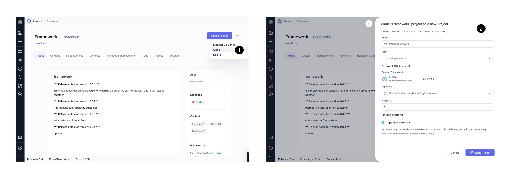
Just **(1)Clone** the `Framework` Project, and **(2)provide** a new name, team, Git account, and repository.

Now the MarketingAnalytics team has their own Project, `MarketingFramework`, to evolve in their own direction. Notice the Pipelines are not templates, rather the `GenericCleanup` Pipeline can be edited by adding a new Gem, eg Repartition:
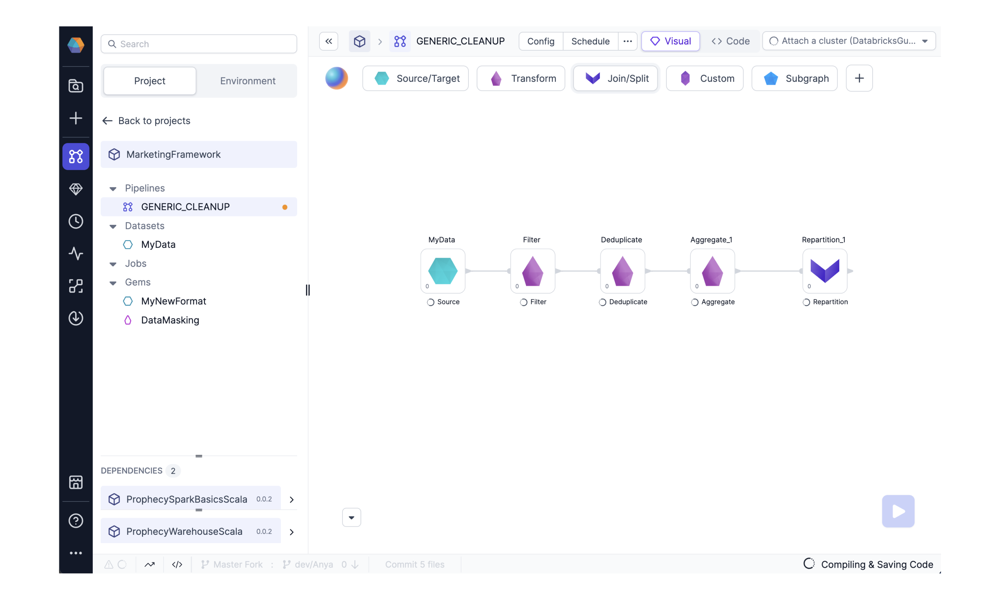

