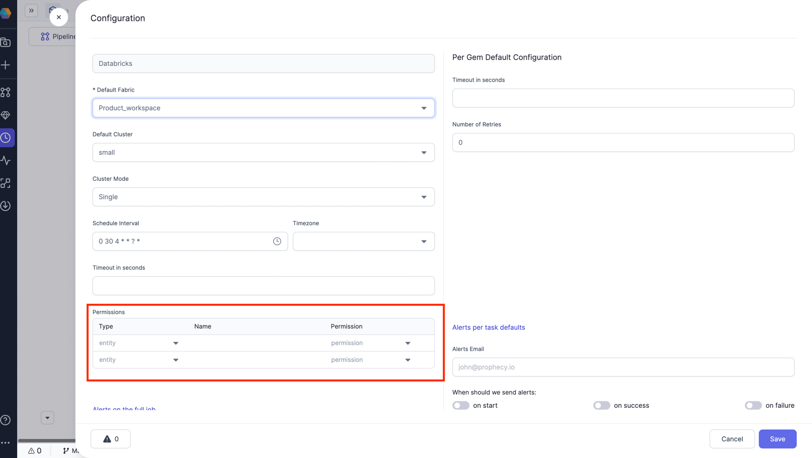
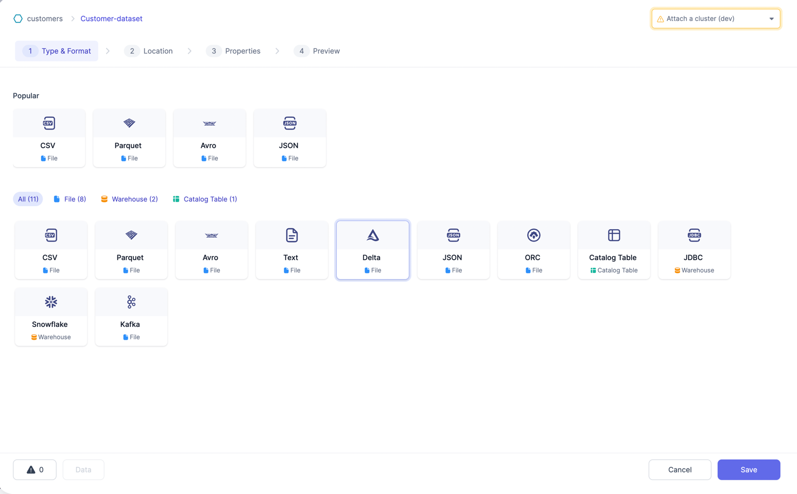
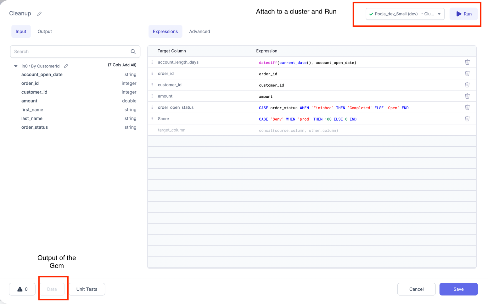

## 3.0.0.\* (Apr 26, 2023)

- Prophecy Python libs version: 1.5.0
- Prophecy Scala libs version: 7.0.18

### Features {#UpdatesRelease300}

#### Low-Code SQL

With the release of **Prophecy 3.0**, we continue to double-down on our goal of combining the best of both worlds: **high-quality code based on software engineering best practices** with a **complete, easy-to-use visual environment**.
Low-Code SQL, brings a new way to develop data models in SQL through a visual interface.
Visual = Code allows both SQL coders and business users to easily collaborate on the same project.
Business users can visually create their data models, with all their work automatically turning into high-quality code on Git. Engineers can use SQL and advanced macros through a code-based editor, with Prophecy parses their code and visualizes it on an editable canvas and ensuring both views remain in sync at all times.

At any step of the process, data users can interactively run their models to make sure they're going in the right direction
Projects built through Prophecy are stored in the dbt Core format as repositories on Git, which allows data teams to follow the best software engineering practices for CI/CD.
Data users can import an existing dbt Core project or start from scratch. They can publish those projects to other teams or subscribe to already existing ones.

#### Expression Builder

To perform data analysis and manipulation, Spark has provided various functions. These functions enable users to perform various transformations on their data.
In order to perform complex data analysis tasks, it's important to be able to construct expressions that combine the Spark functions in various ways.
Prophecy has now made this easy with support of **[Expression Builder](/docs/Spark/expression-builder.md)**.
Using the Spark Expression Builder can save you time and effort when constructing complex expressions, and can help you to better understand the relationships between different functions and their arguments.
Please refer [here](/docs/Spark/expression-builder.md) for Detailed documentation on this feature.

#### Airflow (_Beta_)

Apache Airflow is an open-source platform used to programmatically author, schedule, and monitor workflows.

Airflow allows users to define workflows as DAGs (Directed Acyclic Graphs), where each node in the graph represents a task that needs to be executed.
Tasks can be Data Pipelines in Spark/Python or SQL or scripts. Dependencies between tasks are defined using operators, which are essentially plugins that define how tasks interact with each other.

With Prophecy, you can create and manage Airflow jobs using a visual Drag and drop interface. This allows you to easily design and schedule complex workflows, without having to write any code.
Please refer [here](/docs/Orchestration/airflow/airflow.md) for detailed documentation on this feature.

### Improvements {#UXImprovements300}

#### Support for Databricks ACL

Users can now manage Access to their Databricks jobs via Prophecy UI. This would enable them to Edit and Manage all Databricks Jobs ACL wile configuring a Job in Prophecy UI itself.
Please see below screenshot for example.

#### New UI for Source/Target Gems

Prophecy has revamped the UI for source and target gems to enhance user experience and streamline the process of creating new datasets. The updated design features a Tabular format for quickly filtering by source types and a "popular" section for easy access to frequently used sources. Additionally, while creating a new Source/target, Gem UI now includes a radio button Selection menu for selecting an existing Dataset to use as the source/target.
Please see below screenshot for example

#### New Data Observability Page

Prophecy has updated the UI for the Data Observability page (previously known as Monitoring). You can now monitor the Jobs from this page.

#### Option to Attach a cluster and Run from the Gem Screens

User can now Attach to a cluster and run their Pipeline till current Gem from the Gem screen itself. Please see below image for reference.

