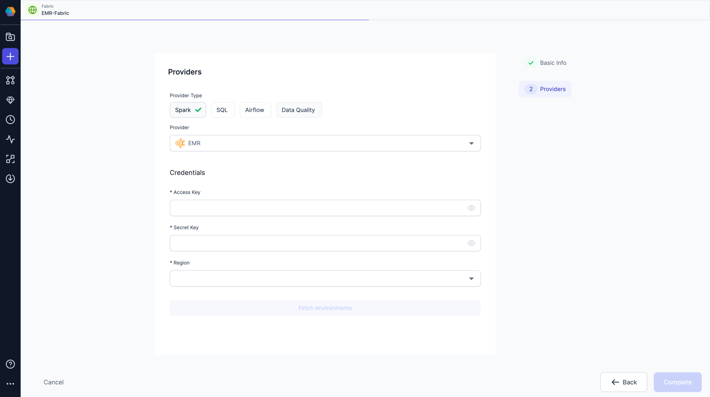

## 3.1.4.\* (August 11, 2023)

- Prophecy Python libs version: 1.5.10
- Prophecy Scala libs version: 7.1.7

### Features {#FeaturesRelease314}

#### Synapse Fabric

We are excited to announce that this release introduces first-class support for Azure Synapse Fabric type.
This new feature empowers our Users to seamlessly create and run their data Pipelines on Azure Synapse instances directly from the Prophecy platform.

#### EMR support for Low code Orchestration

Building upon our previous release, we're excited to announce an extension of our EMR capabilities. In this update, we proudly introduce support for **Releasing Pipelines on EMR**, along with enhanced **EMR cluster management** through **Airflow**. Our latest additions include brand-new EMR Operators and Sensors, empowering users to seamlessly oversee EMR clusters and conveniently schedule pipelines on their EMR Fabrics.

## 3.1.3.\* (August 3, 2023)

- Prophecy Python libs version: 1.5.10
- Prophecy Scala libs version: 7.1.6

### Features {#FeaturesRelease313}

#### EMR Fabric

We are excited to announce that this release introduces first-class support for EMR Fabric type.
This new feature empowers data engineers and data scientists to seamlessly create and run their data Pipelines on Amazon Elastic MapReduce (EMR) instances directly from the Prophecy platform.

### Minor Improvements {#MinorImprovements312}

#### Low code SQL Improvements

- Copilot support for Trino: We've integrated Copilot support for Trino in our Low code SQL product.

#### Low code Spark Improvements

- Restart and Terminate cluster functionality: Prophecy now allows users to Restart and Terminate Databricks Clusters directly from the platform. See the reference image below.
  

#### Other Minor Improvements

- Audit Logging support for Azure: Prophecy now enables syncing of [audit logs](/docs/metadata/configure-audit-logging.md) to Azure Data Lake Storage (ADLS)
- With this Release,admins will no longer have the ability to remove themselves from a team. This avoids accidental removal of self from a team.
