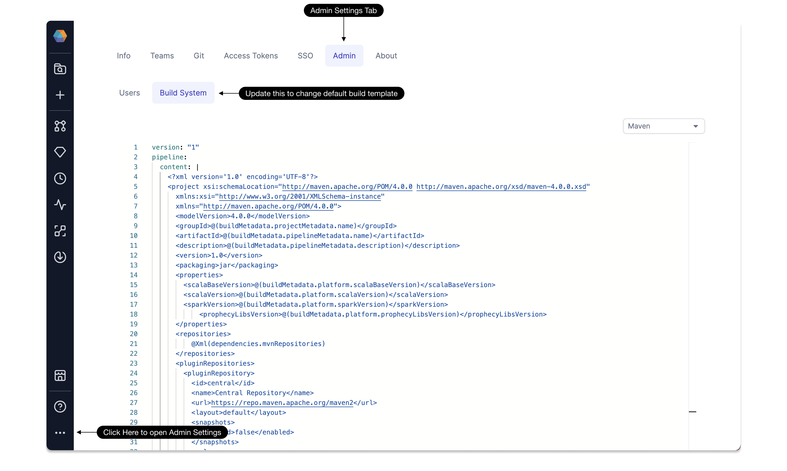

## 3.2.7.\* (December 26, 2023)

- Prophecy Python libs version: 1.7.3
- Prophecy Scala libs version: 7.1.46

### Features {#FeaturesRelease327}

####

## 3.2.6.\* (December 18, 2023)

- Prophecy Python libs version: 1.7.3
- Prophecy Scala libs version: 7.1.46

### Features {#FeaturesRelease326}

#### Gem Dependencies

In our latest 3.2 Release, we've empowered users with the ability to build their own gems. This allows you to incorporate custom logic essential for your specific needs directly into the gem.
Frequently, this involves utilizing custom dependencies within the gems for tasks such as validations and transformations.
With this release, we've introduced a feature that enables you to seamlessly integrate any custom Pypi or Maven dependency into a gem during the build process.
This dependency is also automatically added into the Pipeline using the gem whenever needed. Stay tuned for more comprehensive documentation on this enhancement.

#### Build Template configurable by Admin

Cluster administrators now have the capability to modify the build template for their organization by navigating to the Admin settings. By accessing the 'Build System' tab under the 'Admin' section, administrators can update the template, ensuring that any newly created projects will adopt the latest template. Additionally, existing projects will transition to the updated template, provided the template hasn't been customized.

#### Minor Improvements

- **Task Group Support in Airflow**: We have added support for Taskgroup in Low code Airflow. Airflow task groups are a tool to organize tasks into groups within your DAGs. This is useful to organize complicated DAGs by visually grouping tasks that belong together. This is also useful when you have to apply some `default_args` to sets of tasks, instead of at the DAG level.
- **AutoLayout Improvement**: In this release, we've introduced support for a layer-based auto-layout algorithm to enhance the representation of pipelines, especially those with intricate logic involving numerous cross connections within the gems. Users now have the flexibility to choose between two auto-layout options: `Simple DAG Layout` and `layer-based Layout`. This allows for customization based on individual preferences and specific requirements when arranging and visualizing complex structures.
- **Pipeline Config Names in Job IDE**: Users can now utilize the Alt key to reveal the name of the config instance for a Pipeline gem within a Job. This enhancement simplifies the process of identifying which pipelines are associated with specific configurations, providing a more straightforward way to view this information in the Job interface.
- **Remove Default Project Dependencies**: Initially, Prophecy includes default project dependencies to support common Spark transformations and integration with popular Data Warehouses. In this release, users now have the ability to delete these default dependencies, giving them greater control over the selection of gems available to all users by default in a project.
