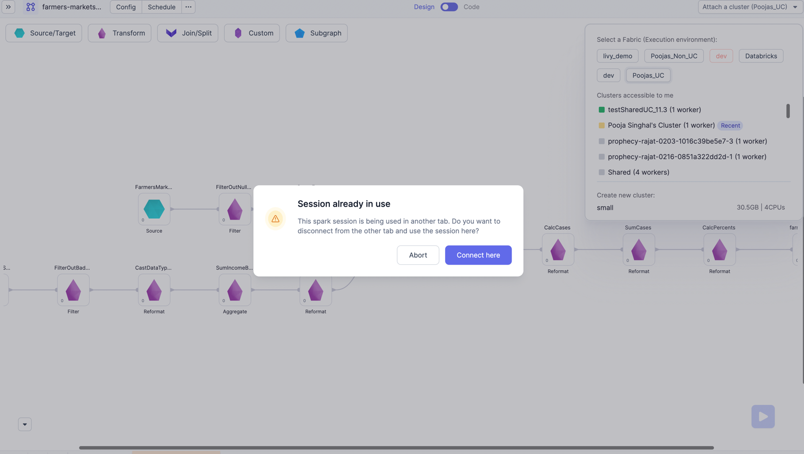
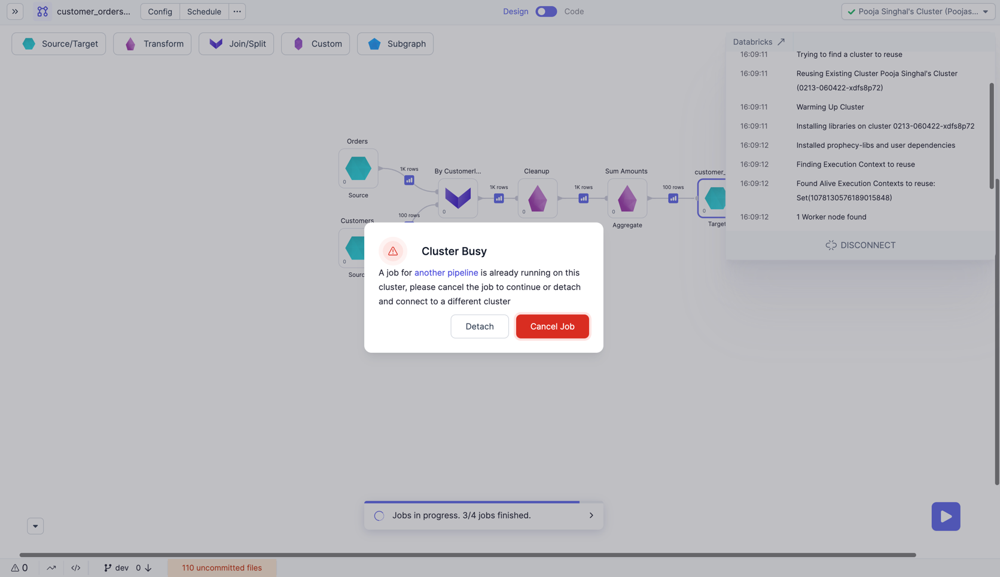
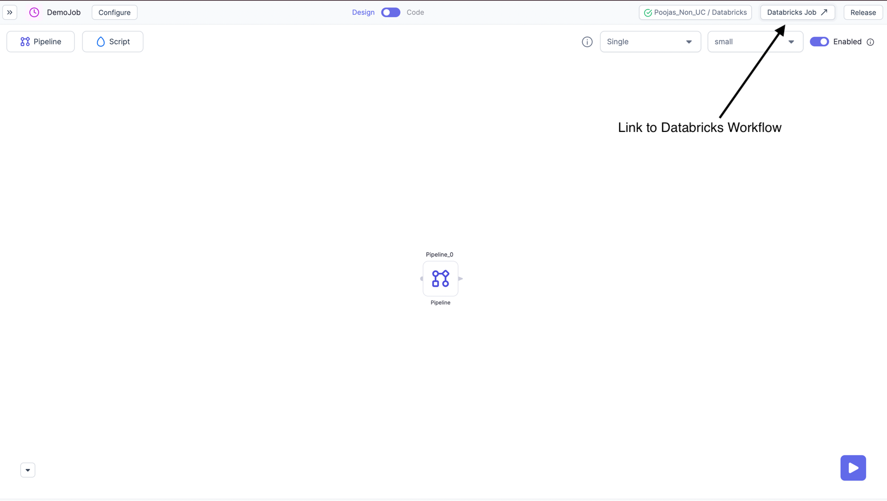
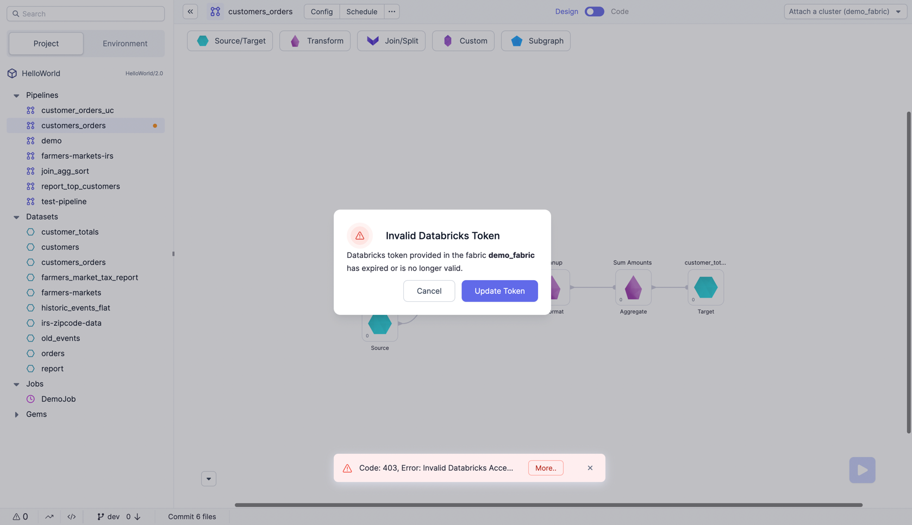
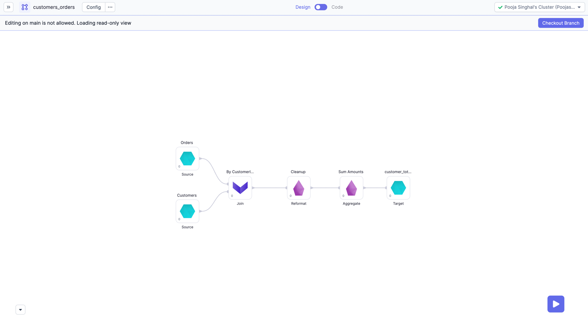
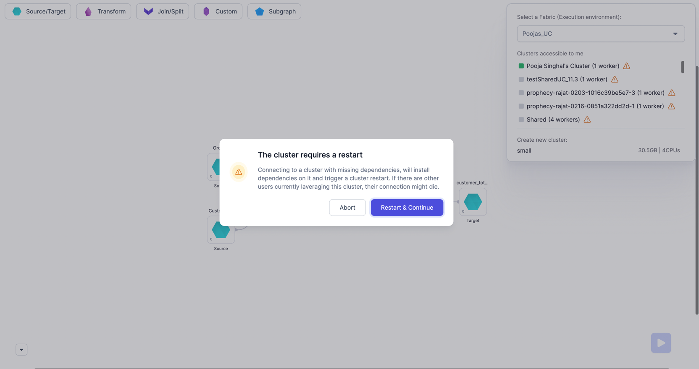
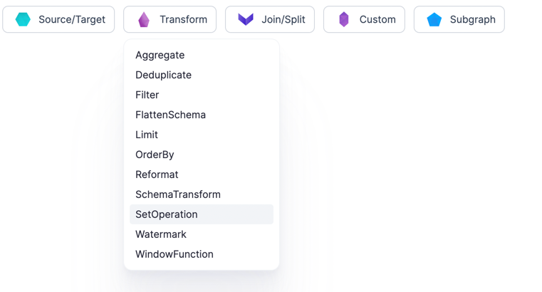
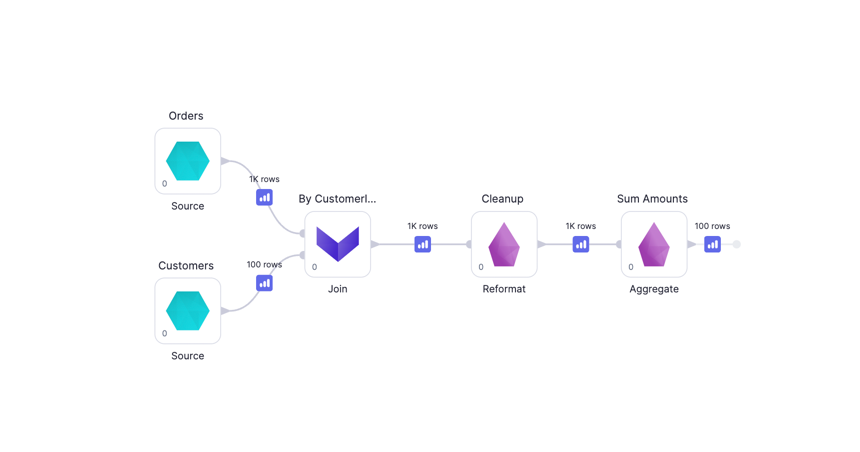
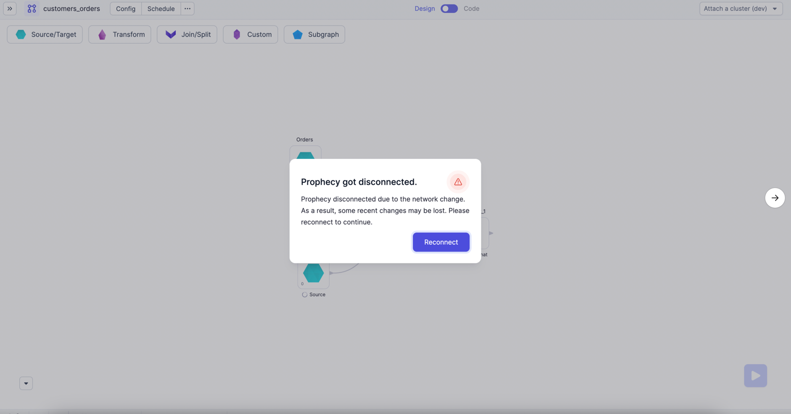
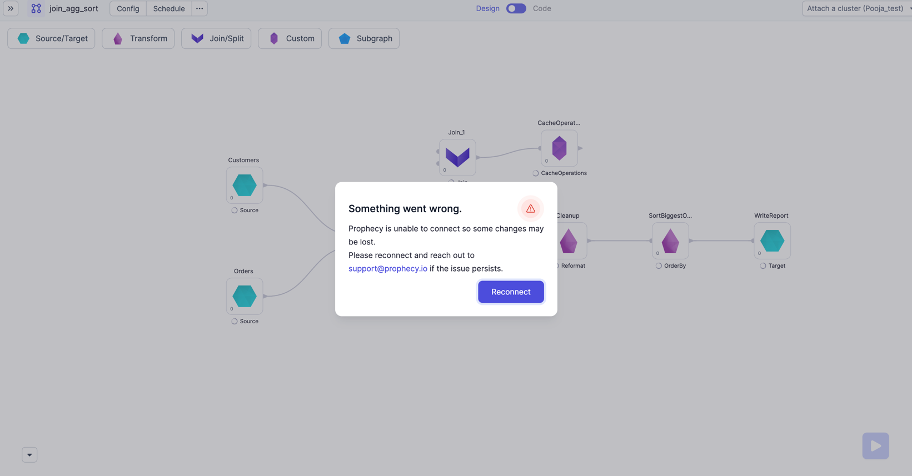

## 2.8.0.\* (February 28, 2023)

- Prophecy Python libs version: 1.4.2
- Prophecy Scala libs version: 7.0.7

### Features {#UpdatesRelease280}

#### A team is not required during sign-up

Users were required to enter a team name when signing up for Prophecy. Prophecy removed the team requirement.
A user can sign up by providing their Name, Email and Company name. They can be added to a team by an administrator after signing up.

#### Added support for Identity provider initiated SSO

Users would now be able to add Prophecy as an app in Okta, and directly get signed in when App is opened from Okta.

#### Sorting columns on Metadata tables

Metadata tables provide various options to sort on its columns. By default, the columns will be sorted on `Modified At` or `Created At` time in decreasing order.

#### Cluster consistency

If a user is editing a Pipeline in a tab where the same Pipeline is already opened in other tabs, Prophecy will ask to detach from the Pipeline in the other tabs. It will allow users to attach the cluster to the Pipeline in the active tab.

A user will see a warning before the cluster is detached from the previous tabs.

If running Jobs already exist in a tab, the user will be prompted to cancel the running Jobs before attaching the cluster to the current tab.

#### Link to Databricks Workflow in Released Prophecy Jobs

In Job editor view we've added the link to the corresponding Databricks Workflow.

Note: this will only appear if the Job is enabled and released.

#### Create Pipelines and Jobs directly from Project Browser

Previously, a user had to navigate out of Pipeline editor to add a new Job or Pipeline. Now they can do it via the same screen and shown below. Please note, the Pipelines and Jobs can only be created in same Project and Git branch using this option.

#### Alert user on Databricks Token Expiry

If their Databricks token is expired or is invalid, the user will now see a prompt as below to update their Databricks token. They will be prompted on the Jobs editor or Pipeline editor when attaching to the Fabric.

### Improvements {#ImprovementsRelease280}

#### Allow Run on main branch

Editing your Pipeline on Main branch is not allowed. Interactive run and Partial run on Gems is allowed when viewing a Pipeline on Main branch. Interims will also work as expected.

#### Cluster restart after setting dependencies

Improved the cluster restart behavior when adding a new Pipeline dependency. When a new Pipeline dependency is added, cluster will be detached and prompt for a restart as shown below. A small subset of users were experiencing cluster restart loops when using certain dependencies and this has been addressed

## 2.7.0.\* (February 16, 2023)

- Prophecy Python libs version: 1.4.0
- Prophecy Scala libs version: 7.0.6

### Behavior Changes {#BehaviorChangesRelease27}

#### Spark and Scala Versions are now Required in Livy Fabrics

For creating a Livy Fabric, previously the Spark and Scala versions were optional and had default values 2.3.0 and 2.11. With this release these fields are made mandatory, and users will need to update their Fabric configurations with respective Spark and Scala version values. Please refer [here](/docs/Spark/fabrics/databricks/databricks.md#livy) for more details.

### New Features {#NewFeaturesRelease27}

#### Kafka and Watermarking support (_Beta_)

With this release, we have added support for Kafka as a streaming Source and Target. Also support for Watermarking is added in all streaming Gems.

#### Data Fabric ACL

Support for Data Fabric authorization is added with this release. This feature allows administrators within a team to assign proper access to its team members. For example, only a team’s administrator can perform tasks such as creation and deletion of Data Fabrics.

#### Ticketing Support

Users can raise Support tickets, Feature requests, and bugs using the following two options:

- Within the Prophecy UI by clicking on the Support icon in the Bottom-left corner.
  

- Submit new tickets and view status of existing tickets from the [Customer portal](https://help.prophecy.io). Please [contact us](mailto:success@Prophecy.io) to enable this in your account.

### UX Improvements {#UXImprovementsRelease27}

#### Auto Connect Gems and Auto suggest on Drag and drop

While adding new Gems to a Pipeline, the new Gem will be Auto-Connected to a previous Gem when dragged nearby.

Also, when dragging a Gem onto the canvas, user will be auto-suggested a Gem position. Please see the below examples. User can hold Shift key to disable this.

#### Zoom-in And Zoom-out

Users can now use Two-fingers-Pinch to zoom-in or zoom-out on the Pipeline canvas.

#### Gem Sorting

Gems are now sorted Alphabetically for easy lookup.

#### Dangling interims

While editing/creating Pipeline, preview data "interims" now available after the tail node (last Gem on the graph).

### Improvements {#ImprovementsRelease27}

#### Project creation on protected main branches

Now users will be able to create projects when using Repositories with protected main Branches. This is applicable for both Single-fork or Multi-fork Repositories.

#### Disconnection Error handling

When a user has an open Pipeline, the Prophecy connection can be lost due to multiple reasons.
We have implemented auto-reconnect for a smoother experience. Now the user is given an actionable message in the UI only when needed:

- If connection is lost due to inactivity (Probably user switched to another tab), then they will see a reconnecting toast as shown below:
  
- When your device network is switched
  
- When some other unknown disconnection happens (For example: the network provider switched at router level)
  

#### Copy pasting Gem in Pipeline editor

When a user is pasting Gems/group of Gems in Pipeline editor, the Gems will now be pasted at the cursor location. They will also remain selected after paste so that user can easily move them around on canvas as needed.

## 2.6.0.\* (February 3 2023)

- Prophecy Python libs version: 6.3.20
- Prophecy Scala libs version: 1.3.22

### New Features {#NewFeaturesRelease26}

#### GCP Support

Prophecy now has support for integrating through Databricks Partner Connect on GCP. For example, when Databricks is deployed and running on GCP and integration between Prophecy and Databricks is needed, the user can integrate with Prophecy through Databricks Partner Connect.

#### Interims for Unity Catalog Workspaces

Pipelines running on **Unity Catalog cluster** now have the ability to show [Vanilla interims](/docs/Spark/execution/databricks-clusters-behaviors.md#vanilla-interims) on all Actions/Tail nodes of the Pipeline.

#### Team-level execution metrics

An administrator will have the option to create the following tables at the time of team creation which are used for storing [Execution Metrics](/docs/Spark/execution/execution-metrics.md). The administrator will grant access to the tables accordingly to their team members.

- Pipeline Metrics Table
- Component (Dataset) Metrics Table
- Interim Table

#### Seamless Git Integration with stored credentials

Added the ability to store [Git](/docs/concepts/git/git.md) credentials for a user across projects. Now the user can re-use Git credentials without re-authenticating.

#### Streaming Pipeline Support (_Beta_)

With this release, Prophecy now supports Streaming Pipelines as a beta feature. Users can now read data from streaming sources, apply transformations and save data to streaming Targets.

### Updates {#UpdatesRelease26}

#### Union By Name

Added Union by name in [Set Operations](/docs/Spark/gems/transform/set-operation.md) Gem. This can be used now to get union by column names when positions are different in two datasets.

### Improvements {#ImprovementsRelease26}

#### Python code generation taking long time

For larger schemas, Prophecy's Python optimiser was taking significant time. As a result, compilation was delayed.
The new optimization speeds up wide table processing on the UI layer by adding pre-optimization phases. This will try to eagerly evaluate and substitute for preconfigured syntax. The compilation time has been reduced orders of magnitude from seconds to milliseconds.

#### Blocked log4j dependency

The Scala maven plugin has a log4j dependency that is inaccessible for some customers. Updated the log4j dependency.
