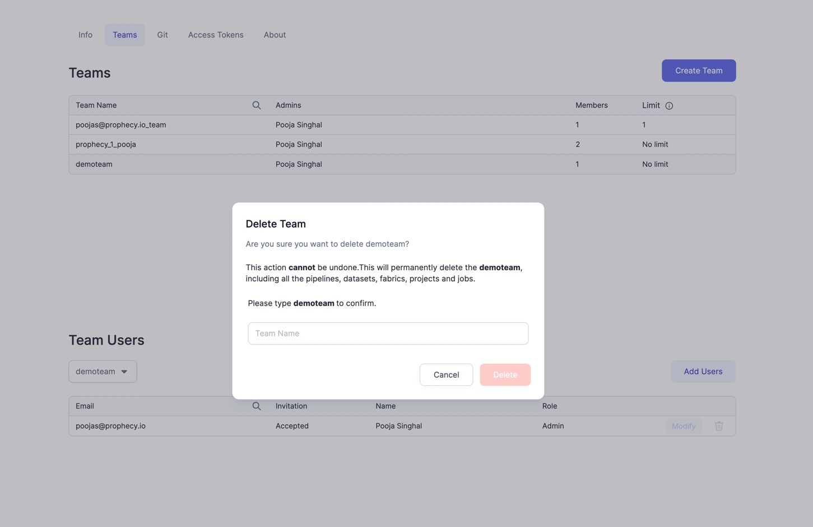

## 2.10.0.\* (Mar 31, 2023)

- Prophecy Python libs version: 1.4.8
- Prophecy Scala libs version: 7.0.16

### Features {#UpdatesRelease2100}

#### Prophecy metadata available through the API

Now Prophecy users can access their metadata using the Prophecy API.
Just create a Personal Access Token [PAT](/docs/metadata/prophecyAPI.md).
One popular use case is to access the Prophecy metadata through automated scripts and integrate this data into an existing data visualization system. Use the Prophecy API to create a single pane of glass interface for data stewards and engineers to see pipelines, datasets, Lineage, etc. Please see [here](/docs/metadata/prophecyAPI.md) for more details on this feature.

### Improvements {#ImprovementsRelease2100}

#### Search box on available clusters

Find clusters faster with cluster search

#### Performance Improvements for Projects with large Number of Entities

With this release, we have optimized the Project Browser to handle Projects with more than 500 Pipelines/Datasets. User should not see delays and should be able to seamlessly browse Entities in large Projects.

#### Datasets improvements

We have removed Restrictions to allow users to be able to save Datasets with Diagnostics errors like missing Input ports/Schema etc.
Along with this we have also added ability to Choose Source/Target while adding a Dataset to Pipeline from browser. Please see below video for example.

#### Warning when deleting Teams

Users will now see Warnings as shown below before deleting Teams etc. Similar warnings are shown while deleting a Project or Fabric too.  

:::caution
Deleting a Team, deletes all the Projects, Pipelines, Datasets, Jobs, Fabrics owned by that team.
:::

## 2.9.0.\* (Mar 24, 2023)

- Prophecy Python libs version: 1.4.7
- Prophecy Scala libs version: 7.0.10

### Features {#UpdatesRelease290}

#### Sharable Subgraphs and UDFs

One of the best practices during Data-Project development is to _Use standardized components_. Prophecy enables this standardization in a few ways:

1. Our standard Gems
2. User-Defined Functions
3. Reusable Subgraphs
4. Custom Gems

With this release, `Subgraph`s and `User-Defined Function`s can now be shared across multiple projects and teams. This allows central Data Platform teams to build reusable code to cover a wide variety of business needs, such as Encryption/Decryption or Identity Masking, and have their "consumers" (the Data Practitioners) take a dependency on that reusable code. Since it's all versioned, when the reusable code changes, the downstream consumers will be notified and can update accordingly.

Data admins can also _Create deployment templates for the pipelines_ that have the best practices baked into them for authorization, notifications,
handling of errors, and logging the correct information.

:::info
Please note, Users will see new Uncommitted changes in their Pipelines when they open it. They can see UDF code being added to all Pipelines, Configs added to Subgraphs, etc.
:::

Please see [here](/docs/package-hub/package-builder/package-builder.md) for more details on this Feature.

#### Ability to commit and Release from the Pipeline page

A user can complete the entire CI-CD process from `commit` to `release` from the Pipeline editor. Please see the below video for an example.

   <iframe src="https://www.loom.com/embed/5b62a4af13b243019705ee001875e773" frameborder="0" webkitallowfullscreen mozallowfullscreen allowfullscreen
      style={{position: 'absolute', top: 0, left: 0, width: '100%', height: '100%'}}></iframe>

### Improvements {#ImprovementsRelease290}

#### Ability to rename a cluster while attaching

When attaching to a cluster, User can now provide a custom name to the cluster (if creating a new cluster), to be able to identify it in the future again.
Please see the below video for an example.

   <iframe src="https://www.loom.com/embed/d28f3ba9dd80482f983f5f7e753d1588" frameborder="0" webkitallowfullscreen mozallowfullscreen allowfullscreen
      style={{position: 'absolute', top: 0, left: 0, width: '100%', height: '100%'}}></iframe>

#### Checkout remote branches

Users can now check out branches created directly in Git(outside of Prophecy) for editing. On the checkout screen, users will now see a list of remote and local branches separately. Once checked out, the branch will be shown as a local branch.
Please see the below video for an example.

   <iframe src="https://www.loom.com/embed/cd9fb2c1a43940c98683b6451625bac1" frameborder="0" webkitallowfullscreen mozallowfullscreen allowfullscreen
      style={{position: 'absolute', top: 0, left: 0, width: '100%', height: '100%'}}></iframe>

#### Open Project lineage view

When clicking `Open Project` from a Project page, Users will now see a Birds-eye view of their entire Project. They will have shortcuts to edit Pipelines and access all Metadata from this screen. Please see the below video for an example.

   <iframe src="https://www.loom.com/embed/69fcdee808af4b94844bd603ca93865e" frameborder="0" webkitallowfullscreen mozallowfullscreen allowfullscreen
      style={{position: 'absolute', top: 0, left: 0, width: '100%', height: '100%'}}></iframe>

#### Cluster auto-attach behavior

For Configured Pipelines (Read-Only mode from Dependencies) in Pipeline view, Cluster will auto-attach to the `last-used` cluster from the Fabric. This behavior is now consistent for all Pipelines in Edit/Read-Only mode.
Please see the below video for an example.

   <iframe src="https://www.loom.com/embed/09bb5a748d874382bbf6f6c0aebb3d25" frameborder="0" webkitallowfullscreen mozallowfullscreen allowfullscreen
      style={{position: 'absolute', top: 0, left: 0, width: '100%', height: '100%'}}></iframe>

#### Control Data Sampling behavior for Configured Pipelines

A User can now change the Data Sampling([Interims](/docs/Spark/execution/interactive-execution.md#interims)) for Interactive Runs of Configured Pipelines(Read-Only mode from Dependencies).
Please see the below video for an example.

   <iframe src="https://www.loom.com/embed/a30e25b0cfc842c4b198f8c36349a879" frameborder="0" webkitallowfullscreen mozallowfullscreen allowfullscreen
      style={{position: 'absolute', top: 0, left: 0, width: '100%', height: '100%'}}></iframe>

