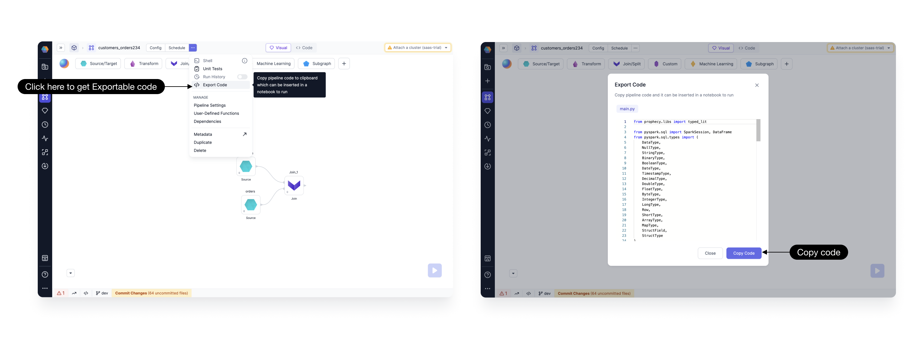
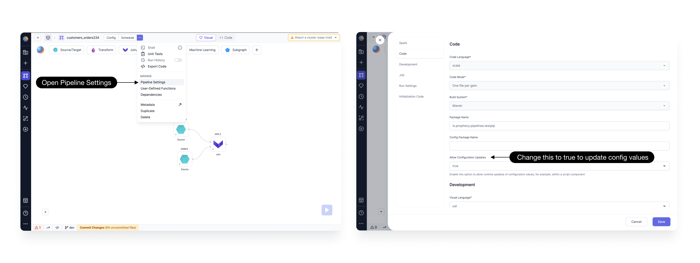

## 3.2.3.\* (October 31, 2023)

- Prophecy Python libs version: 1.6.9
- Prophecy Scala libs version: 7.1.27

### Features {#FeaturesRelease323}

#### Export and Execute Pipeline Code in Databricks Notebooks

In this release, we've introduced a convenient feature for pipeline users. You can now easily export and copy your pipeline code for direct execution in a Databricks Notebook. To do this, just click on the ... option and select 'Export Code' to copy the code to your clipboard as shown below.

#### Config Variable Value Updates in Scala

In this latest release, we've introduced a new pipeline setting that allows users to modify or override configuration variable values in Scala using Script gems. Previously, this feature was available for Python projects and is now extended to Scala projects. By default, this setting is enabled for all new pipelines. To enable it for existing pipelines, simply set the Allow Configuration Update flag to true, as demonstrated below.

## 3.2.1.\* (October 10, 2023)

- Prophecy Python libs version: 1.6.2
- Prophecy Scala libs version: 7.1.22

### Features {#FeaturesRelease321}

#### Advance Settings for Releases and Deployments

In this latest update, we are introducing advanced settings for releases and deployments to empower Project Admins with finer control.
Regular project releases handle the deployment of pipelines, gems, and jobs to designated environments.
With this enhancement, users have the flexibility to redeploy previously created release versions and opt to deploy specific jobs during the deployment process. These capabilities, among others, are now easily accessible through the Prophecy UI.

For more details on these exciting features, please refer to the [documentation](/engineers/deployment).
