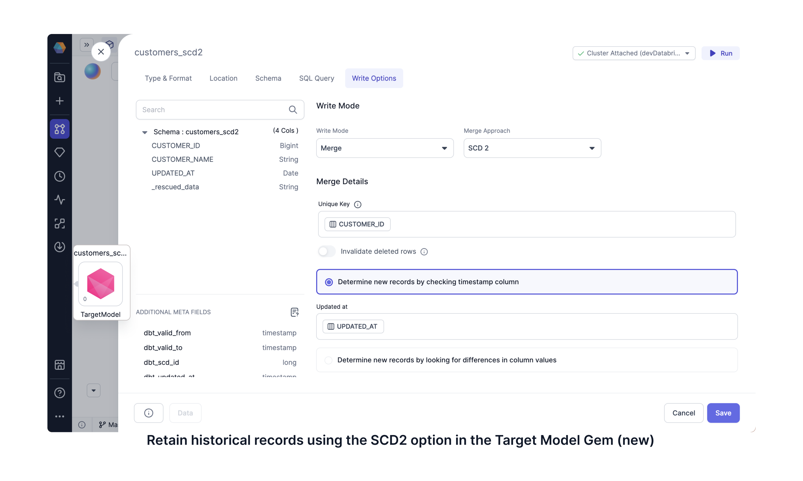

## Available in Prophecy Release 3.3.9

Prophecy's SQL Transformation Copilot has a new user interface in four different areas. Check them out in the following video or the descriptions. Find out what to expect in your new user interface for an even easier experience.

   <iframe src="https://www.loom.com/embed/3b181d2e60ad4e3094c0a8bb36f8a601?sid=d8385d0b-b309-4e72-b5ed-a49ade2ee492" frameborder="0" webkitallowfullscreen mozallowfullscreen allowfullscreen
      style={{position: 'absolute', top: 0, left: 0, width: '100%', height: '100%'}}></iframe>

### Model write options

In this release, we've updated the UX and capabilities of the target model format and write options. In the previous release, you'd find **Advance Settings** are available for defining model write formats and lots of other DBT options (left). In this release, the advance settings are still available, but the most frequently used settings are accessible in the target model gem as well (right).

There are now the following tabs within the [target model](/engineers/target-models):

- **[Type & Format](/engineers/type-and-format-target-model)**: Update the format of the model, e.g., table, view, ephemeral, etc.
- **[Location](/engineers/location-target-model)**: Update the location by overwriting the Database, Schema, or Alias
- **[Schema](/engineers/schema-target-model)**: Make schema changes
- **[SQL Query](/engineers/sql-query-target-model)**: View and enable your custom SQL query
- **[Write Options](/engineers/write-options-target-model)**: Use Write Modes such as Overwrite, Append, and Merge

### Variable Declaration and the Target Model SQL Query interface

We've added the powerful functionality to configure variables directly in a [SQL Query](/engineers/sql-query-target-model) for each target model. Normally only advanced users would be able to use Jinja or DBT templating with declared variables for their last mile data processing. Declared variables are accessible by clicking **Configuration** to add the variable of interest (left). With this release, you can use the variable (along with standard DBT functions) in the target model SQL Query tab (right).

### Building SCD2 Tables

Slowly changing dimensions (SCD) doesn't have to be so challenging. With this release, you can take advantage of Prophecy's visual interface to configure [SCD type 2 writes](/engineers/write-options-target-model/#scd2) and retain data history. Open the Target Model gem, select Table format. For the merge write option, select SCD2 and choose a unique key and relevant timestamp column for your data. Now any data practitioner can capture updated records without deleting the previous records.

### Visual Expression Builder

You can use a simplified expression builder within your data transformation gems, Data Explorer, and Data Tests. The [Visual Expression Builder](docs/analysts/development/gems/visual-expression-builder/visual-expression-builder.md) takes you through building your expressions, following a step-by-step visual guide. It suggests expressions and functions to you, including nested and conditional functions. All the while, you don't have to worry about writing the expression syntax since it takes care of that for you.

