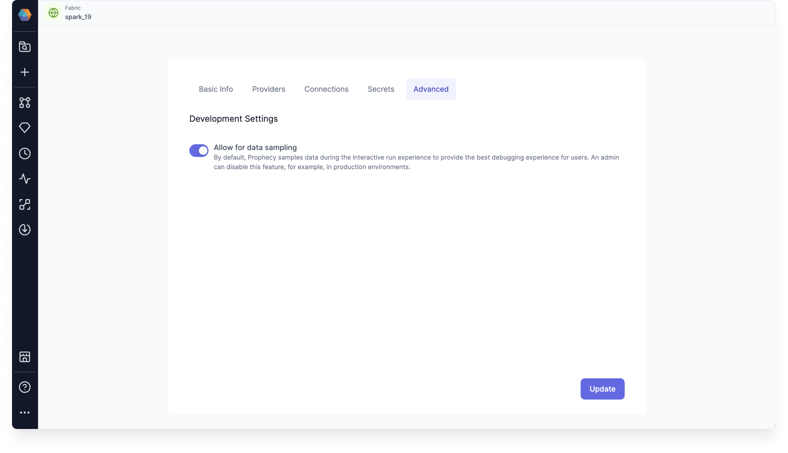
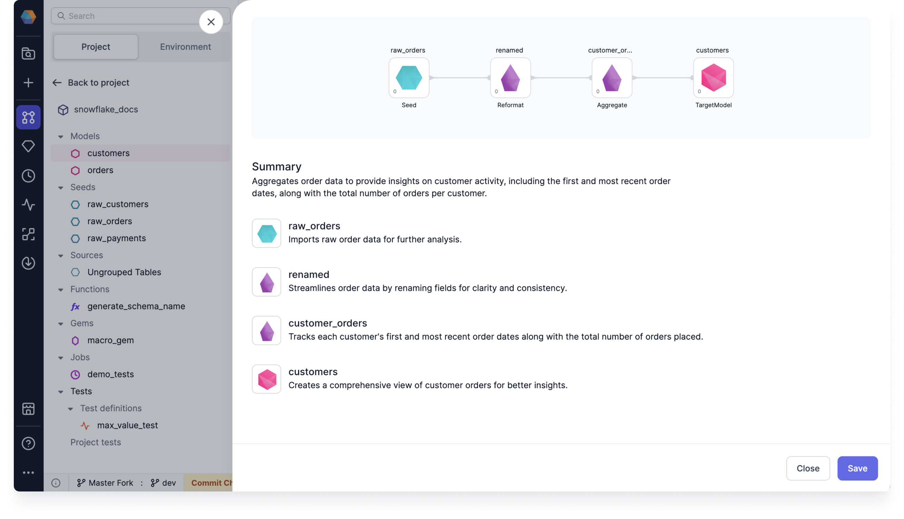

## 3.4.\* (October 28, 2024)

- Prophecy Python libs version: 1.9.24
- Prophecy Scala libs version: 8.4.0

### Features {#Features34}

#### Spark Copilot Enhancements {#Spark34}

- **Limit data preview in interims**: There is a new global level flag that admins can use to disable Data sampling for a given fabric. This flag overrides the pipeline level Data sampling settings. When disabled, you won't be able to see production data in the interims when you run the pipeline.

  

  Data sampling is enabled on by default. When left enabled, Data sampling uses the pipeline's data sampling settings. Prophecy samples data during the interactive run experience to provide the best debugging experience for users.

  For more information, see [Interims](/docs/Spark/execution/interactive-execution.md#interims).

#### SQL Copilot Enhancements {#SQL34}

- **Data tests**: We now support model and column data tests, which are dbt macro generated tests that can be parametrized and applied to a given model or any number of columns.

  You can create a new data test definition to use in your model or column test, or you can use an out-of-the-box supported dbt Simple data test.

  

  For more information, see [Use model and column tests](/docs/analysts/development/data-tests/use-model-tests.md).

- **Variant type support**: You can use Prophecy to convert your variant schemas into flat, structured formats to make them easier to understand and use for analytics.

  This is available for when you want to determine the variant schema of your Snowflake array or object.

  

  Using the variant schema functionality, you can do the following:

  - Infer the variant schema
  - Configure the parsing limit for inferring the column structure
  - Use a nested column inside of the Visual Expression Builder

  For more information, see [Variant schema](docs/data-modeling/visual-expression-builder/variant-schema.md).

- **Flatten Schema gem**: When processing raw data it can be useful to flatten complex data types like `Struct`s and `Array`s into simpler, flatter schemas. This gem builds upon the variant type support by allowing you to preserve all schemas, and not just the first one.

  

  FlattenSchema works on Snowflake sources that have nested columns that you'd like to extract into a flat schema.

  For more information, see [FlattenSchema](docs/analysts/development/gems/prepare/flatten-schema.md).

- **Deduplicate gem**: You can use the deduplicate gem to remove rows with duplicate values of specified columns. There are four **Row to keep** options that you can use in your deduplicate gem.

  

  For more information, see [Deduplicate](docs/analysts/development/gems/prepare/deduplicate.md).

- **Gem builder**: You can add custom gems to your SQL projects using the gem builder. You can create custom source, target, and transformation gems, and then publish them for your team to use.

  Our SQL gem builder supports Databricks and Snowflake SQL.

  

  For more information, see [Gem builder](/docs/extensibility/gem-builder/sql-gem-builder.md).

#### AI Copilot Enhancements {#AICopilot34}

- **Voice interface in Copilot conversations**: You can now use audio to interact with Data Copilot. Copilot will transcribe your request and read aloud the text response shown in the chat.

You must use Google Chrome to use the voice interface.

- **Enhanced Gem Modification for AI Copilot**: We’ve upgraded the graph modification experience in AI Copilot. Now, you can specify particular gems for Copilot to focus on, allowing you to better control and limit the scope of changes. This added flexibility is especially valuable when working with large model graphs, making targeted edits more efficient and precise.

For example, here are a few ideas that you can base your prompts on:

- Propagate the customer ID through all the gems
- Add a reformat gem after this
- Join selected gems on common columns
- Join this gem with payment data

Added/updated gems are highlighted in yellow.

- **Use previous prompts in chat with AI Copilot**: Now you can revert to a previous prompt, and Copilot will return the result for that prompt. Go ahead and edit the previous prompt - AI Copilot will accept the edits and generate a suggestion accordingly.

- **Prompt suggestions**: AI Copilot will now make suggested prompts in the Chat interface. Click a suggested prompt to view the resulting model graph.

- **Updated Explain dialog design**: We've updated the Explain dialog design so that it's cleaner and easier to use.

  

### Minor Improvements {#MinorImprovements34}

- **Code diff on merge screen**: You can view the code changes of your commit when you start the process to commit changes. This gives you granular change visibility so that you can understand the detailed changes being made to your pipelines, models, datasets, and other entities.

  

  You can also use manual merge to resolve conflicts. This provides you with simple, yet effective ways to resolve merge conflicts for granular changes. For SQL, you can also toggle on **Code Changes** to view and edit the code directly on the files.

  For more information, see the [Git docs](/docs/ci-cd/git/git.md).

- **Databricks Volumes support**: Prophecy now supports Databricks Volumes. When you run a Python or Scala pipeline via a job, you must bundle them as whl/jar artifacts. These artifacts must then be made accessible to the Databricks job in order to use them as a library installed on the cluster.

  You can designate a path to a Volume for uploading the whl/jar files on the Providers tab of your Databricks fabric.

  

- **Prophecy Lib version**: You can now find out what the current Prophecy Library version is on your clusters. Use the Cluster Attached dropdown to see the log for the current version in the fabric connection logs.

  
