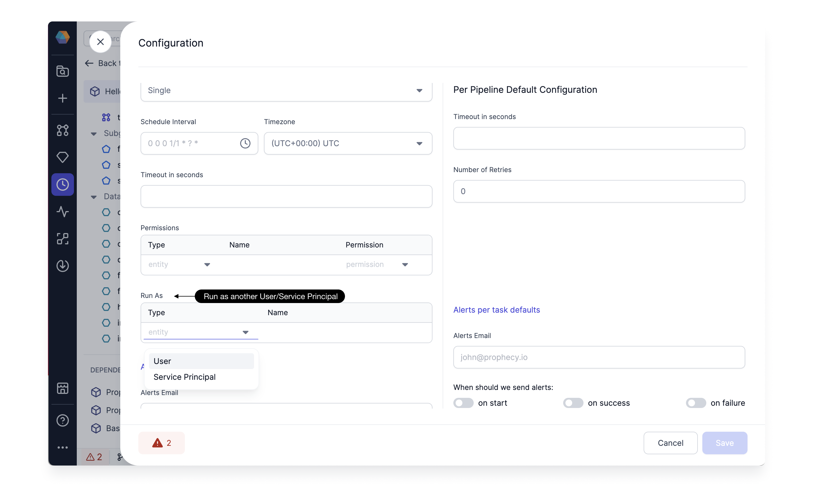

## 3.2.8.\* (Jan 11, 2024)

- Prophecy Python libs version: 1.7.4
- Prophecy Scala libs version: 7.1.53

### Features {#FeaturesRelease328}

#### Run as another User/Service Principal for Databricks Jobs

By default, Databricks Jobs run as the identity of the Job owner. This means that the Job assumes the permissions of the Job Owner, and it can only access data and database object that the owner has permission to access.
You can change the identity that the Job is running as to a Service Principal and then your Job will assume the permission of that service principle. Workspace admins can also change the identity that Job is running to a different user in
the workspace. To change the `run as` settings you need to have either they can manage or is the owner permission on the Job. To change this, simply go to Job settings, and Change the Run As settings as shown below.

