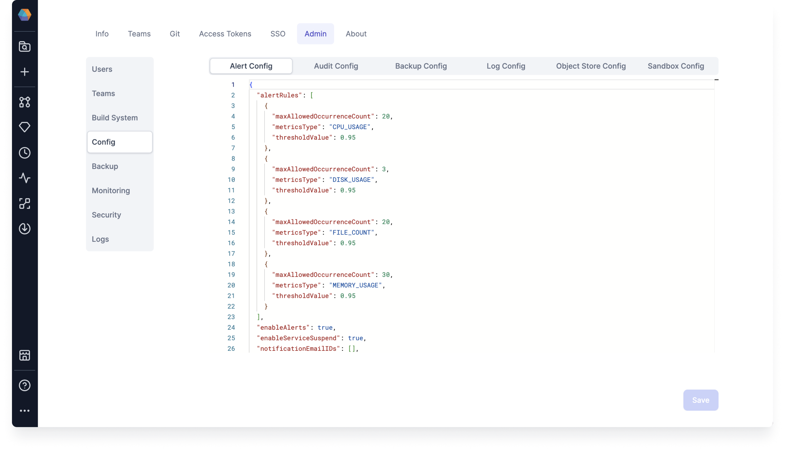
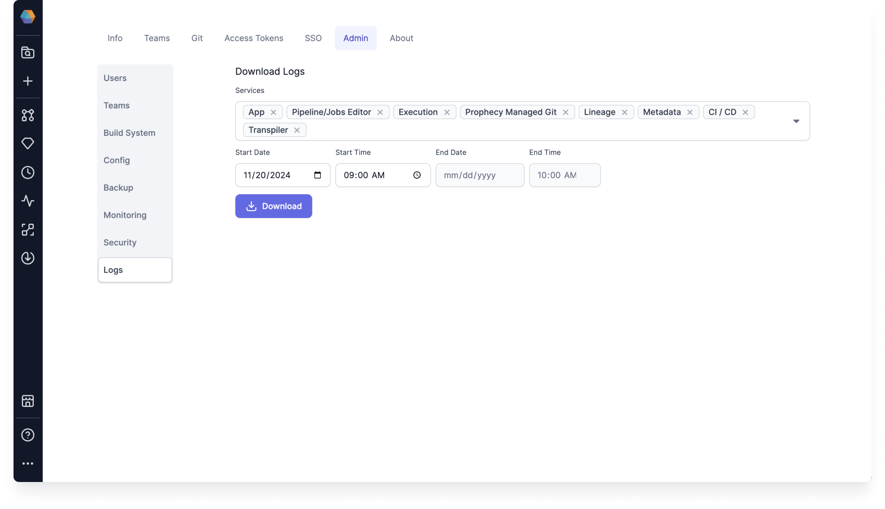

## 3.4.1.\* (November 25, 2024)

- Prophecy Python libs version: 1.9.24
- Prophecy Scala libs version: 8.5.0

### Features {#Features341}

#### Monitor and alert for resource utilization

Prophecy now offers a reliable solution for configuring alerts to monitor resource usage in Prophecy-managed microservices.

It enables proactive alerting when resource utilization approaches defined thresholds, ensuring timely intervention before limits are reached. Additionally, it supports the suspension of critical services in the event of resource overflows.

For more information, see Alerts Configuration.

#### Download Logs

As an admin user, you can download your environment logs from Prophecy without needing access to your Prophecy cluster or the assistance of Prophecy Support.

This reduces the delay in debugging any issues with your Prophecy services. You can share the compressed log file with your Prophecy support engineer by uploading it to Zendesk.

For more information, see Download Logs.

#### Extended Maintenance release

Release 3.4.1 is our first Extended Maintenance (EM) release, offering you the option to choose a Prophecy version with long-term support.

For more information, see Prophecy versions support.

Extended Maintenance releases require additional resources, such as CPU and memory. Starting with `v3.4.1.0 EM`, SQL Sandbox is enabled, so every SQL Pipeline sessions will spin up an additional pod.

After upgrading to 3.4.1, you must enable SQL Sandbox Config in the UI by navigating to the **Sandbox Config** tab in the Config sub tab of the Admin Settings.

For more information, see [Prophecy versions support](/docs/release_notes/version_chart/versions_support.md).

### Minor Improvements {#MinorImprovements341}

- **Execution Metrics bug fix**: We fixed a bug where Execution Metrics is disabled but turns on during interactive execution.

- **Blank config package field bug fix**: We fixed a bug where a Python Pipeline would crash after clearing the config package name and then attempting to save.
