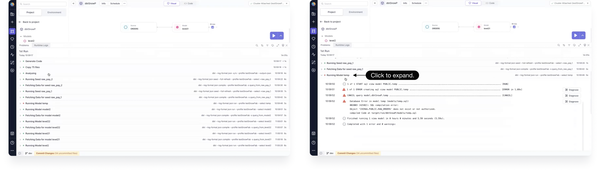

## 3.4.\* (October 28, 2024)

- Prophecy Python libs version: 1.9.16
- Prophecy Scala libs version: 8.2.1

### Features {#Features34}

#### Spark Copilot Enhancements {#Spark34}

- **Jinja Config syntax**: We've unified the config syntax across all project types by supporting Jinja config syntax.

  For example, instead of using `'$test_expression'` for SQL or `Config.test_expression` for Scala/Python, you can use `{{test_expression}}`.

  

  For more information on enabling the syntax, supported functionalities, and examples, see [Jinja Config syntax](../../Spark/configuration/configuration.md).

#### SQL Copilot Enhancements {#SQL34}

- **Lineage run**: You can now run your project from the lineage view. By using the play button, you can select which entities you'd like to include in your run.

  

  After the run has completed, you can click to view interim data.

  From the resulting Runtime Logs panel, you can see logs of the current run, which are grouped for easy viewing. Click on a grouping to expand it.

  

  We also help you diagnose errors in failed runs. Simply click the Diagnose button next to the error log. You are shown the error and a suggestion for a possible way to fix it.

  For more information, see [Lineage run and diagnose](../../metadata/lineage/lineage-run-and-diagnose.md).

- **Parametrized schema**: In some scenarios, you may need to parameterize your location paths using external variables. You can do this by enabling the Schema field parameterization on the Location tab of your Target Model.

### Minor Improvements {#MinorImprovements34}

- **Deployment APIs**: You can use our external APIs for deployment and monitoring of your Prophecy project.
