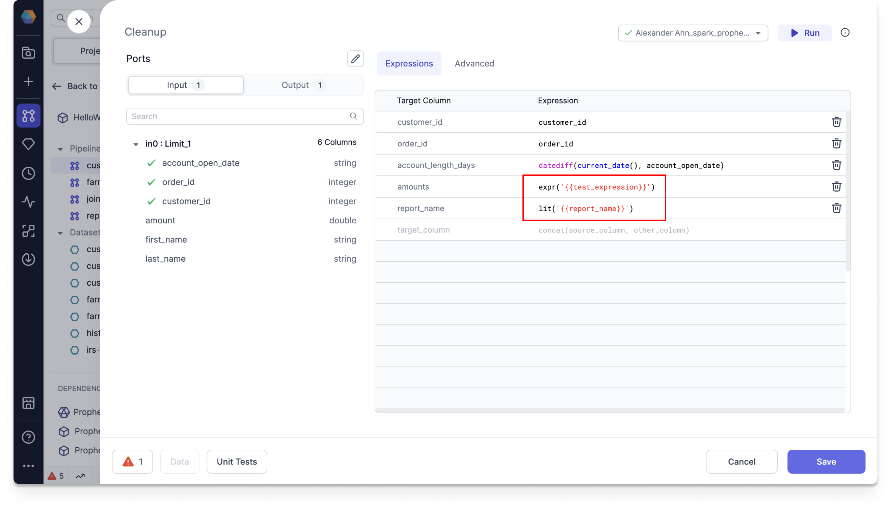
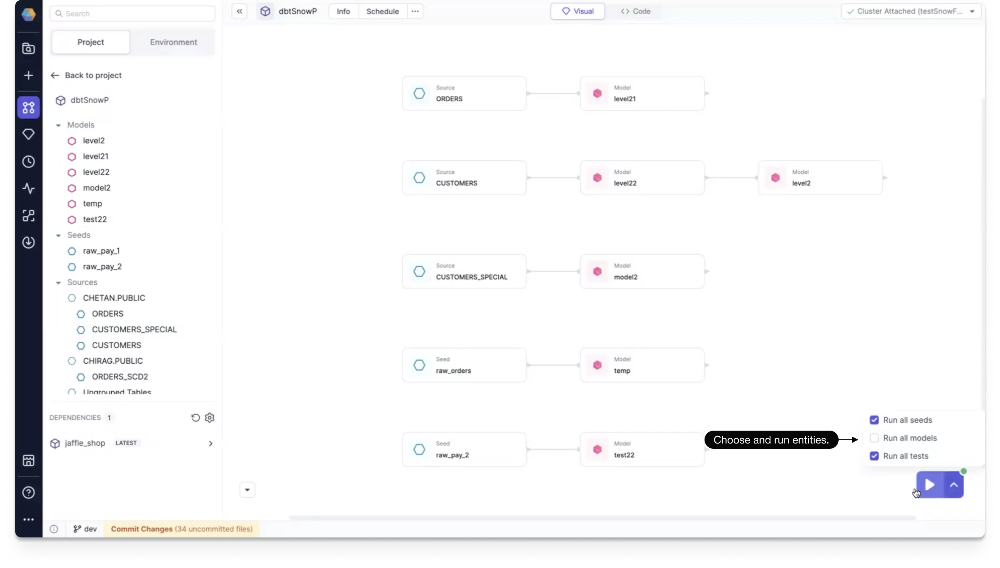
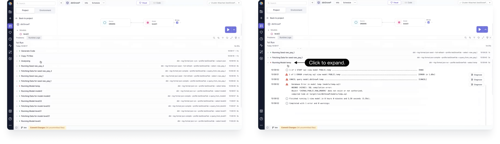

## 3.3.11.\* (September 20, 2024)

- Prophecy Python libs version: 1.9.16
- Prophecy Scala libs version: 8.2.1

### Features {#Features3311}

#### Spark Copilot Enhancements {#Spark3311}

- **Jinja Config syntax**: We've unified the config syntax across all project types by supporting Jinja config syntax.

  For example, instead of using `'$test_expression'` for SQL or `Config.test_expression` for Scala/Python, you can use `{{test_expression}}`.

  

  For more information on enabling the syntax, supported functionalities, and examples, see [Jinja Config syntax](../../Spark/configuration.md).

#### SQL Copilot Enhancements {#SQL3311}

- **Lineage run**: You can now run your project from the lineage view. By using the play button, you can select which entities you'd like to include in your run.

  

  After the run has completed, you can click to view interim data.

  From the resulting Runtime Logs panel, you can see logs of the current run, which are grouped for easy viewing. Click on a grouping to expand it.

  

  We also help you diagnose errors in failed runs. Simply click the Diagnose button next to the error log. You are shown the error and a suggestion for a possible way to fix it.

  For more information, see [Lineage run and diagnose](docs/lineage/lineage-run-and-diagnose.md).

- **Parametrized schema**: In some scenarios, you may need to parameterize your location paths using external variables. You can do this by enabling the Schema field parameterization on the Location tab of your Target Model.

### Minor Improvements {#MinorImprovements3311}

- **Deployment APIs**: You can use our external APIs for deployment and monitoring of your Prophecy project.

## 3.3.10.\* (September 2, 2024)

- Prophecy Python libs version: 1.9.14
- Prophecy Scala libs version: 8.1.4

### Features {#Features3310}

#### Spark Copilot Enhancements {#Spark3310}

- **Source suggestion**: While working on your pipeline, if there is an unconnected source, Data Copilot will now suggest other sources that you can add to it on the graph.

#### SQL Copilot Enhancements {#SQL3310}

- **SQL Subgraph**: We now support [Subgraphs in your SQL models](../../SQL/gems/subgraph/subgraph.md). Subgraphs allow you to wrap multiple different gems under a single parent gem. These logical groupings can simplify the Visual view of your model.

- **Support for configurations in the Target Model**: The Target Model supports column selection and project-level configurations.

- **Schedule button**: Just as you can schedule a pipeline in Spark, you can now use the Schedule button to schedule a model in SQL. Opening the Schedule screen shows all existing jobs. You can also create a new job.

- **Support dragging function parameters**: You can drag and drop function parameters in the Visual view of the expression builder.

### UX Improvements {#UXImprovements3310}

- **Support teams search**: You can use search on the teams select box during Fabric creation.

- **SQL upload file button**: The Upload File button is now always present on the Environment tab.

### Minor Improvements {#MinorImprovements3310}

- **Fix with AI while saving gems**: When saving a gem, Data Copilot provides a one-click option to automatically resolve any diagnostic errors within the gem.

- **Auto describe Datasets**: We now automatically describe Datasets and their columns when you drop a Dataset from the Environment tab. Additionally, we improved the quality of the descriptions using interim data when you run your pipeline.

- **UDFs and Macros in Copilot expression suggestions**: The Data Copilot can now generate expressions using custom UDFs and Macros defined in Spark and SQL projects.

- **Prevent unnecessary code changes**: Unnecessary code changes are no longer made for the following cases:

  - after a new user loads a job that was created by another user in the pipeline
  - after multiple users open a pipeline with published subgraphs

- **UI doesn't refresh after pull origin fix**: We've fixed an issue where merged changes didn't appear after pulling origin in Prophecy until you've refreshed the UI.

- **Fabric configuration reset fix**: We've fixed an issue where the Fabric configuration would reset during creation when adding a job size and selecting JSON.

- **Upgrade dbt version**: We've upgraded our dbt supported version to v1.8.
