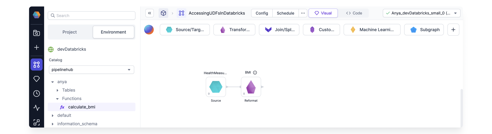
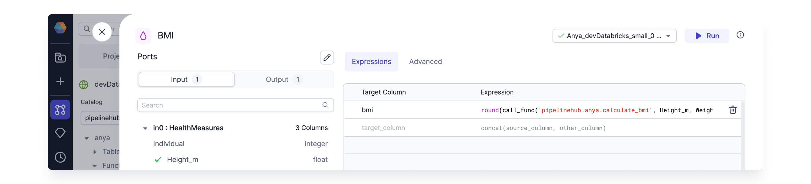

January 9, 2025

- Prophecy Python libs version: 1.8.15
- Prophecy Scala libs version: 7.1.93

### Import functions from the Databricks Unity Catalog

Many teams maintain user defined functions (UDFs) in Databricks. SQL UDFs stored in Databricks Unity Catalog are now available for use in Prophecy Gems. Just connect to a Databricks fabric using the appropriate credential, open the Project's environment tab, and you'll see the functions stored in the catalog accessible to that user in Prophecy.

Call the UDF from any Gem in the Project. There's no need to click infer schema; Prophecy saves you a step by using the UDF to automatically infer the schema.

SQL UDFs can be accessed from Prophecy Python Projects with this release.

### File upload in Spark Pipelines

There are now three ways to upload a file and incorporate it into your Spark Pipeline:

- Drag and drop the file directly onto the Pipeline canvas.
- Open the Source/Target Gem drawer and click **Upload file**.
- Create a new Source Gem, click **+ New Dataset**, and then select **Upload file**.

### Minor improvements {#MinorImprovements343}

- **SCIM user experience enhancements.** When SCIM is enabled, there is a new option under **Settings > SSO** that lets you easily generate a SCIM token.
- **[Machine-to-Machine functionality with Databricks OAuth.](docs/administration/authentication/databricks-oauth.md)** This feature lets you use Databricks OAuth for authentication during scheduled Jobs, as well as for Project releases and deployments. Visit the Databricks documentation to learn more about [access to Databricks with a Service Principal using OAuth](https://docs.databricks.com/en/dev-tools/auth/oauth-m2m.html).
