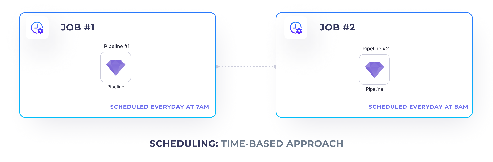
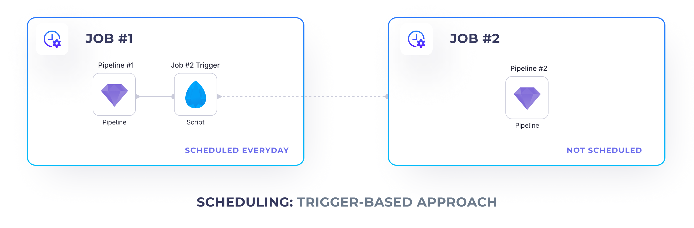

To better structure your projects, sometimes you would like to create multiple different jobs that trigger only a
specific set of pipelines. E.g. when using
the [Bronze, Silver, Gold](https://www.prophecy.io/blogs/prophecy-with-delta#bronze-silver-gold-layers) architecture,
one might want to have a project for each one of the stages and run each stage sequentially - run _Gold_ after _Silver_
is
finished and _Silver_ and after _Bronze_.

However, this poses a question: How to schedule multiple jobs together?

## Time-based Approach



One traditional approach is to schedule the sequential jobs to run at different time intervals. E.g. the _first job_ can
run at 7am and the _second job_ can run an hour later. This works well, if there's no data dependencies between those
jobs, or we're confident the _first job_ is going to always finish before the _second job_.

But what would happen if our _first job_ (e.g. bronze ingestion) hasn't yet finished, but the _second job_ (e.g. silver
cleanup) is about to start? This could potentially result in only partially processed data or even break the downstream
jobs completely. Recoverability and maintenance also becomes more difficult.

## Trigger-based Approach



This is where, it might be worth to explore the trigger-based approach. Using this approach, we place additional
triggers in our upstream jobs that trigger the jobs that should be executed after those finished.

To achieve that we can leverage the `Script` gem
and [Databricks Jobs API](https://docs.databricks.com/dev-tools/api/latest/jobs.html#operation/JobsRunNow).

To be able to trigger a job from within another job, we need to:

1. deploy the job we want to trigger and find it's Databricks `job_id`
2. add a `Script` gem to the scheduled job that triggers the other one

### Deploying jobs

First of all, to be able to trigger one job from another, we need to release it and get it’s databricks job id.

Please note that this job is disabled - as we’re only going to run it from a manual API, instead of a time-based
trigger.

<div class="wistia_responsive_padding" style={{padding:'56.25% 0 0 0', position:'relative'}}>
<div class="wistia_responsive_wrapper" style={{height:'100%',left:0,position:'absolute',top:0,width:'100%'}}>
<iframe src="https://fast.wistia.net/embed/iframe/0f08c3ppuc?videoFoam=true" title="Deploying Jobs Video" allow="autoplay; fullscreen" allowtransparency="true" frameborder="0" scrolling="no" class="wistia_embed" name="wistia_embed" msallowfullscreen width="100%" height="100%"></iframe>
</div></div>
<script src="https://fast.wistia.net/assets/external/E-v1.js" async></script>

### Job trigger

Once we have the ID of the job that we'd like to trigger, we can go ahead and create a _Script_ gem in our upstream job
that's going to run it.

Insert the following script to trigger a job:

```python
import requests

# STEP 1: Enter your workspace ID here
domain = 'https://dbc-147abc45-b6c7.cloud.databricks.com'
# STEP 2: Ensure you have a workspace.token secret created and accessible
token = dbutils.secrets.get(scope='workspace', key='token')

response = requests.post(
    '%s/api/2.1/jobs/run-now' % (domain),
    headers={'Authorization': 'Bearer %s' % token},
    # STEP 3: Enter a job_id you'd like to trigger
    json={'job_id': '549136548916411'}
)

if response.status_code == 200:
    print(response.json())
else:
    raise Exception('An error occurred triggering the job. Complete error: %s' % (response.json()))
```

Make sure to specify the following arguments:

1. Databricks workspace url - [How to find it?](https://docs.databricks.com/workspace/workspace-details.html#workspace-instance-names-urls-and-ids)
2. Databricks token - [How to generate it?](https://docs.databricks.com/dev-tools/api/latest/authentication.html#generate-a-personal-access-token)

   Please note, that it's not recommended to store your databricks token within the code directly, as that creates a
   potential venue for the attacker. A better approach is to laverage databricks secrets. Check
   out [this guide](https://docs.databricks.com/security/secrets/secrets.html#create-a-secret-in-a-databricks-backed-scope)
   to learn how to create databricks secrets.

3. The databricks job id as previously embedded

<div class="wistia_responsive_padding" style={{padding:'56.25% 0 0 0', position:'relative'}}>
<div class="wistia_responsive_wrapper" style={{height:'100%',left:0,position:'absolute',top:0,width:'100%'}}>
<iframe src="https://fast.wistia.net/embed/iframe/rf59zd5fgv?videoFoam=true" title="Deploying Jobs Video" allow="autoplay; fullscreen" allowtransparency="true" frameborder="0" scrolling="no" class="wistia_embed" name="wistia_embed" msallowfullscreen width="100%" height="100%"></iframe>
</div></div>
<script src="https://fast.wistia.net/assets/external/E-v1.js" async></script>
