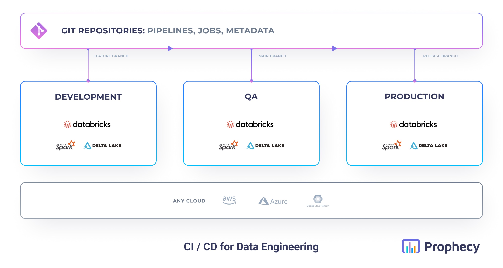
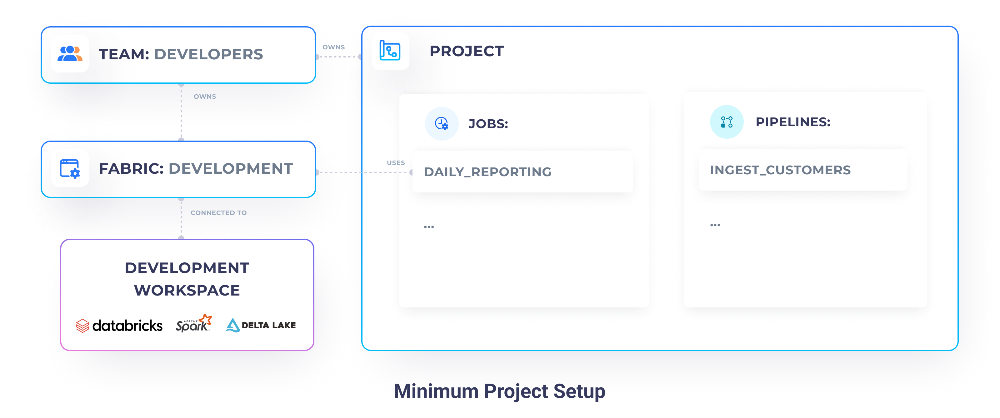

**Continuous Integration (CI)** and **Continuous Delivery (CD)** are some of the cornerstones of modern and reliable
software engineering practices. To iterate quickly on the software, engineers push code as often as possible to their
main GIT branch (branch shared by all the teammates). The **CI** process automatically tests the pushed code, by running
unit & integration tests, to avoid any future challenges. After the team has decided that their new code is ready to be
deployed to production, the **CD** process automatically deploys all the changes after they've been tested in the
production environment.

For a CI/CD process to work efficiently, the engineers often work and test their code in multiple different
environments.
A common example is a setup with three stages: **Development**, **QA**, **Production**.

Those practices have been applied to software engineering for many years now and enabled a lot of organizations to
deploy reliably their code even **many times a day**! However, even today, the vast majority of data practitioners are
still struggling with operationalizing their code.

This has been mostly caused by** difficult to work with formats** (like notebooks or proprietary ETL binaries) that
aren't easily versioned and stored in GIT, and lack of access to **well-modeled synthetic data** for lower environments.
Additionally, data users are often not used to working with technologies like GIT, which have a very steep learning
curve.

Here comes Prophecy! Since Prophecy works very similarly to a **code-based IDE** with an additional **low-code
productivity
layer**, all your code for data pipelines and jobs is directly accessible to you and stored in GIT. This enables any
data
practitioners to leverage the **best DevOps practices easily**.

## Single-fabric Development

First of all, let's consider, the **simplest scenario**, where you have only a single execution environment (e.g a
single Databricks
workspace). In those cases, usually, everyone on your team has access to that environment. Everyone does both the
development and productionization of your pipelines in the same place.

In Prophecy, at minimum, you will find yourself having:

- **multiple projects** - your GIT repositories which store all the Spark, Airflow, and metadata code
- **multiple data pipelines** - various ETL / ELT tasks written in Spark
- **multiple jobs** - the orchestration of your data pipelines written in Databricks Jobs or Airflow
- **a single team** - all your teammates in the same place, with the same access
- **a single fabric** - the connection to your Databricks workspace

This is great for simple setups and very small teams, but can quickly lead to many problems. In such a setup, it's very
easy for you and your teammates to make mistakes and **accidentally affect production** pipelines. There's also **lack
of data
separation**, so any PII information becomes visible to everyone!

A better approach is to have physical environments, connected to different stages of development. A common example is a
setup with three stages: **Development**, **QA**, **Production**. Each environment has usually its independent data,
metastore, clusters, and even permissions.

## Multi-fabric Deployment with Prophecy

Let's consider a better alternative to a single environment development.

### Why so many environments?

The simplest alternative involves adding just one more execution environment called **production**.

By separating your **development** or QA use-cases from your **production** use-cases, you get:

- PII safety (by using mock or anonymized data)
- Faster development (by using smaller data samples)
- Reduced development costs (by using smaller cluster sizes)
- Increased data quality confidence (by only pushing code after tests and validations pass)

You can push your code to the **production environment** only after you're confident it's going to work well. The
production environment has access to your real data, uses large optimal clusters, and has significantly restricted
access. In some cases, only the operational support teams should have access to your production environment.

If you'd like to involve more stages, to even further increase the reliability of your development process, you can add
a **QA environment**. That environment should have data, hardware, and software that closely simulates the Production
environment (e.g. data slices directly taken from production), and should serve as a holding area. Using QA, your
engineers make sure that the jobs are going to run smoothly in the production environment, without actually potentially
breaking production, if some code is wrong.

### Development and Production

For our example, however, let's focus on a setup with two environments: **Development** & **Production**. Our
**Development environment** is accessible to our whole organization (developers, analysts, support) and is connected to
our development Databricks workspace, which contains only dummy customer data. Whereas, our **Production environment**
is only accessible to our production support team and is connected to our production Databricks workspace, which has
real customer data.

#### Entities setup

1. Create two **teams**:

   - **developers** - a superset of all the teams, which contains your developers and members of the _prod_support_
     team
   - **prod_support** - team composed of members who have privileged production access permissions

2. Create two **fabrics**:

   - **development** - owned by the `developers` team
   - **production** - owned by the `prod_support` team

3. Set up your **projects** - create your projects, as you would before. Projects should be owned by the _developers_
   team.

4. Set up your **jobs** - for every single set of pipelines you'd like to schedule, create two jobs:
   - **job_development** - jobs built by the _developers_ for integration and testing purposes
   - **job_production** - jobs built by the _prod_support_ team, based on the development jobs - they will run in the
     production environment

   <iframe src="https://www.loom.com/embed/b9669f374f504e469b2f88374bcf35d3" frameborder="0" webkitallowfullscreen mozallowfullscreen allowfullscreen
      style={{position: 'absolute', top: 0, left: 0, width: '100%', height: '100%'}}></iframe>

#### Development & Testing

Phew, that was a lot of work! But the biggest chunk is behind us 💪.

Now that we have set up our fabrics and teams, built some pipelines, it's time to test the whole data flow on our
development environment.

Testing your pipelines and jobs is very simple. Simple click on the play button and watch your code run!

:::info Coming Soon
Note, that currently, we're spinning up a new cluster for each of the tasks, therefore your job might take a few minutes
to complete. However, soon, you will be able to have granular control over which pipeline runs on which cluster.
:::

#### Deployment to Production

Once we're confident that our job works correctly, and we have tested it well, we can start deploying it to our
**production** environment. In our setup, only a production support engineer can do that. Therefore, login as them,
duplicate your job on the production fabric, set appropriate pipeline configurations and enable it.

That's it! Now you can commit any remaining changes and release your pipeline. Prophecy automatically takes care of the
release process, by building your pipelines, running unit tests, and finally deploying the pipeline jars/wheels
alongside the job definition directly to Databricks (or AirFlow).

If you're new to this process, check out, our [GIT](/metadata/git)
and jobs deployment documentation.

   <iframe src="https://www.loom.com/embed/28153636876f409184e6ba2dcbc8f273" frameborder="0" webkitallowfullscreen mozallowfullscreen allowfullscreen
      style={{position: 'absolute', top: 0, left: 0, width: '100%', height: '100%'}}></iframe>

## Multi-fabric Deployment with GitHub

So far, we looked at how Prophecy makes it really easy to deploy our jobs to multiple environments, directly using the
CI / CD system built into it. However, it is often the case that you want to deploy your pipelines from your GIT
instead. This enables you to have a more secure production environment, where it doesn't have to connect to directly
Prophecy itself.

As we know, Prophecy publishes all the entities (pipelines, jobs, metadata, etc) directly on your GIT. That means you
can very easily deploy that code to whatever Databricks environment you'd like - very easily.

### Setup GitHub actions

###
