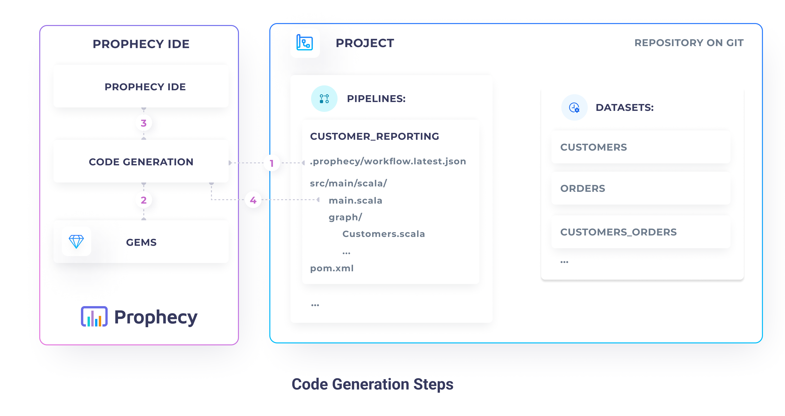
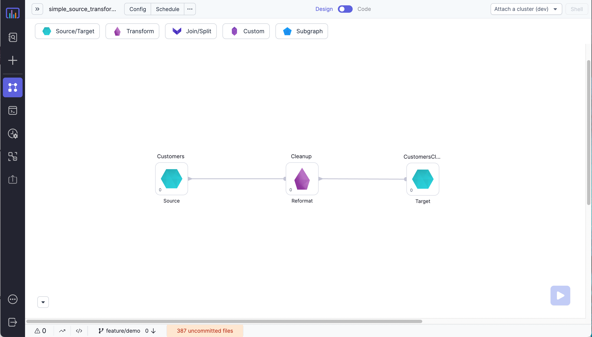
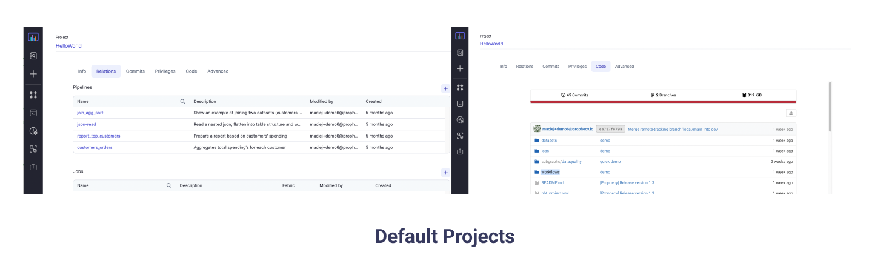

## Prophecy IR

### Introduction

This page describes how to generate the Prophecy Pipelines programmatically. Prophecy generates code directly based on
the Prophecy IR representation. Prophecy IR is the Prophecy internal representation format the generically describes
the Prophecy PySpark, Spark, and SQL Pipelines and expressions.

:::caution Beta

This documentation is only accessible to a select subset of design customers and is subject to change.

:::



The Prophecy IR lifecycle follows the following steps:

1. **Read Prophecy IR** - Prophecy IR stores the current visual state of the Pipeline as a
   serialized `workflow.latest.json` file. This file is stored on a Git repository, alongside the generated code.
   Prophecy IR reads the state file, parses and validates it.
2. **Read available gems** - Prophecy reads available gems specifications and validates the state file against them.
3. **Visualize Pipeline** - Prophecy visualizes the Pipeline on the Prophecy IDE, based on the loaded state and gem
   specifications.
4. **Generate code** - After the Pipeline is successfully visualized, Prophecy saves the Pipelines code on the Git
   repository.

### Prophecy IR format

#### Visual Representation



#### workflow.latest.json

```json lines
{
  "metainfo": {
    // Pipeline id in the format {project_id}/{repository_path}
    "id" : "826/pipelines/customers_orders",
    // backend language name (scala, python, or sql)
    "language" : "scala",
    // expressions language type (scala, python, or sql)
    "frontEndLanguage" : "sql",
    // functions definitions and configurations
    "udfs" : { "language" : "scala", "udfs" : [ ... ] },
    "udafs" : { "language" : "scala", "code" : "..." },
    "configuration" : { },
    // spark configurations
    "sparkConf" : [ ],
    "hadoopConf" : [ ],
    // default build system
    "buildSystem" : "maven",
    // dependencies
    "externalDependencies" : [ ],
    // metrics settings
    "isImported" : false,
    "interimMode" : "Full",
    "interimModeEnabled" : true,
    "visualCodeInterimMode" : "Disabled",
    "recordsLimit" : {
      "enabled" : false,
      "value" : 1000
    }
  },
  // definitions of connections between the components
  "connections" : [
      { "id" : "1", "source" : "source_id", "sourcePort" : "source_output", "target" : "reformat_id", "targetPort" : "reformat_input" },
      { "id" : "1", "source" : "reformat_id", "sourcePort" : "reformat_output", "target" : "target_id", "targetPort" : "target_input" }
  ],
  // instances of gems
  "processes" : {
    // each gem instance is composed of:
    "source_id" : {
      // 1. unique id
      "id" : "source_id",
      // 2. type of the gem
      "component" : "Source",
      // 3. gem descriptions and position
      "metadata" : { "label" : "Customers", "slug" : "Customers", "x" : 120, "y" : 320, /* ... */ },
      // 4. definition of inputs and outputs
      "ports" : { "inputs" : [ ], "outputs" : [ { "id" : "source_output", "slug" : "out" } ] },
      // 5. properties describing the data source (for Source / Target only)
      "properties" : { "datasetId" : "826/datasets/customers" }
    },
    "target_id" : {
      "id" : "target_id",
      "component" : "Target",
      "metadata" : { "label" : "CustomersCleaned", "slug" : "CustomersCleaned", "x" : 1370, "y" : 220 },
      "ports" : { "inputs" : [ { "id" : "target_input", "slug" : "in" } ], "outputs" : [ ], /* ... */ },
      "properties" : { "datasetId" : "826/datasets/customers_cleaned" }
    },
    "reformat_id" : {
      "id" : "reformat_id",
      "component" : "Reformat",
      "metadata" : { "label" : "Cleanup", "slug" : "Cleanup", "x" : 565, "y" : 220, /* ... */ },
      "ports" : { "inputs" : [ { "id" : "reformat_input", "slug" : "in" } ], "outputs" : [ { "id" : "reformat_output", "slug" : "out" } ] /* ... */ },
      // 6. properties describing the transformation logic
      "properties" : {
         /* ... */
        "expressions" : [ {
          "target" : "account_length_days",
          "expression" : { "format" : "sql", "expression" : "datediff(current_date(), account_open_date)" },
          "description" : ""
        } ]
      }
    }
  }
}
```

### Complete example

For a complete example open any of the `workflow.latest.json`'s of the default Pipelines in the HelloWorld project!


